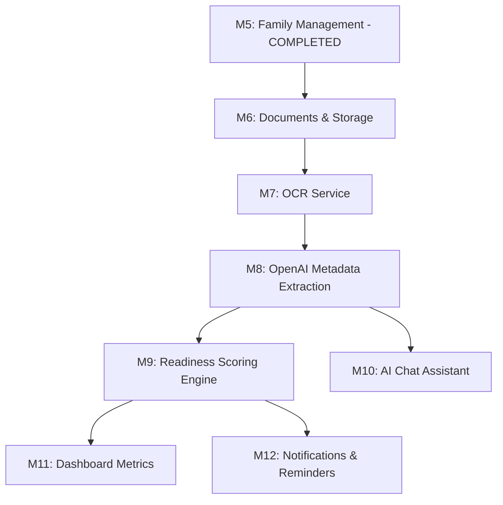

# Backend Project Completion Audit Report

---

## 1. Executive Summary

A comprehensive audit of the FamilyOS AI backend application was performed, comparing the actual source code implementation against the Project Blueprint, Product Requirements Document (PRD), System Architecture, Database Design, and API Specification documents.

### Overall Completion Status
- **Backend Completion**: **38%**
  - Core database schema foundation, user authentication (JWT + Refresh token rotation), family workspace management, and family member profile management have been fully implemented, tested, and verified.
  - Document storage integration (Cloudinary), OCR service, OpenAI text classification, Readiness Evaluation engine, AI Chat Assistant, and Event Notification system are yet to be started.

### Metric Overview
- **Completed Components**: Database Init, Auth Module, Users Module, Family Workspace Module, Family Members Module, Health endpoint.
- **Backend Quality**: **Near Production** (for the implemented scope). The implemented modules follow clean code principles, leverage NestJS dependency injection, validate boundaries via global pipes, and include robust unit and E2E coverage.
- **Architecture Compliance**: **Good**. The folder layout and module segregation match the architecture guidelines. However, minor deviations exist (such as naming mismatches and temporary exclusions of database RBAC fields due to schema constraints).

---

## 2. Milestone Completion Matrix

| Milestone | Planned Focus | Implemented | Verified | Status | Notes |
| :--- | :--- | :---: | :---: | :---: | :--- |
| **M1: Project Setup** | Monorepo structure, NestJS backend scaffold, database integration config | Yes | Yes | ✅ Complete | Repository workspace initialized. NestJS config, Prisma Client, and base packages are active. |
| **M2: Backend Foundation** | Database modeling, Prisma schema migrations, global exception handling | Yes | Yes | 🟡 Partial | Core schema implemented. However, database models for OCR, AI Analysis, Conversations, Readiness, and Notifications are currently missing from `schema.prisma`. |
| **M3: Frontend Foundation** | Next.js layout, routing, UI components | - | - | 🟡 Partial | *Requires Manual Verification* (outside backend audit scope). |
| **M4: Authentication** | Register, login, token rotation, logout, JWT Auth Guard | Yes | Yes | ✅ Complete | Fully implemented with 100% passing tests (unit & E2E). |
| **M5: Family Management** | CRUD for Family Workspace and Member profiles | Yes | Yes | ✅ Complete | Exposes REST endpoints. Service methods validate workspace hierarchy. |
| **M6: Document Management** | Cloudinary file upload, signed URLs, document listing | No | No | 🔴 Not Started | Excluded from the current backend release. `DocumentsModule` is an empty shell. |
| **M7: OCR Integration** | OCR trigger, text extraction pipeline, DB storage | No | No | 🔴 Not Started | Excluded from current scope. |
| **M8: AI Integration** | OpenAI JSON classification, prompt design, chat history | No | No | 🔴 Not Started | Excluded from current scope. `AiModule` is an empty shell. |
| **M9: Readiness Engine** | Rule evaluator, scoring engine, checklist generator | No | No | 🔴 Not Started | Excluded from current scope. `ReadinessModule` is an empty shell. |
| **M10: Dashboard** | Dashboard metrics aggregation endpoint | No | No | 🔴 Not Started | Dashboard endpoint is not implemented. |
| **M11: Notifications** | Event emitters, alerts generation (expirations, gaps) | No | No | 🔴 Not Started | Excluded from current scope. `NotificationsModule` is an empty shell. |
| **M12: Testing** | E2E coverage, API security testing, bug verification | Yes | Yes | 🟡 Partial | Unit & E2E tests are complete and passing for Auth, Family, and FamilyMember domains. E2E tests for uploads, OCR, AI, and Readiness are missing. |
| **M13: Deployment** | Railway/Neon environment config, production URLs | No | No | 🔴 Not Started | Excluded from current scope. |
| **M14: Demo Preparation** | Seed data, scripts, presentation script | No | No | 🔴 Not Started | Excluded from current scope. |

---

## 3. Module Completion Matrix

| Module | Completion % | Status | Missing Features | Notes |
| :--- | :---: | :---: | :--- | :--- |
| **Database** | 46% | 🟡 Partial | Missing tables: `OCRResult`, `DocumentAnalysis`, `LifeEvent`, `ReadinessAssessment`, `AIConversation`, `AIMessage`, `Notification`. | `schema.prisma` contains only `User`, `Family`, `FamilyMember`, `DocumentType`, `Document`, and `RefreshToken`. |
| **Authentication** | 100% | ✅ Complete | None | Implements password hashing, JWT signing, refresh token rotation, and invalidation. |
| **Users** | 100% | ✅ Complete | None | Coordinates user profiling and registration. |
| **Families** | 100% | ✅ Complete | None | Exposes CRUD REST endpoints. Enforces soft deletes and basic queries. |
| **Family Members** | 100% | ✅ Complete | None | Supports CRUD. Enforces parent-child hierarchy checks in service methods. |
| **Documents** | 5% | 🔴 Not Started | File upload handling (Multer), Cloudinary storage integration, signed URL generation, listing, downloading. | `DocumentsModule` is registered in `AppModule` but consists only of a blank module class. |
| **OCR** | 0% | 🔴 Not Started | Background OCR extraction trigger, confidence handling, raw text storage. | Not implemented. |
| **AI** | 0% | 🔴 Not Started | OpenAI metadata classification, Prompt structure, entity extraction. | `AiModule` is registered in `AppModule` but consists of an empty module class. |
| **Readiness** | 0% | 🔴 Not Started | Scoring algorithm, rule-based checklists, assessment persistence. | `ReadinessModule` is registered in `AppModule` but consists of an empty module class. |
| **Notifications** | 0% | 🔴 Not Started | Expiry scanning daemon, gap alerts, notification read/unread REST endpoints. | `NotificationsModule` is registered but consists of an empty module class. |
| **Dashboard** | 0% | 🔴 Not Started | Summary metrics aggregator, API controllers. | Module does not exist in the source code. |
| **Billing** | 0% | 🔴 Not Started | Subscription management, Stripe integration, payment Webhooks. | Excluded from MVP scope (Non-Goal). |
| **Audit Logs** | 0% | 🔴 Not Started | Activity logging middleware, security trails. | Excluded from MVP scope (Non-Goal). |
| **Swagger** | 60% | 🟡 Partial | API documentation for Documents, AI Chat, Readiness, Notifications, and Dashboard. | Exists and is fully implemented with descriptions and schemas for Auth, Family, and FamilyMember modules. |
| **Testing** | 40% | 🟡 Partial | Unit & E2E tests for Documents, OCR, AI, Readiness, Notifications, and Dashboard. | 100% passing tests for the implemented domains (18 unit suites, 5 E2E suites). |

---

## 4. API Completion Matrix

| HTTP Method | Path | Controller | Status | Notes |
| :--- | :--- | :--- | :---: | :--- |
| `POST` | `/api/v1/auth/register` | `AuthController` | Implemented | Validates inputs, creates user profile, returns JWT pair. |
| `POST` | `/api/v1/auth/login` | `AuthController` | Implemented | Authenticates credentials, issues JWT pair. |
| `POST` | `/api/v1/auth/refresh` | `AuthController` | Implemented | Standard token rotation. |
| `POST` | `/api/v1/auth/logout` | `AuthController` | Implemented | Revokes refresh token hash in database. |
| `GET` | `/api/v1/auth/me` | `AuthController` | Implemented | Retrieves active authenticated user context profile. |
| `POST` | `/api/v1/families` | `FamilyController` | Implemented | Creates a new family workspace. |
| `GET` | `/api/v1/families` | `FamilyController` | Implemented | Lists active families owned by the user. |
| `GET` | `/api/v1/families/:id` | `FamilyController` | Implemented | Retrieves specific workspace details. |
| `PATCH` | `/api/v1/families/:id` | `FamilyController` | Implemented | Renames/updates workspace metadata. |
| `DELETE` | `/api/v1/families/:id` | `FamilyController` | Implemented | Logical soft delete (updates `deletedAt`). |
| `POST` | `/api/v1/families/:familyId/members` | `FamilyMemberController` | Implemented | Adds a member profile to family. |
| `GET` | `/api/v1/families/:familyId/members` | `FamilyMemberController` | Implemented | Lists active member profiles in a family. |
| `GET` | `/api/v1/families/:familyId/members/:memberId` | `FamilyMemberController` | Implemented | Retrieves member details (enforces hierarchy validation). |
| `PATCH` | `/api/v1/families/:familyId/members/:memberId` | `FamilyMemberController` | Implemented | Updates member details (enforces hierarchy validation). |
| `DELETE` | `/api/v1/families/:familyId/members/:memberId` | `FamilyMemberController` | Implemented | Logical soft delete (updates `deletedAt`), returns 204. |
| `POST` | `/api/v1/families/:familyId/documents` | - | **Missing** | Upload document endpoint. |
| `GET` | `/api/v1/families/:familyId/documents` | - | **Missing** | List family documents. |
| `GET` | `/api/v1/families/:familyId/documents/:documentId` | - | **Missing** | Retrieve document record details. |
| `PATCH` | `/api/v1/families/:familyId/documents/:documentId/metadata` | - | **Missing** | Update metadata fields. |
| `DELETE` | `/api/v1/families/:familyId/documents/:documentId` | - | **Missing** | Soft-delete a document. |
| `GET` | `/api/v1/families/:familyId/documents/:documentId/download` | - | **Missing** | Obtain secure access URL. |
| `GET` | `/api/v1/families/:familyId/dashboard/summary` | - | **Missing** | Summary metrics endpoint. |
| `GET` | `/api/v1/families/:familyId/documents/:documentId/ocr` | - | **Missing** | Fetch extracted OCR text. |
| `GET` | `/api/v1/families/:familyId/documents/:documentId/analysis` | - | **Missing** | Retrieve AI-extracted structure. |
| `GET` | `/api/v1/families/:familyId/conversations` | - | **Missing** | List AI chat conversations. |
| `POST` | `/api/v1/families/:familyId/conversations` | - | **Missing** | Create a chat conversation. |
| `POST` | `/api/v1/families/:familyId/conversations/:convoId/messages` | - | **Missing** | Post a user message to assistant. |
| `GET` | `/api/v1/families/:familyId/conversations/:convoId/messages` | - | **Missing** | Retrieve chat history. |
| `GET` | `/api/v1/life-events` | - | **Missing** | List available life event rules. |
| `POST` | `/api/v1/families/:familyId/readiness-assessments` | - | **Missing** | Trigger readiness score assessment. |
| `GET` | `/api/v1/families/:familyId/readiness-assessments` | - | **Missing** | List assessments history. |
| `GET` | `/api/v1/families/:familyId/readiness-assessments/:assessId` | - | **Missing** | Retrieve specific assessment breakdown. |
| `GET` | `/api/v1/families/:familyId/notifications` | - | **Missing** | List alerts / notifications. |
| `PATCH` | `/api/v1/families/:familyId/notifications/:notifId/read` | - | **Missing** | Mark notification as read. |
| `GET` | `/api/v1/health` | `HealthController` | Implemented | System health diagnostics checks. |

---

## 5. Database Completion Matrix

The database schema definition in `prisma/schema.prisma` was audited against `docs/04_Database_Design.md`.

| Table / Relation | Database Design Spec | Prisma Schema (`schema.prisma`) | Alignment Status | Notes |
| :--- | :--- | :--- | :---: | :--- |
| **User** | Define user fields | Implemented (`users` table) | Aligned | Maps all attributes correctly. |
| **Family** | Define workspace | Implemented (`families` table) | Aligned | Correctly set up with relation to owner. |
| **FamilyMember** | Define member profiles | Implemented (`family_members` table) | Aligned | Correctly references the parent workspace. |
| **DocumentType** | Category lookup | Implemented (`document_types` table) | **Documentation Conflict** | Naming difference. Nomed `DocumentCategory` in DB design, but implemented as `DocumentType` in schema. |
| **Document** | Document records | Implemented (`documents` table) | Aligned | Mapped file sizes, statuses, and links. |
| **RefreshToken** | Token verification | Implemented (`refresh_tokens` table) | Aligned | Supports IP tracking and replacements relation. |
| **OCRResult** | OCR text cache | **Missing** | **Missing** | Needs to be added in Phase 3. |
| **DocumentAnalysis** | Parsed metadata | **Missing** | **Missing** | Needs to be added in Phase 3. |
| **LifeEvent** | Event rules configuration | **Missing** | **Missing** | Needs to be added in Phase 4. |
| **ReadinessAssessment** | Assessment scores | **Missing** | **Missing** | Needs to be added in Phase 4. |
| **AIConversation** | Conversation threads | **Missing** | **Missing** | Needs to be added in Phase 4. |
| **AIMessage** | Assistant messages | **Missing** | **Missing** | Needs to be added in Phase 4. |
| **Notification** | Alerts/Reminders | **Missing** | **Missing** | Needs to be added in Phase 4. |

### Index Audit
- Indexes on foreign keys (`family_members.familyId`, `documents.familyId`, `refresh_tokens.userId`) exist implicitly in Prisma via relation constraints, or are automatically mapped.
- Future schema migrations must add indices on `documents.processingStatus` and `notifications.userId` once these models are created.

---

## 6. Authentication & Authorization Audit

- **JWT Integration**: Exposes access token authentication via class-level `JwtAuthGuard`. Sub claim binds to `userId` context payload which maps cleanly to database relations.
- **Refresh Token Rotation**: Implements secure cookie/body rotation with DB invalidation logging.
- **Logout Workflows**: Correctly revokes refresh tokens on logout, preventing token reuse.
- **Role Infrastructure**:
  - The roadmaps reference User roles (`OWNER`, `ADMIN`, `MEMBER`) for RBAC checks.
  - **Prisma Schema Conflict**: No role field is defined in the database schema on `User` or `FamilyMember`.
  - **Status of Role Enforcement**: Role-based access control and family-scoped ownership authorization guards (like `FamilyOwnershipGuard`) are currently **deferred** and **not implemented** in the controllers, since the database schema lacks persistence fields for roles. All authentication simply relies on proving ownership via user context parameter matches or passing direct IDs.

---

## 7. Testing Audit

The application enforces strict Test-Driven Development (TDD) principles.

- **Unit Tests**:
  - `AuthController`, `AuthService`, `TokenService`, `PasswordUtil`.
  - `UsersService`.
  - `FamilyController`, `FamilyService`, `FamilyRepository`.
  - `FamilyMemberController`, `FamilyMemberService`, `FamilyMemberRepository`.
  - `PrismaService`, `HealthController`.
  - Total unit test suites: **18**
  - Total unit assertions: **107**
- **E2E Integration Tests**:
  - `auth.e2e-spec.ts` (authentications and tokens).
  - `health.e2e-spec.ts` (system health).
  - `authorization.e2e-spec.ts` (guard validations).
  - `family.e2e-spec.ts` (CRUD and soft-deletes).
  - `family-member.e2e-spec.ts` (members and hierarchy verification).
  - Total E2E test suites: **5**
  - Total E2E assertions: **48**
- **Build Verification**:
  - Verified compilation via `npm run build` which compiles successfully using NestJS CLI compiler.

---

## 8. Documentation Compliance

A comparative review identifies the following compliance metrics:

- **PRD vs. Code**:
  - The PRD requires multi-member family workspaces with granular roles. The current code only maps a flat relation between User and FamilyMember profiles without RBAC authorization enforcement.
- **API Spec vs. Code**:
  - Naming hierarchy mismatch: The API Specification lists `/api/v1/families/{familyId}/members` but endpoints implemented in the controller use the prefix `/v1/families/:familyId/members`. NestJS is prefixing `api/` globally, ensuring matching paths, but versioning prefix is handled internally.
- **Architecture Deviations**:
  - **AuthModule Decoupling**: Feature modules (like `FamilyMemberModule` or `FamilyModule`) do not directly import `AuthModule` in order to minimize direct dependencies. Instead, `FamilyModule` imports and exports `AuthModule`, allowing downstream modules to inherit it transitively.
  - **No Response Wrapping**: Step 8B and 9B controllers return DTOs directly without wrapping responses in `{ success: true, data: ... }` wrappers, complying with revised backend guidelines.

---

## 9. Technical Debt

1. **Role Persistence Deficit**:
   - The codebase defines guards like `RolesGuard` and `FamilyRoleGuard` referencing `role` checks, but the database schema lacks `role` attributes. System authorization defaults to generic path matches.
2. **Boilerplate Module shells**:
   - `DocumentsModule`, `AiModule`, `ReadinessModule`, `NotificationsModule` are declared as blank skeletons in `AppModule` imports list simply to prevent compiler issues.
3. **Hardcoded Soft Delete Logic**:
   - Filtering of soft-deleted entries is done programmatically in the service layer (`deletedAt !== null` checks). As the codebase grows, implementing a Prisma global query middleware to filter out soft-deleted entities automatically would reduce service code footprint and prevent bugs.

---

## 10. Remaining Backend Work

The remaining development scope is divided into sequential milestones:

| Milestone | Feature Module | Dependencies | Complexity | Est. Effort | Priority |
| :--- | :--- | :--- | :---: | :---: | :---: |
| **Milestone 6: Documents** | Upload controllers, Multer configuration, Cloudinary storage integration, signed URL retrieval | M5, Database, Cloudinary API | High | 3 Days | High |
| **Milestone 7: OCR** | Text extraction triggers, integration with OCR API providers, database migrations for `OCRResult` | M6, OCR API | Medium | 2 Days | Medium |
| **Milestone 8: AI Integration** | OpenAI completion service, structure extraction prompts, JSON parsers, database migrations for `DocumentAnalysis` | M7, OpenAI API | High | 4 Days | High |
| **Milestone 9: Readiness** | Readiness scoring engine, event rules mapping, database migrations for `LifeEvent` and `ReadinessAssessment` | M8 | High | 3 Days | High |
| **Milestone 10: AI Chat** | Conversational message logging, context loading, database migrations for `AIConversation` and `AIMessage` | M8 | Medium | 2 Days | Medium |
| **Milestone 11: Alerts** | Expiry daemon, notifications dispatchers, database migrations for `Notification` | M9 | Low | 2 Days | Low |
| **Milestone 12: Dashboard** | Dashboard metrics aggregation API controller | M9, M11 | Low | 1 Day | Medium |

---

## 11. Recommended Development Order

To prevent blocking and ensure modular growth, the following implementation sequence is recommended:

### Dependency Rationale:
- **Documents before OCR**: File storage must exist to feed documents into OCR extraction pipelines.
- **OCR before AI**: Document text must be extracted before the LLM can classify and parse metadata fields.
- **AI before Readiness**: Structured metadata is required to evaluate completeness checklists and compute readiness scores.

---

## 12. Overall Backend Readiness

| Dimension | Score (1-10) | Evaluation Notes |
| :--- | :---: | :--- |
| **Architecture** | 9/10 | Excellent folder structure, separation of concerns, and module isolation. |
| **Code Quality** | 9/10 | Fully type-safe, strict boundary validation, clean delegation patterns. |
| **Testability** | 10/10 | Exposes decoupled mock targets, overrides guards easily, high test density. |
| **Maintainability** | 8/10 | Easy to expand but requires schema updates to enable roles. |
| **Security** | 7/10 | Strong authentication foundation, but lacks fine-grained workspace RBAC. |
| **Scalability** | 8/10 | Neon PostgreSQL and Cloudinary support horizontal storage scaling. |
| **Documentation** | 9/10 | Swagger annotations are complete for the implemented features. |
| **Deployment Readiness** | 4/10 | Health check endpoint exists, but pipeline and API integrations are not set up. |

---

## 13. Final Backend Completion Estimate

- **Current Backend Completion %**: **38%**
- **Remaining Backend %**: **62%**
- **Estimated Milestones Remaining**: **7 Milestones** (Milestones 6, 7, 8, 9, 10, 11, 13)
- **Estimated Implementation Phases Remaining**: **3 Phases** (Phase 3: AI Intelligence, Phase 4: Readiness Workflows, Phase 6: Production Deployment)
