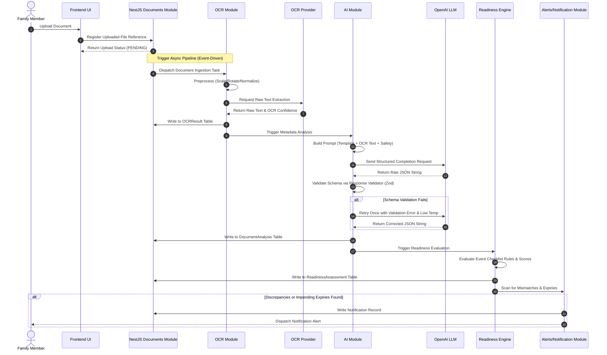

# FamilyOS AI Roadmap (3.3) – Technical Implementation Planning Blueprint

This document defines the structured technical blueprint for the **3.3 AI Roadmap** of FamilyOS. It establishes the architectural design, module divisions, and workflows for OCR text processing, LLM prompt engineering, inconsistency resolution, and chat context window management, based strictly on the approved system documentation.

---

## 1. Objectives

The objective of this planning blueprint is to translate the high-level **3.3 AI Roadmap** requirements into a concrete technical architecture for the FamilyOS backend. This blueprint coordinates the roles, boundaries, pipelines, data flows, and security constraints for the following capabilities:
1. **OCR Text Processing**: Preprocessing and text extraction from document images/PDFs.
2. **LLM Prompt Engineering**: Managing prompt templates, structure, safety, and JSON output schema enforcement.
3. **Inconsistency Resolution**: Cross-document fact comparison (name and address matching) and anomaly reporting.
4. **Context Window Management**: Sliding window historical context, relevant document pruning, and token optimization for conversational AI.

---

## 2. Scope

The scope of this blueprint covers:
- The design of the OCR ingestion pipeline, client/server responsibilities, and error handling.
- The prompt infrastructure, including template design, builders, versioning, validation, and JSON structure enforcement.
- The similarity analysis engine for name spelling and address inconsistencies.
- The session memory and context assembly workflow for the AI Chat Assistant.
- Documented boundaries and dependencies, without inventing thresholds, limits, models, or prompt text.

---

## 3. Documentation Analysis

Based on the official documentation in:
* [02_PRD.md](file:///c:/projects/namasteDevHackathon/familyOS/docs/02_PRD.md)
* [07_Product_Development_Roadmap.md](file:///c:/projects/namasteDevHackathon/familyOS/docs/07_Product_Development_Roadmap.md)
* [08_AI_Architecture.md](file:///c:/projects/namasteDevHackathon/familyOS/docs/08_AI_Architecture.md)
* [09_Document_Processing_Architecture.md](file:///c:/projects/namasteDevHackathon/familyOS/docs/09_Document_Processing_Architecture.md)
* [10_Document_Management_Architecture.md](file:///c:/projects/namasteDevHackathon/familyOS/docs/10_Document_Management_Architecture.md)
* [11_AI_Architecture.md](file:///c:/projects/namasteDevHackathon/familyOS/docs/11_AI_Architecture.md)
* [12_Backend_Module_Roadmap.md](file:///c:/projects/namasteDevHackathon/familyOS/docs/12_Backend_Module_Roadmap.md)
* [04_Database_Design.md](file:///c:/projects/namasteDevHackathon/familyOS/docs/04_Database_Design.md)

### 3.1 Explicitly Documented Requirements
- **Supported Document Families**: Aadhaar Card, PAN Card, Passport, and Driver's License.
- **Supported Life Events**: Driving License Application, Passport Renewal, International Travel Visa, Higher Education Admission, and Health Insurance Claim.
- **Pipeline States**: `PENDING` -> `OCR_PROCESSING` -> `AI_PROCESSING` -> `SUCCESS` or `FAILED`.
- **OCR Integration Layer Boundaries**: Raw text extraction from files (images/PDFs) returning UTF-8 string text. No logical reasoning or corrections.
- **AI Metadata Extraction Layer Boundaries**: Takes raw OCR text and a target schema, returns structured JSON. Nulls fields if missing or illegible.
- **Knowledge Generation Layer (Discrepancy Engine) Boundaries**: Evaluates spelling variations across documents using Levenshtein distance and token matching. Does not rewrite database records; triggers alerts.
- **Readiness Explanation Layer Boundaries**: Explains readiness gaps in bulleted summary form based on rule engine findings.
- **AI Assistant Layer Boundaries**: Scopes answers strictly to provided document context; fallbacks to out-of-scope warning message.
- **Failure Handling**:
  - OCR failure marks status as `FAILED`. User can manually trigger retry.
  - AI extraction failure retries once with lower temperature. If it fails again, status becomes `SUCCESS` but review status is `PENDING_REVIEW` with empty fields for manual entry.

### 3.2 Design Decision Required
The following details are not specified in the documentation and are highlighted for architectural decision:
> [!IMPORTANT]
> - **OCR Service Provider**: The choice between Google Cloud Vision, Tesseract, AWS Textract, or Azure Form Recognizer is undefined (Google Cloud Vision/Tesseract are only listed as examples in roadmap).
> - **OCR Preprocessing Library**: The specific tool/library (e.g., Sharp, Jimp, OpenCV) for image scaling, rotating, and normalization on client/server is unspecified.
> - **OCR Confidence Threshold**: The numeric threshold (e.g., 0.8 or 80%) below which OCR results are marked as failed/limited is unspecified.
> - **LLM Model Selection**: The specific models for classification versus conversational reasoning (e.g., GPT-4o, GPT-4o-mini) are illustrative and not formally decided.
> - **Prompt Repository Storage**: The physical mechanism to store versioned prompts (e.g., in git, database, configuration files, or external registry) is not specified.
> - **Similarity Thresholds**: The specific distance thresholds for Levenshtein distance, Cosine similarity, or token match indicators to trigger a name/address mismatch alert are unspecified.
> - **Token Boundaries & Chunk Sizes**: The context window size, maximum prompt token size, chunking logic, and embedding models are unspecified.
> - **Sliding Window Size**: The exact message count for chat history pruning is not specified (only "e.g., last 5 messages" is documented).

---

## 4. Architecture Impact

### 4.1 Affected Modules
1. **Documents Module** ([Documents Module](file:///c:/projects/namasteDevHackathon/familyOS/docs/12_Backend_Module_Roadmap.md#L9-L23)): Owns file upload signatures, metadata registration, and DB persistence.
2. **OCR Module** ([OCR Module](file:///c:/projects/namasteDevHackathon/familyOS/docs/12_Backend_Module_Roadmap.md#L24-L34)): Receives image reference, pre-processes, invokes external OCR, and writes plain text into the `OCRResult` table.
3. **AI Module** ([AI Module](file:///c:/projects/namasteDevHackathon/familyOS/docs/12_Backend_Module_Roadmap.md#L35-L45)): Coordinates Prompt Builder, OpenAI integration, Response Validator (Zod), and inserts structured results into the `DocumentAnalysis` table.
4. **Readiness Module** ([Readiness Module](file:///c:/projects/namasteDevHackathon/familyOS/docs/12_Backend_Module_Roadmap.md#L46-L57)): Evaluates checklists, readiness score calculation, and links outcomes to the `ReadinessAssessment` table.
5. **AI Assistant Module** ([AI Assistant Module](file:///c:/projects/namasteDevHackathon/familyOS/docs/12_Backend_Module_Roadmap.md#L58-L70)): Handles thread management, session persistence, and contextual prompts.
6. **Notifications Module** ([Notifications Module](file:///c:/projects/namasteDevHackathon/familyOS/docs/12_Backend_Module_Roadmap.md#L71-L81)): Listens to analysis outputs, scans dates, and triggers mismatch or expiration alerts.

### 4.2 Shared AI Utilities & New Responsibilities
- **AI Orchestration Layer**: A facade that coordinates background processing.
- **Prompt Builder Utility**: Reusable module that merges template definitions, safety guardrails, few-shot libraries, and injected contexts.
- **Structured Response Parser & Validator**: Schema-driven Zod wrapper that handles JSON extraction, cleaning, and retry loops.
- **Similarity Comparison Service**: Handles string normalization, token matching, and distance metrics.

### 4.3 Cross-Module Interaction Diagram



---

## 5. OCR Processing Planning

### 5.1 Preprocessing Workflow Sequence
1. **Trigger**: Occurs immediately after a document metadata record is registered with status `PENDING`.
2. **Retrieve File Asset**: The `OcrService` fetches the Cloudinary URL or buffer using secure backend permissions.
3. **Preprocessing Execution**:
   - **Image Scaling**: Standardize image resolution to maximize text legibility.
   - **Rotation Correction**: Deskew and rotate the document orientation to normal landscape/portrait angles.
   - **Image Normalization**: Adjust contrast and brightness to remove shadows or low-contrast background noise.
4. **Text Extraction**: Submit the preprocessed image to the external OCR Provider.
5. **Output Normalization**: Standardize the UTF-8 string output, removing redundant spaces or encoding errors, and persisting the record in `OCRResult`.

### 5.2 Client/Server Responsibilities
- **Client (Frontend)**:
  - Validates file type (e.g. PDF, JPEG, PNG) and file size limits.
  - Handles direct Cloudinary uploads using backend-provided signatures.
  - Renders processing, success, or failure indicators on the Vault UI.
  - Handles manual triggers for retry on failed extractions.
- **Server (Backend)**:
  - Generates signed upload signatures.
  - Orchestrates image preprocessing steps.
  - Interfaces with external OCR providers securely.
  - Caches and stores raw text and extraction confidence in the database.
- **OCR Provider**:
  - Returns machine-readable text and confidence signals from image binaries.

### 5.3 Error and Retry Logic
- If OCR fails or returns empty text, update status in database to `FAILED` with `failureReason`.
- The system does not automate subsequent OCR retries on failure; the user must trigger a retry manually from the library UI.

---

## 6. Prompt Engineering Planning

### 6.1 Prompt Architecture & Components

```
+-----------------------------------------------------------+
|                     Prompt Repository                     |
|  - System Prompts (Persona, Boundaries, Safety Rules)      |
|  - User Prompts (Task definitions, specific schemas)       |
|  - Few-Shot Examples Library (Passport, PAN, Aadhaar, DL)  |
+-----------------------------------------------------------+
                             |
                             v
+-----------------------------------------------------------+
|                       Prompt Builder                      |
|  - Injects contextual OCR Text / User Queries             |
|  - Applies XML / Markdown boundaries for separation       |
|  - Integrates JSON Schema instructions                    |
+-----------------------------------------------------------+
                             |
                             v
+-----------------------------------------------------------+
|                      Structured Output                    |
|  - OpenAI JSON Mode / Tool Calling Output                 |
|  - Zod Validation / Parse Sanitization                    |
+-----------------------------------------------------------+
```

### 6.2 Prompt Lifecycle and Versioning Strategy
- **Prompt Repository**: Store prompts as versioned assets in the codebase (outside inline code logic) to permit independent updates.
- **Prompt Builders**: Merge base system prompts, few-shot guides, context (with clear delimiters), and Zod schema instructions.
- **JSON Schema Enforcement**: Utilize OpenAI's structured output mode (JSON mode or schema bindings) combined with strict Zod validation on the backend.
- **Safety Boundaries**: The system prompts must strictly forbid the LLM from:
  - Making assumptions or inferring missing values (must write `null`).
  - Offering official legal, financial, or government advice.
  - Accessing data outside the current user workspace.

---

## 7. AI Extraction Planning

### 7.1 Metadata Ingestion Workflow
1. **Trigger**: Dispatched upon successful storage of OCR text.
2. **LLM Invocation**: The AI Module retrieves the corresponding prompt and OCR text, sending it to OpenAI.
3. **Structured Validation**: The response parser reads the JSON string and validates it against the Zod schema for the specific document type.
4. **Correction Loop**: If validation fails, compile the error stack and send a secondary query to OpenAI requesting correction (only once, with lowered temperature).
5. **Metadata Verification Mapping**:
   - If successful, write values to the database.
   - If the correction loop fails, write empty fields with `reviewStatus = PENDING_REVIEW`, relying on manual user correction.

### 7.2 Integration with Downstream Consumers
```
                  +-----------------------------------+
                  |        DocumentAnalysis           |
                  |  - Extracted Fields               |
                  |  - Expiry & Mismatch flags        |
                  +-----------------------------------+
                                    |
            +-----------------------+-----------------------+
            |                                               |
            v                                               v
+-----------------------+                       +-----------------------+
|   Readiness Engine    |                       |  Notifications Module |
| - Checklist Rules     |                       | - Cron Expiration Scan|
| - Score Evaluator     |                       | - Discrepancy Alerts  |
+-----------------------+                       +-----------------------+
            |                                               |
            +-----------------------+-----------------------+
                                    |
                                    v
                        +-----------------------+
                        |   AI Chat Assistant   |
                        | - Bounded Context     |
                        | - Vector facts        |
                        +-----------------------+
```

---

## 8. Inconsistency Resolution Planning

### 8.1 Comparison & Matching Workflow
The discrepancy engine evaluates extracted factual data against family workspace profile details.
1. **Data Ingestion**: Read extracted metadata from `DocumentAnalysis` and user profile fields.
2. **Text Normalization**: Clean names and addresses (lowercase, remove punctuation, strip extra spaces).
3. **Similarity Engine Calculations**:
   - **Name Spelling Variants**: Calculate Levenshtein distance and token matches across documents.
   - **Address Inconsistencies**: Compute token match indicators and cosine similarity over normalized address fragments.
4. **Anomaly Scoring**: Trigger warnings when distance/similarity values deviate from defined thresholds.
5. **Downstream Actions**:
   - Write warning flags to `mismatchFlags` in the `DocumentAnalysis` record.
   - Inject mismatch warnings into `mismatchWarnings` under `ReadinessAssessment`.
   - Fire a notification record via the Alerts Module.

### 8.2 Supported Validation Types
- **Name Mismatches**: Spelling errors, initials vs full name, missing middle/surnames.
- **Address Conficts**: Old address vs current address, discrepancies across different government identity documents (Aadhaar vs Passport).

---

## 9. Context Window Management

### 9.1 Chat Assistant Lifecycle & Memory Strategy
1. **Query Scope Isolation**: Identify target family workspace and target family member.
2. **Context Retrieval**:
   - Fetch active conversation messages from the database (`AIMessage` table).
   - Fetch active document summaries, metadata, and readiness checklists associated with the workspace/member.
3. **Token Management & Pruning**:
   - Calculate prompt tokens before invoking the LLM API.
   - **Sliding History Window**: Restrict historical messages to a sliding window of recent interactions (or summarize earlier messages).
   - **Context Truncation**: Prioritize critical document facts and readiness checklist states first. Truncate older messages or less relevant document texts if token counts exceed context limits.
4. **System Boundaries**:
   - Ingress content filters block unrelated or general queries.
   - Out-of-bounds fallback response: *"I can only answer questions related to your family's uploaded documents and readiness checklists."*

---

## 10. AI Service Responsibilities

Responsibilities are divided to preserve separation of concerns and avoid single-prompt bottlenecks:

| Layer | Primary Technical Responsibility |
|---|---|
| **OCR Service** | Receives binary URL, conducts preprocessing, calls external provider, retrieves plain UTF-8 text. |
| **AI Extraction Service** | Formulates metadata prompts, controls LLM query parameters, validates JSON output using Zod schemas, executes the single-retry correction loop. |
| **Discrepancy Engine** | Performs Levenshtein distance, Cosine similarity, and token match calculations. Records warnings in DB. |
| **Readiness Engine** | Evaluates checklist completion rules against structured metadata. Computes scores. Calls AI to generate summaries explaining scores. |
| **Context Builder Service** | Measures context token counts, prunes old messages, scopes data to active workspace, and builds final assistant prompt. |
| **Alert Service** | Runs background cron scanners to check expiration dates and dispatch notifications. |

---

## 11. Performance Planning

- **Asynchronous Execution**: Ingestion, OCR, and AI metadata extraction must run on background threads using an event-driven architecture, returning `202 Accepted` to client requests.
- **caching Strategies**:
  - Store OCR output in the `OCRResult` table to prevent re-extracting text on subsequent analyses.
  - Cache static life event checklists, rules, and guidance summaries in Redis or database memory.
- **Token Pruning**: Pre-clean OCR texts (remove spaces, symbols) before injection into prompt contexts.
- **Cost Routing**: Utilize cheaper models for simple tasks (classification) and preserve expensive models for conversational reasoning.

---

## 12. Security & Privacy

- **Workspace Isolation**: SQL and NoSQL queries must strictly scope document fetches to the authenticated family ID. Under no circumstances may data from another family workspace be injected into prompts.
- **Signed Storage Access**: All documents in Cloudinary are restricted. Timed signed download URLs (`expires_in = 15 minutes`) must be generated for all rendering and backend fetches.
- **No Training Data Usage**: Confirm that the API agreement with the LLM provider prevents user documents and chat text from being utilized to train models.
- **Information Minimization**: Redact or avoid sending irrelevant PII (e.g. full biometric hashes, unneeded phone numbers) to the LLM. Only send fields required for schema validation.

---

## 13. Testing Strategy

### 13.1 Unit & Service Tests
- **OCR Validation**: Mock OCR responses returning clean, garbled, or empty strings to test failure paths.
- **Zod Schema Tests**: Verify validation logic on correct JSON structures, invalid types, and empty values.
- **Similarity Engine Tests**: Run unit tests on name/address comparison algorithms with predefined test pairs (e.g. "John Smith" vs "John S.").
- **Readiness Scoring Tests**: Assert correct score computations against varying combinations of missing, present, and mismatched files.

### 13.2 Regression & E2E Tests
- **Golden OCR Datasets**: Maintain a repository of sample OCR plain text outputs. Run regression tests against updated extraction prompts to ensure accuracy does not decline.
- **Session Boundary Tests**: Attempt queries requesting cross-workspace document information to verify that the system blocks the request or filters it out.
- **Message Stream Tests**: Test streaming responses from the OpenAI assistant interface.

---

## 14. Dependencies

- **Authentication**: JWT token validation, role management.
- **Storage**: Cloudinary signed uploads and asset deletion APIs.
- **Database**: Prisma Client connected to Neon PostgreSQL.
- **External AI Providers**: OpenAI API, Third-party OCR Provider.

---

## 15. Risks & Mitigations

| Risk | Mitigation |
|---|---|
| **OCR Quality Degradation** | Poor quality scans are captured as FAILED, prompting user alerts and enabling manual entry overrides. |
| **LLM Output Format Instability** | Mitigated through Zod validation schemas and automated one-time JSON formatting correction retries. |
| **API Rate Limits & Latency** | Handled by executing I/O bound tasks asynchronously in background threads and using optimistic UI loading states. |
| **Context Window Overflow** | Mitigated by using pre-calculation token counts and context-truncation sliding windows. |
| **Cost Overruns** | Restrict document upload file sizes and chat history depth. |

---

## 16. Documentation Gaps

The following parameters must be formally defined by product owners and stakeholders before implementation starts:
1. **OCR Provider**: Confirm the choice of OCR provider API.
2. **Preprocessing Settings**: Confirm whether image rotation, scaling, and contrast adjustment will occur on the client side (in browser/app) or on the backend server.
3. **Confidence Scoring Thresholds**: Define the exact numeric thresholds below which an OCR result or AI extraction is marked as `FAILED` or `Needs Review`.
4. **Similarity Engine Thresholds**: Define the Levenshtein distance limit and Cosine similarity margin used to declare a name or address mismatch.
5. **Token Limits**: Define maximum token limits for LLM prompts and context windows.
6. **Chat History Pruning Policy**: Confirm the message count limit for the sliding history window.
7. **Vector / Embedding Model**: Specify whether embeddings and vector searches will be implemented for context retrieval, or if keyword/metadata matching is sufficient for the MVP.

---

## 17. Execution Order

Milestones must progress sequentially to ensure data dependencies are met:

```
[ Phase 1: Ingestion & OCR ]
  - Implement async OCR background workers.
  - Setup OCRResult storage and OCR GET endpoints.
            |
            v
[ Phase 2: Prompt & Extraction Infrastructure ]
  - Define prompt repository, Zod schemas, and Prompt Builders.
  - Build OpenAI service integrations and Response Validators.
            |
            v
[ Phase 3: Inconsistency Resolution & Scoring ]
  - Build the similarity engine (Levenshtein, Cosine metrics).
  - Implement the Readiness checklist scoring algorithm.
            |
            v
[ Phase 4: Context Management & Assistant ]
  - Setup token estimating utilities and context pruning.
  - Implement session memory and streaming chat APIs.
            |
            v
[ Phase 5: Verification & Deployment ]
  - Run regression tests on golden datasets.
  - Deploy to Railway, Neon connection pooling, and verify.
```

---

## 18. Acceptance Criteria

- **Architecture**: Ingestion and AI processes are decoupled from HTTP request loops, running asynchronously in background handlers.
- **OCR Pipeline**: Documents successfully transition states to `OCR_PROCESSING` and write plain UTF-8 text to `OCRResult`.
- **AI Extraction**: AI Module outputs validated JSON according to document type Zod schemas, failing gracefully into a manual edit request on error.
- **Similarity checks**: Name/address mismatches are flagged in `DocumentAnalysis` and surfaced in the `ReadinessAssessment` schema.
- **Context Boundaries**: AI Chat responses retrieve data only from the active workspace, failing gracefully when queries are out of scope.
- **Security**: Cloudinary URLs are signed and limited to 15-minute validity.

---

## 19. Definition of Done

- [ ] Approved documentation thoroughly analyzed.
- [ ] Technical module impacts and boundaries established.
- [ ] OCR pipeline and client/server ownership detailed.
- [ ] Prompt architecture and validation flow specified.
- [ ] Similarity comparison algorithms mapped.
- [ ] Context pruning and token management workflows planned.
- [ ] Monitoring, performance, and security requirements incorporated.
- [ ] Testing strategies mapped.
- [ ] Gaps in documentation explicitly isolated.
- [ ] Sequence of execution prepared.
- [ ] Acceptance criteria defined.
