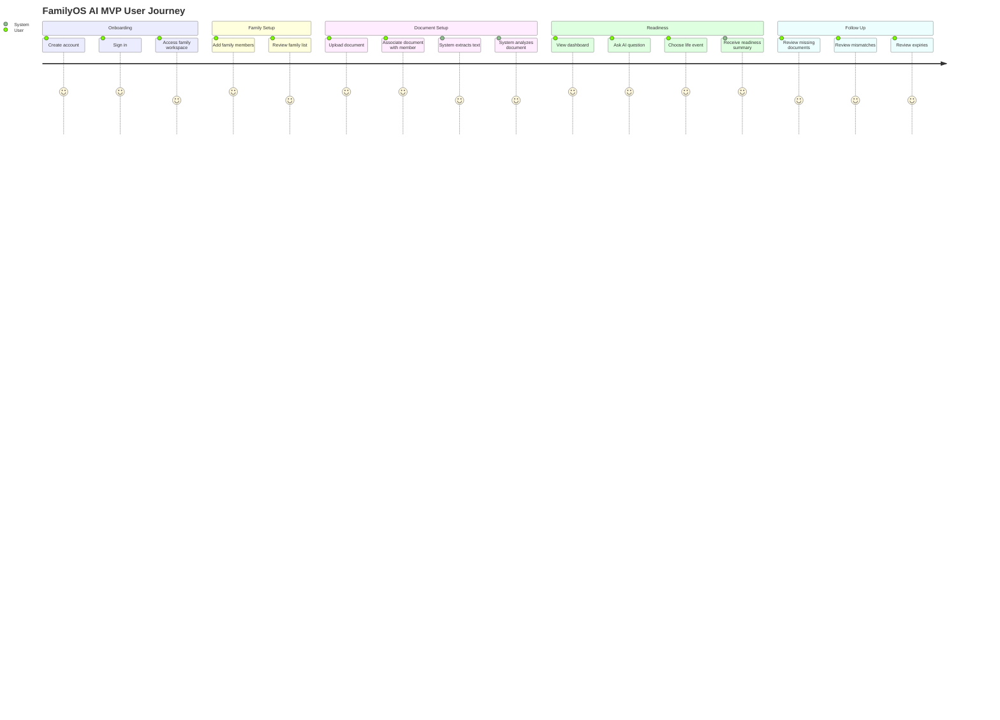
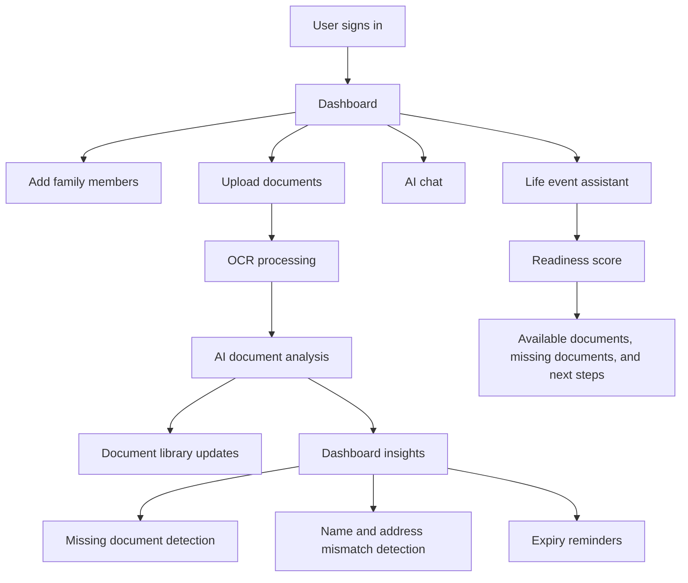

# FamilyOS AI MVP Product Requirements Document

## Document Control

| Item | Detail |
|---|---|
| Project | FamilyOS AI |
| Document | MVP Product Requirements Document |
| Version | 1.0 |
| Status | Draft for MVP planning |
| Source Reference | `docs/project-blueprint.md` |
| Audience | Product, Design, Frontend, Backend, QA |

## 1. Introduction

FamilyOS AI is an AI-powered Family Digital Secretary focused on helping families manage document readiness, not just document storage.

This Product Requirements Document defines what must be built for the MVP. It follows the approved Project Blueprint and translates the product vision into user-facing product behavior, feature expectations, acceptance criteria, and release readiness requirements.

This document intentionally does not define APIs, database schema, backend implementation, frontend implementation, infrastructure, or detailed UI design. Those topics will be covered in separate architecture and technical documents.

## 2. Product Overview

FamilyOS AI provides a secure family workspace where users can add family members, upload important documents, and receive AI-powered insights about document readiness.

The MVP should allow users to:

- Create and access a secure account.
- Manage family members in a family workspace.
- Upload important documents for family members.
- View uploaded documents in a document library.
- Allow the system to extract and analyze document content.
- Ask an AI assistant questions about uploaded documents.
- Check readiness for supported life events.
- Identify missing documents, mismatched names or addresses, and upcoming expirations.
- View a dashboard summary of family document status.

The product experience should feel trustworthy, clear, and practical for families handling sensitive documents.

## 3. Business Objectives

| Objective | Description | MVP Outcome |
|---|---|---|
| Validate core value proposition | Confirm that users value AI-powered document readiness over simple storage | Users upload documents and engage with readiness insights |
| Establish trust | Create confidence in storing and reviewing sensitive family documents | Users understand document status and AI outputs clearly |
| Drive activation | Encourage users to set up family members and upload documents | Users complete workspace setup and upload first documents |
| Demonstrate AI utility | Show practical AI value through document analysis and life event guidance | Users ask readiness questions and receive useful responses |
| Create scalable product foundation | Define clear product behavior for future architecture documents | Product, design, engineering, and QA can proceed from shared requirements |

## 4. Target Audience

| Audience | Priority | Description |
|---|---|---|
| Families | Primary | Families that need a shared, organized, intelligent vault for life documents |
| Individuals | Secondary | Individuals managing personal identity, travel, education, financial, or government documents |
| Legal advisors | Future | Professionals who may help families review document readiness |
| Insurance advisors | Future | Professionals who may request and validate policy-related documents |
| Financial planners | Future | Professionals who may help users prepare financial documentation |

## 5. User Roles

| Role | MVP Availability | Description |
|---|---|---|
| Account Owner | Yes | Primary user who creates the account and manages the family workspace |
| Family Member | Yes | Person represented inside the workspace whose documents can be stored and reviewed |
| AI Assistant | Yes | System capability that helps interpret documents and answer readiness questions |
| Advisor | No | Future external professional with controlled access |
| Workspace Collaborator | No | Future invited user with shared workspace permissions |

## 6. User Personas

### Persona 1: Family Organizer

| Attribute | Detail |
|---|---|
| Profile | Parent, guardian, or responsible family member |
| Primary need | Keep family documents organized and ready for important events |
| Pain points | Missing documents, scattered files, expiry tracking, inconsistent names or addresses |
| Success moment | Quickly knows whether the family is ready for a government or life event |

### Persona 2: Individual Planner

| Attribute | Detail |
|---|---|
| Profile | Student, professional, traveler, or person managing personal documents |
| Primary need | Maintain personal documents and understand readiness for applications |
| Pain points | Confusing requirements, missed renewals, difficulty finding documents |
| Success moment | Gets a clear checklist and readiness score for a life event |

### Persona 3: Future Advisor

| Attribute | Detail |
|---|---|
| Profile | Legal, insurance, or financial professional |
| Primary need | Review client document readiness with permission |
| Pain points | Manual collection, repeated follow-ups, unclear document status |
| Success moment | Can assess readiness without requesting the same documents repeatedly |

## 7. User Stories

| ID | User Story | Priority |
|---|---|---|
| US-001 | As a user, I want to create an account so that my family documents are protected. | Must Have |
| US-002 | As a user, I want to sign in securely so that only authorized users can access my workspace. | Must Have |
| US-003 | As a user, I want to add family members so that documents can be organized by person. | Must Have |
| US-004 | As a user, I want to upload documents so that FamilyOS AI can store and analyze them. | Must Have |
| US-005 | As a user, I want to associate documents with family members so that readiness checks are accurate. | Must Have |
| US-006 | As a user, I want to view uploaded documents in a library so that I can find what has already been added. | Must Have |
| US-007 | As a user, I want the system to extract text from documents so that manual entry is reduced. | Must Have |
| US-008 | As a user, I want AI to identify document type and key details so that documents become understandable. | Must Have |
| US-009 | As a user, I want to ask questions about my documents so that I can get quick guidance. | Must Have |
| US-010 | As a user, I want to check readiness for a life event so that I know what is available and missing. | Must Have |
| US-011 | As a user, I want a readiness score so that I can quickly understand preparedness. | Must Have |
| US-012 | As a user, I want missing documents identified so that I know what to collect next. | Must Have |
| US-013 | As a user, I want name and address mismatches highlighted so that I can avoid process delays. | Should Have |
| US-014 | As a user, I want expiry reminders so that I can renew documents before they expire. | Should Have |
| US-015 | As a user, I want a dashboard summary so that I can understand family document health at a glance. | Must Have |

## 8. User Journey

## 9. Feature List

| Feature | MVP Description |
|---|---|
| Authentication | Secure account creation, login, logout, and protected access |
| Dashboard | Summary of family members, documents, alerts, and readiness indicators |
| Family Management | Add, edit, and view family members |
| Document Upload | Upload supported documents and associate them with members |
| Document Library | View, search, filter, and inspect uploaded documents at a product level |
| OCR Processing | Extract readable text from uploaded documents |
| AI Document Analysis | Identify document type and important extracted attributes |
| AI Chat | Ask document-related questions and receive contextual guidance |
| Life Event Assistant | Check preparedness for supported life events |
| Readiness Score | Show a simple preparedness indicator for life event readiness |
| Missing Document Detection | Identify documents unavailable for a selected life event |
| Name/Address Mismatch Detection | Surface likely inconsistencies across uploaded documents |
| Expiry Reminder | Identify expired or soon-to-expire documents |

## 10. Feature Prioritization

### MoSCoW Prioritization

| Priority | Features |
|---|---|
| Must Have | Authentication, Dashboard, Family Management, Document Upload, Document Library, OCR Processing, AI Document Analysis, AI Chat, Life Event Assistant, Readiness Score, Missing Document Detection |
| Should Have | Name/Address Mismatch Detection, Expiry Reminder, confidence and uncertainty messaging, basic document review states |
| Could Have | Search enhancements, richer filters, document tagging, downloadable readiness summary, manual document checklist without upload |
| Won't Have | Direct government submission, payments, advisor portal, native mobile app, multi-workspace support, legal advice, financial advice, official identity verification |

## 11. Detailed Feature Specifications

### 11.1 Authentication

| Item | Requirement |
|---|---|
| Description | Users must be able to create an account, sign in, access protected product areas, and sign out. |
| Goal | Protect sensitive family document information and ensure each user accesses only their own workspace. |
| User Flow | User opens product, creates an account or signs in, accesses the family workspace, and signs out when finished. |
| Acceptance Criteria | User can register successfully with valid information. User can sign in with valid credentials. Invalid credentials are rejected with a clear error. Signed-out users cannot access protected product areas. User can sign out successfully. |
| Edge Cases | Duplicate account attempt, invalid email format, weak or invalid password, expired session, interrupted session, repeated failed login attempts. |
| Success Criteria | Users can reliably access their own workspace and unauthorized access is blocked. |

### 11.2 Dashboard

| Item | Requirement |
|---|---|
| Description | The dashboard must summarize the user's family workspace status, including family members, uploaded documents, readiness indicators, missing documents, mismatches, and expiries where available. |
| Goal | Give users an immediate understanding of family document health. |
| User Flow | User signs in and lands on or navigates to the dashboard. User reviews document status, alerts, and readiness indicators. User selects a relevant item to continue deeper into the product. |
| Acceptance Criteria | Dashboard shows a meaningful empty state for new users. Dashboard updates after family members and documents are added. Dashboard highlights missing, mismatched, or expiring documents when detected. Dashboard does not present uncertain AI output as verified fact. |
| Edge Cases | No family members, no uploaded documents, documents still being processed, failed document analysis, incomplete data, conflicting AI findings. |
| Success Criteria | Users can understand the current state of their family document readiness without needing to inspect every document manually. |

### 11.3 Family Management

| Item | Requirement |
|---|---|
| Description | Users must be able to add, view, and update family members within their family workspace. |
| Goal | Organize documents and readiness checks around real people in the family. |
| User Flow | User opens family management, adds a family member, enters required basic details, saves the member, and later updates member information if needed. |
| Acceptance Criteria | User can create a family member. User can view the family member list. User can update member information. Family members can be selected when associating documents. The system clearly handles missing required member information. |
| Edge Cases | Duplicate member names, incomplete member details, accidental repeated entry, member with no documents, document associated with wrong member. |
| Success Criteria | Users can maintain a clear family structure that supports document organization and readiness checks. |

### 11.4 Document Upload

| Item | Requirement |
|---|---|
| Description | Users must be able to upload supported document files and associate each upload with a family member where applicable. |
| Goal | Capture the documents required for AI analysis, readiness checks, and document library visibility. |
| User Flow | User selects upload, chooses a document, assigns it to a family member or self, confirms upload, and sees the document enter processing or available status. |
| Acceptance Criteria | User can upload supported file types. Unsupported file types are rejected with a clear message. User can associate a document with a family member. User receives clear feedback for upload success, upload failure, and processing state. |
| Edge Cases | Large file, unsupported file type, poor image quality, duplicate document, interrupted upload, wrong family member selected, upload succeeds but processing fails. |
| Success Criteria | Users can reliably add documents and understand what happened after upload. |

### 11.5 Document Library

| Item | Requirement |
|---|---|
| Description | Users must be able to view uploaded documents and their product-level status in a library. |
| Goal | Make uploaded documents findable, reviewable, and understandable. |
| User Flow | User opens the document library, reviews documents, filters or searches where available, opens a document summary, and checks associated member, document type, status, and extracted insights. |
| Acceptance Criteria | Library shows uploaded documents. Each document has a clear status. User can identify which family member a document belongs to. User can distinguish analyzed documents from documents still processing or failed. Empty state guides users to upload documents. |
| Edge Cases | No documents, many documents, duplicate-looking documents, unknown document type, failed analysis, document without associated member. |
| Success Criteria | Users can quickly understand which documents exist and which need attention. |

### 11.6 OCR Processing

| Item | Requirement |
|---|---|
| Description | The system must extract text from uploaded documents when possible. |
| Goal | Reduce manual data entry and prepare document content for AI analysis. |
| User Flow | User uploads a document. The system processes the document and extracts readable text. User sees whether extraction succeeded, partially succeeded, or failed. |
| Acceptance Criteria | Uploaded documents enter an extraction process. Extracted text supports later analysis. Poor-quality documents are handled gracefully. Users are informed when text could not be extracted reliably. |
| Edge Cases | Blurry image, low contrast, rotated document, handwritten content, partial scan, multi-page document, password-protected file, unsupported language or script. |
| Success Criteria | A meaningful portion of supported uploaded documents can be converted into usable text for analysis. |

### 11.7 AI Document Analysis

| Item | Requirement |
|---|---|
| Description | The system must analyze extracted document content to identify document type and important document attributes where possible. |
| Goal | Turn uploaded files into structured product understanding that supports readiness, mismatch detection, expiry reminders, and AI chat. |
| User Flow | After OCR processing, the system analyzes the document. User can review the detected document type, key information, and any uncertainty or failure state. |
| Acceptance Criteria | System identifies common document types where possible. System extracts important details where available. System communicates uncertainty when confidence is low. System does not claim official verification. User can understand whether a document was successfully analyzed. |
| Edge Cases | Unknown document type, conflicting text, multiple documents in one upload, poor OCR result, missing fields, unofficial or non-standard document format, AI uncertainty. |
| Success Criteria | Users receive understandable document insights that support readiness workflows. |

### 11.8 AI Chat

| Item | Requirement |
|---|---|
| Description | Users must be able to ask document-related questions and receive AI responses based on available family document context. |
| Goal | Help users get quick, contextual guidance from their uploaded documents. |
| User Flow | User opens AI chat, asks a question, receives an answer that references available information, gaps, and suggested next steps. |
| Acceptance Criteria | Chat can answer questions about uploaded document availability and readiness. Chat explains when information is missing. Chat avoids presenting guidance as official legal or government advice. Chat should not expose documents outside the user's workspace. |
| Edge Cases | User asks unrelated question, user asks for legal advice, insufficient uploaded documents, conflicting document data, AI cannot determine answer, unsafe or sensitive request. |
| Success Criteria | Users receive useful, bounded, document-aware answers that help them decide what to do next. |

### 11.9 Life Event Assistant

| Item | Requirement |
|---|---|
| Description | Users must be able to ask about or select a supported life event and receive a readiness summary. |
| Goal | Help users prepare for important processes using documents already available in the workspace. |
| User Flow | User selects or asks about a life event, chooses relevant family member if needed, system checks available documents, and returns available documents, missing documents, readiness score, and next steps. |
| Acceptance Criteria | User can initiate a supported life event readiness check. System identifies relevant available documents. System lists likely missing documents or information. System provides a high-level process summary. System clearly states when guidance is informational. |
| Edge Cases | Unsupported life event, no documents uploaded, document analysis incomplete, multiple family members, uncertain requirements, conflicting document details. |
| Success Criteria | Users understand whether they are ready for a selected life event and what to do next. |

### 11.10 Readiness Score

| Item | Requirement |
|---|---|
| Description | The system must provide a simple score or indicator showing preparedness for a selected life event. |
| Goal | Give users a quick summary of readiness without requiring them to interpret every document manually. |
| User Flow | User runs a life event check. System evaluates available and missing information and displays a readiness result with explanation. |
| Acceptance Criteria | Readiness result is easy to understand. Score is accompanied by reasons. Missing or uncertain information lowers confidence. Score does not imply official eligibility or approval. |
| Edge Cases | No documents, incomplete analysis, uncertain document type, conflicting details, unknown requirements, unsupported event. |
| Success Criteria | Users can quickly understand preparedness and identify the next best action. |

### 11.11 Missing Document Detection

| Item | Requirement |
|---|---|
| Description | The system must identify documents that appear unavailable for a supported life event. |
| Goal | Help users collect missing documents before starting a process. |
| User Flow | User asks about a life event. System compares expected document needs with available analyzed documents and lists missing items. |
| Acceptance Criteria | Missing document results are shown clearly. Available documents are separated from missing documents. System explains when analysis is limited by incomplete uploads or unknown document types. |
| Edge Cases | Document uploaded but not analyzed, document type uncertain, document belongs to another member, duplicate documents, unsupported life event. |
| Success Criteria | Users know which documents they likely need to collect next. |

### 11.12 Name/Address Mismatch Detection

| Item | Requirement |
|---|---|
| Description | The system should detect likely name or address inconsistencies across uploaded documents for the same family member. |
| Goal | Reduce delays caused by inconsistent identity or address information across documents. |
| User Flow | User uploads and analyzes multiple documents for a member. System compares extracted names and addresses and surfaces likely mismatches. User reviews mismatch warning and decides next steps. |
| Acceptance Criteria | System highlights likely name inconsistencies. System highlights likely address inconsistencies. System communicates uncertainty and avoids declaring legal invalidity. System keeps mismatch findings associated with the relevant family member. |
| Edge Cases | Initials versus full name, spelling variations, old address versus current address, multilingual text, OCR error, documents belonging to different members, partial address match. |
| Success Criteria | Users become aware of likely inconsistencies that may require review or correction. |

### 11.13 Expiry Reminder

| Item | Requirement |
|---|---|
| Description | The system should identify documents that are expired or nearing expiry when expiry information is available. |
| Goal | Help users avoid missed renewals and last-minute document issues. |
| User Flow | User uploads documents. System extracts expiry dates where available. Dashboard and document library surface expired or soon-to-expire documents. |
| Acceptance Criteria | Expired documents are clearly identified. Soon-to-expire documents are clearly identified. Documents without expiry dates do not show false expiry warnings. Users understand that expiry detection depends on available document data. |
| Edge Cases | No expiry date present, OCR reads date incorrectly, multiple dates on one document, date format ambiguity, expired document uploaded intentionally, renewal already completed but old document remains. |
| Success Criteria | Users can identify documents that require renewal attention. |

## 12. Non Functional Requirements

| Category | Requirement |
|---|---|
| Reliability | Core account, family, upload, dashboard, and assistant workflows should behave consistently. |
| Performance | Product screens should remain responsive during normal usage, including when documents are processing. |
| Scalability | Product behavior should support future growth in users, documents, and AI workloads. |
| Availability | Users should receive clear status when product capabilities are temporarily unavailable. |
| Maintainability | Requirements should remain modular enough for independent frontend and backend delivery. |
| Observability | Product behavior should support meaningful diagnostics for failed uploads, failed analysis, and assistant errors. |
| Data integrity | Users should never see another family's information. |
| AI safety | AI responses must remain bounded, explain uncertainty, and avoid official legal, financial, or government claims. |

## 13. Accessibility Requirements

| Area | Requirement |
|---|---|
| Keyboard access | Core workflows should be usable without relying only on pointer input. |
| Screen reader support | Important statuses, errors, and form states should be understandable to assistive technologies. |
| Color independence | Alerts and readiness indicators should not rely on color alone. |
| Text clarity | Product copy should be concise, plain, and readable. |
| Error identification | Form and workflow errors should clearly identify what needs correction. |
| Focus management | Users should be able to navigate forms, upload flows, chat, and alerts predictably. |

## 14. Security Requirements

| Area | Requirement |
|---|---|
| Authentication | Protected product areas must require authenticated access. |
| Authorization | A user must only access their own family workspace and documents. |
| Session handling | Users must be able to sign out, and expired sessions must be handled clearly. |
| Sensitive data protection | Document-related information must be treated as sensitive. |
| Upload safety | Unsupported or invalid uploads must be rejected safely. |
| AI boundaries | AI must not reveal data outside the user's workspace. |
| Abuse prevention | Repeated invalid actions should be handled in a controlled way. |

## 15. Privacy Requirements

| Area | Requirement |
|---|---|
| Family data isolation | Each family workspace must remain private to its account owner in MVP. |
| Minimum necessary display | Product screens should show only information needed for the user's current task. |
| User awareness | Users should understand when documents are being analyzed by AI. |
| Sensitive AI output | AI responses should avoid exposing unnecessary personal details. |
| Data correction | Users should be able to recognize when AI-extracted information may need review. |
| No advisor access in MVP | External advisors must not access user workspaces in the MVP. |

## 16. Error Handling Requirements

| Scenario | Required Product Behavior |
|---|---|
| Invalid login | Show a clear error without exposing sensitive security details. |
| Session expired | Ask user to sign in again and avoid losing context where practical. |
| Upload failed | Explain that upload failed and allow retry. |
| Unsupported file | Explain that the selected file is not supported. |
| OCR failed | Mark extraction as failed or limited and allow user to continue where possible. |
| AI analysis failed | Show that analysis could not be completed and avoid using incomplete results as facts. |
| Chat unavailable | Explain that assistant response is unavailable and allow retry later. |
| Life event unsupported | Explain that the selected or requested event is not supported in MVP. |
| Missing data | Explain which information is missing and how the user can improve readiness. |

## 17. Notifications

MVP notifications are product-level notifications shown inside the application. External channels such as email, SMS, WhatsApp, and calendar integrations are future scope.

| Notification Type | MVP Behavior |
|---|---|
| Upload status | Inform users when upload succeeds, fails, or enters processing. |
| Processing status | Inform users when OCR or AI analysis is pending, completed, limited, or failed. |
| Missing document alert | Surface missing documents in dashboard and readiness views. |
| Mismatch alert | Surface likely name or address inconsistencies when detected. |
| Expiry alert | Surface expired and soon-to-expire documents when expiry information is available. |
| Assistant limitation | Inform users when the assistant cannot answer due to missing or uncertain information. |

## 18. Assumptions

| Assumption | Description |
|---|---|
| MVP is web-first | Native mobile apps are not part of MVP. |
| Initial document focus is Indian family documents | Examples include Aadhaar, PAN, Passport, and similar life documents. |
| AI output requires user judgment | AI insights may be uncertain and should support, not replace, user review. |
| Government guidance is informational | FamilyOS AI does not submit applications or guarantee eligibility. |
| One account owner manages the workspace | Shared workspace collaboration is future scope. |
| Documents can vary in quality | OCR and analysis must handle imperfect uploads gracefully. |

## 19. Constraints

| Constraint | Description |
|---|---|
| Locked technology stack | Product requirements must align with the approved stack in the Project Blueprint. |
| MVP discipline | Only features needed to validate the core value proposition are included. |
| Sensitive data domain | Security, privacy, and trust must influence all product behavior. |
| AI uncertainty | Product language must account for uncertain extraction and analysis. |
| No direct government integration | The product provides guidance, not official submission. |
| Parallel team delivery | Requirements must be clear enough for frontend and backend work to proceed independently. |

## 20. Out of Scope

The following are not part of the MVP:

- Direct government application submission.
- Official document verification.
- Legal, financial, tax, or insurance advice.
- Advisor-facing portal.
- Multi-user workspace collaboration.
- Multiple family workspaces per account.
- Native mobile applications.
- Payment workflows.
- Email, SMS, WhatsApp, or calendar reminder integrations.
- Detailed document editing workflows.
- API design.
- Database design.
- UI design specifications.

## 21. Future Enhancements

| Enhancement | Description |
|---|---|
| Advisor access | Controlled access for legal, insurance, and financial advisors. |
| External reminders | Email, SMS, WhatsApp, and calendar-based reminders. |
| Multi-workspace support | Ability to manage multiple family groups. |
| Secure sharing | Temporary sharing of selected documents or readiness summaries. |
| Emergency vault mode | Fast access to critical documents during urgent situations. |
| Advanced verification | Deeper authenticity and consistency checks. |
| Mobile apps | Native iOS and Android experiences. |
| Multi-language support | Support for regional languages. |
| Expanded life events | Broader support for education, travel, insurance, finance, and legal workflows. |
| Downloadable readiness report | User-friendly summary for offline review or advisor discussion. |

## 22. MVP Acceptance Checklist

| Area | Acceptance Requirement | Status |
|---|---|---|
| Blueprint alignment | PRD follows the approved Project Blueprint and does not contradict MVP scope. | Pending Review |
| Authentication | User can register, sign in, access protected areas, and sign out. | Pending Build |
| Dashboard | User can see meaningful workspace, document, alert, and readiness summaries. | Pending Build |
| Family Management | User can add, view, and update family members. | Pending Build |
| Document Upload | User can upload supported documents and associate them with family members. | Pending Build |
| Document Library | User can view uploaded documents and understand their status. | Pending Build |
| OCR Processing | System can extract text where possible and communicate failure or uncertainty. | Pending Build |
| AI Document Analysis | System can identify document type and important details where possible. | Pending Build |
| AI Chat | User can ask document-related questions and receive bounded contextual guidance. | Pending Build |
| Life Event Assistant | User can check readiness for supported life events. | Pending Build |
| Readiness Score | User receives a clear preparedness indicator with explanation. | Pending Build |
| Missing Document Detection | System identifies likely missing documents for supported life events. | Pending Build |
| Name/Address Mismatch Detection | System highlights likely inconsistencies without overstating certainty. | Pending Build |
| Expiry Reminder | System identifies expired or soon-to-expire documents when dates are available. | Pending Build |
| Error Handling | User receives clear, non-technical errors for failed workflows. | Pending Build |
| Security | Workspace and document access remain private to the authenticated user. | Pending Build |
| Privacy | Sensitive information is handled with clear user awareness and minimal unnecessary exposure. | Pending Build |
| Accessibility | Core workflows meet baseline accessibility expectations. | Pending Build |

## Feature Flow

