# FamilyOS AI System Architecture Document

## Document Control

| Item | Detail |
|---|---|
| Project | FamilyOS AI |
| Document | System Architecture Document |
| Version | 1.0 |
| Status | Draft for architecture review |
| References | `docs/01_Project_Blueprint.md`, `docs/project-blueprint.md`, `docs/02_PRD.md` |
| Audience | Architecture, Frontend, Backend, QA, Product |

## 1. Introduction

FamilyOS AI is an AI-powered Family Digital Secretary that helps families organize, understand, and prepare important life documents for government and life events.

This document defines how the major system components interact for the MVP. It translates the approved Project Blueprint and PRD into a technology-aware architecture reference for frontend and backend development.

This is not a low-level implementation document. It does not define APIs, database schema, DTOs, folder structures, implementation code, or specific backend module names.

## 2. Architecture Goals

| Goal | Description |
|---|---|
| Secure document readiness platform | Protect sensitive family documents and document intelligence across all workflows |
| Clear component ownership | Define responsibility boundaries between frontend, backend, database, storage, OCR, and AI services |
| AI-enabled document understanding | Support OCR, document analysis, chat, readiness scoring, mismatch detection, and missing document detection |
| Parallel development | Allow frontend and backend developers to work independently against agreed behavior and architecture boundaries |
| MVP discipline | Support the MVP scope without designing future-only complexity into the first release |
| Extensibility | Leave clear paths for future advisor access, external reminders, more life events, and deeper verification |
| Operational clarity | Make failure states, trust boundaries, and external integration risks explicit before implementation |

## 3. Architecture Principles

| Principle | Architectural Meaning |
|---|---|
| Privacy by design | Sensitive family data is isolated by workspace and protected throughout the system |
| Backend as system authority | The backend owns business decisions, access control, orchestration, and persistence coordination |
| Frontend as experience layer | The frontend presents product workflows, validation feedback, status, and AI results clearly |
| External services are bounded | Cloudinary, OpenAI, and OCR capabilities are treated as external dependencies behind controlled backend orchestration |
| AI output is assistive | AI provides guidance and insights, not official legal, financial, identity, or government verification |
| Explicit uncertainty | OCR and AI confidence limitations must be represented in product behavior |
| Fail gracefully | Upload, OCR, AI, and readiness workflows must expose clear statuses when partial or failed |
| Contract-driven delivery | Frontend and backend alignment should be established through later API contract documentation |

## 4. High Level Architecture

FamilyOS AI follows a web SaaS architecture with a Next.js frontend, a NestJS backend, PostgreSQL for structured data, Cloudinary for document storage, OpenAI for AI reasoning, and an OCR provider for text extraction.

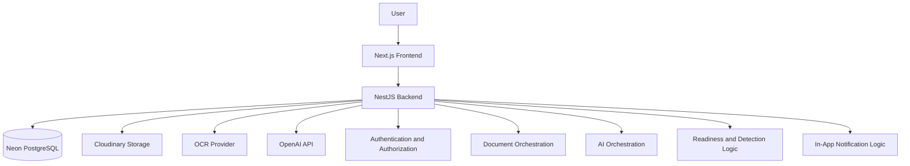

### High Level Responsibilities

| Layer | Responsibility |
|---|---|
| User Interface | Enables account, family, upload, document library, dashboard, chat, and readiness workflows |
| Backend Application | Coordinates authentication, authorization, business workflows, AI, OCR, storage, and persistence |
| Structured Data Store | Stores application records, user-owned workspace information, document metadata, statuses, and derived intelligence |
| Object Storage | Stores uploaded document files and related media assets |
| OCR Provider | Extracts text from uploaded documents where possible |
| AI Provider | Performs document interpretation, assistant reasoning, readiness guidance, and summarization |

## 5. Logical Architecture

The logical architecture separates product capabilities from infrastructure dependencies.

```mermaid
flowchart LR
    subgraph Experience[Experience Layer]
        Dashboard[Dashboard]
        FamilyUI[Family Management]
        UploadUI[Document Upload]
        LibraryUI[Document Library]
        ChatUI[AI Chat]
        LifeEventUI[Life Event Assistant]
    end

    subgraph Application[Application Layer]
        Auth[Auth and Session Control]
        Family[Family Workspace Logic]
        Documents[Document Workflow Logic]
        Processing[OCR and AI Processing Orchestration]
        Readiness[Readiness and Detection Logic]
        Notifications[In-App Notifications]
    end

    subgraph Data[Data and External Services]
        DB[(PostgreSQL)]
        Storage[Cloudinary]
        OCR[OCR Provider]
        OpenAI[OpenAI API]
    end

    Experience --> Application
    Application --> Data
```

## 6. System Components

### Component Diagram

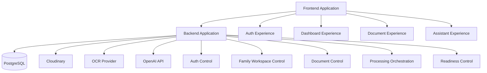

### 6.1 Frontend

The frontend is the user experience layer for FamilyOS AI.

| Responsibility | Description |
|---|---|
| User workflows | Provides flows for authentication, dashboard, family management, upload, library, AI chat, and life event readiness |
| Input collection | Collects user-provided information needed for product workflows |
| Status presentation | Displays upload, OCR, AI analysis, readiness, mismatch, expiry, and error states |
| Client-side validation | Provides early feedback before submitting user actions |
| Session-aware experience | Presents authenticated and unauthenticated states appropriately |
| AI transparency | Shows AI results as assistive, uncertain where applicable, and not official verification |

### 6.2 Backend

The backend is the authoritative application layer.

| Responsibility | Description |
|---|---|
| Authentication control | Validates user identity and manages protected access |
| Authorization control | Ensures users access only their own workspace and documents |
| Workflow orchestration | Coordinates family, document, upload, OCR, AI, readiness, and notification workflows |
| Business rules | Applies product rules for readiness, missing documents, mismatches, expiries, and AI boundaries |
| External integration control | Communicates with Cloudinary, OCR provider, and OpenAI |
| Persistence coordination | Writes and reads structured application state from PostgreSQL |
| Error normalization | Converts internal and external failures into consistent product states |

### 6.3 PostgreSQL

PostgreSQL stores structured application data.

| Responsibility | Description |
|---|---|
| Application records | Stores users, workspace-level records, family member information, document metadata, processing status, and derived insights |
| Relationship integrity | Maintains associations between users, family workspaces, family members, documents, and readiness outputs |
| Queryable product state | Supports dashboard, library, readiness, and alert views |
| Audit readiness | Provides a foundation for future traceability and review capabilities |

This document does not define database tables, fields, indexes, or migrations.

### 6.4 Cloudinary

Cloudinary stores uploaded document files and related assets.

| Responsibility | Description |
|---|---|
| File storage | Stores uploaded document assets outside the application database |
| Asset retrieval support | Enables controlled document access through backend-governed product flows |
| Storage separation | Keeps binary document files separate from structured application records |

### 6.5 OpenAI

OpenAI provides AI reasoning capabilities for document intelligence and assistant workflows.

| Responsibility | Description |
|---|---|
| Document understanding | Helps identify document type and important document attributes from extracted content |
| Assistant reasoning | Answers user questions using available family document context |
| Life event guidance | Produces high-level, informational summaries for supported life events |
| Readiness explanation | Helps explain available documents, missing documents, readiness score rationale, and next steps |

OpenAI output must be treated as assistive and must not be presented as official legal, financial, government, or identity verification.

### 6.6 OCR Provider

The OCR provider extracts readable text from uploaded documents.

| Responsibility | Description |
|---|---|
| Text extraction | Converts supported document files or images into machine-readable text |
| Extraction confidence | May provide signal about extraction quality or limitations |
| Pre-AI preparation | Produces text used by AI analysis and readiness workflows |

The specific OCR provider may be selected separately. This architecture treats OCR as a replaceable external capability.

## 7. Responsibilities of Each Component

| Capability | Frontend | Backend | PostgreSQL | Cloudinary | OCR Provider | OpenAI |
|---|---|---|---|---|---|---|
| Authentication | Presents flows | Enforces identity and session behavior | Stores structured auth-related state as needed | None | None | None |
| Family management | Collects and displays family data | Applies ownership and business rules | Stores family records | None | None | None |
| Document upload | Collects file and association input | Validates workflow and coordinates storage | Stores document metadata and status | Stores file asset | None | None |
| OCR processing | Shows processing state | Sends eligible documents for OCR | Stores extraction status and results as needed | Provides source file | Extracts text | None |
| AI analysis | Shows analysis state and results | Sends bounded context for analysis | Stores analysis status and derived insights | None | May provide extracted text | Analyzes document content |
| AI chat | Captures question and displays response | Retrieves allowed context and controls AI request | Provides document context | None | None | Generates response |
| Life event readiness | Presents readiness result | Computes and orchestrates readiness behavior | Provides available document intelligence | None | None | Supports explanation and guidance |
| Notifications | Displays in-app notices | Determines alert conditions | Stores status or alert-related state as needed | None | None | None |

## 8. End-to-End Request Flow

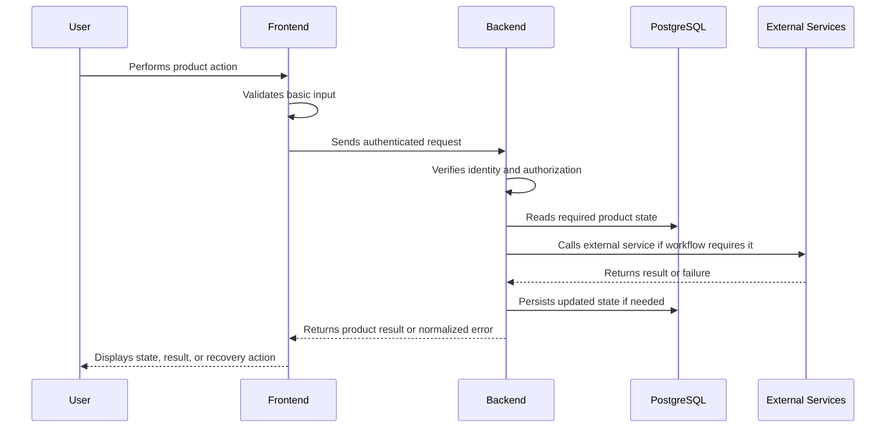

### Request Flow Expectations

| Step | Architectural Expectation |
|---|---|
| User action | Starts from a clear product workflow |
| Frontend validation | Provides early feedback but does not replace backend validation |
| Backend authorization | Confirms the user can perform the requested action |
| Data access | Retrieves only data within the user's allowed workspace |
| External dependency | Uses external services only through backend-governed workflows |
| Response | Returns a product state the frontend can present clearly |

## 9. Authentication Flow

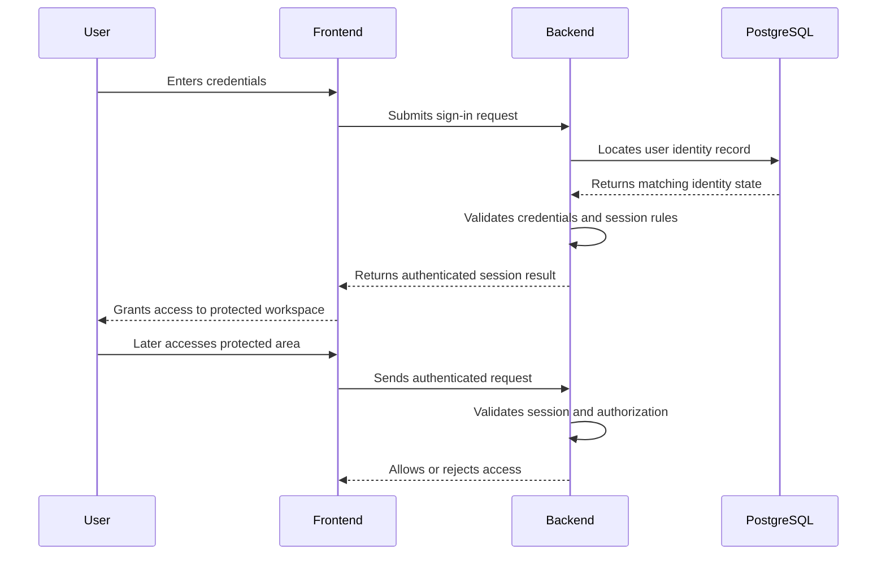

### Authentication Flow Requirements

| Area | Requirement |
|---|---|
| Protected access | Dashboard, family, document, chat, and readiness areas require authentication |
| Session handling | Expired or invalid sessions must return a clear re-authentication state |
| Logout | User must be able to end the active session |
| Workspace isolation | Authentication alone is not enough; authorization must verify workspace ownership |

## 10. Document Upload Flow

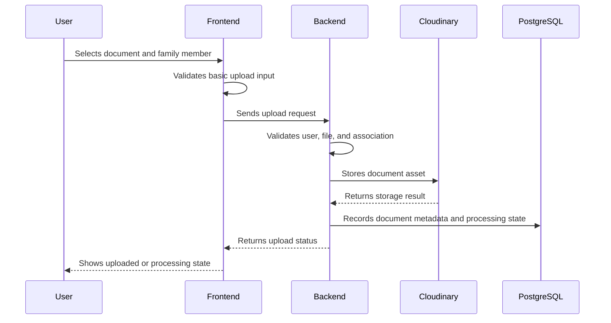

### Upload Flow Requirements

| Area | Requirement |
|---|---|
| Association | Documents should be associated with the correct family member where applicable |
| Feedback | User must see success, failure, or processing status |
| Storage separation | File assets are stored in Cloudinary; structured state is stored in PostgreSQL |
| Failure handling | Failed uploads must not be treated as available documents |

## 11. OCR Processing Flow

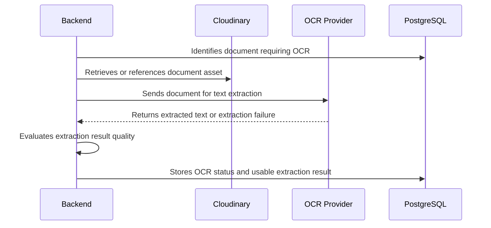

### OCR Flow Requirements

| Area | Requirement |
|---|---|
| Status tracking | Documents must reflect pending, completed, limited, or failed OCR states |
| Quality awareness | Poor extraction should not be silently treated as reliable |
| Continuation | Failed OCR should allow the document to remain visible with limited intelligence |
| Replaceability | OCR provider should remain architecturally replaceable |

## 12. AI Analysis Flow

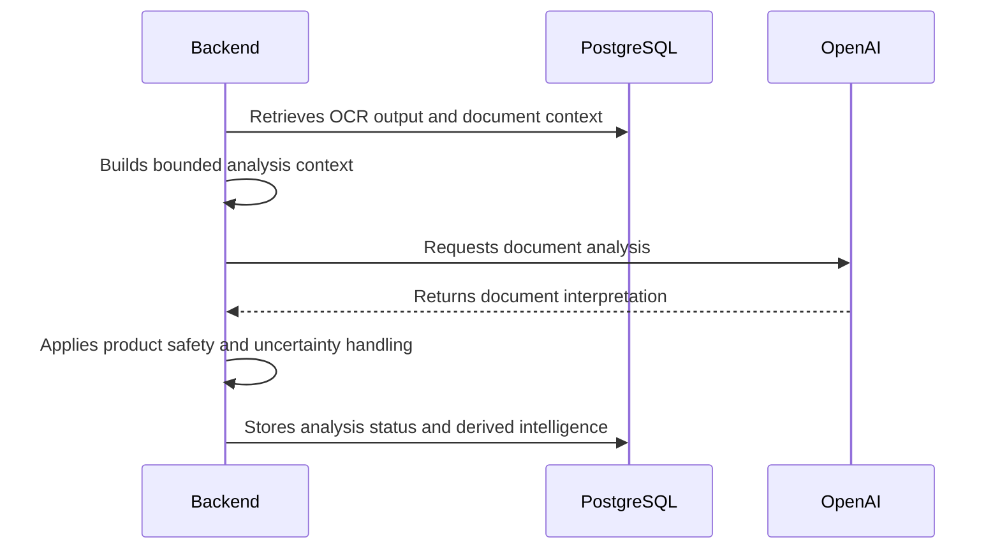

### AI Analysis Requirements

| Area | Requirement |
|---|---|
| Bounded context | Only necessary, authorized document context should be sent for analysis |
| Document intelligence | AI analysis should support document type, important attributes, expiry detection, and mismatch checks |
| Uncertainty | Low confidence or ambiguous results must be represented clearly |
| Safety | AI output must not be treated as official document verification |

## 13. AI Chat Flow

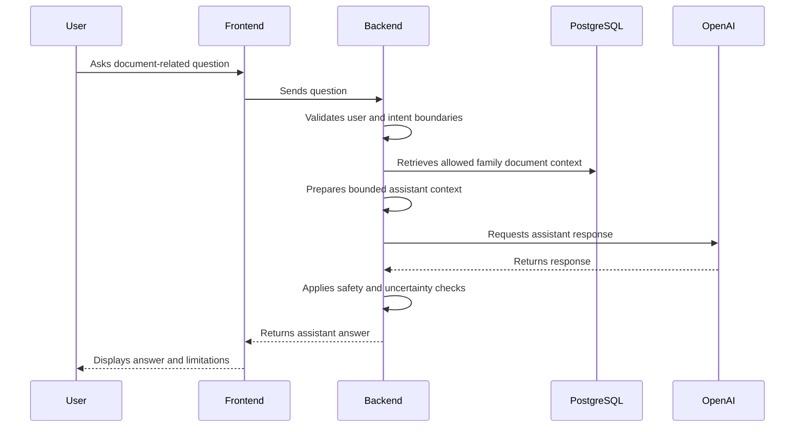

### AI Chat Requirements

| Area | Requirement |
|---|---|
| Contextual response | Chat responses should use available uploaded document context |
| Missing context | Assistant must explain when documents or information are missing |
| Safety boundary | Assistant must avoid legal, financial, tax, or official government claims |
| Privacy boundary | Assistant must never use or reveal another workspace's data |

## 14. Life Event Assistant Flow

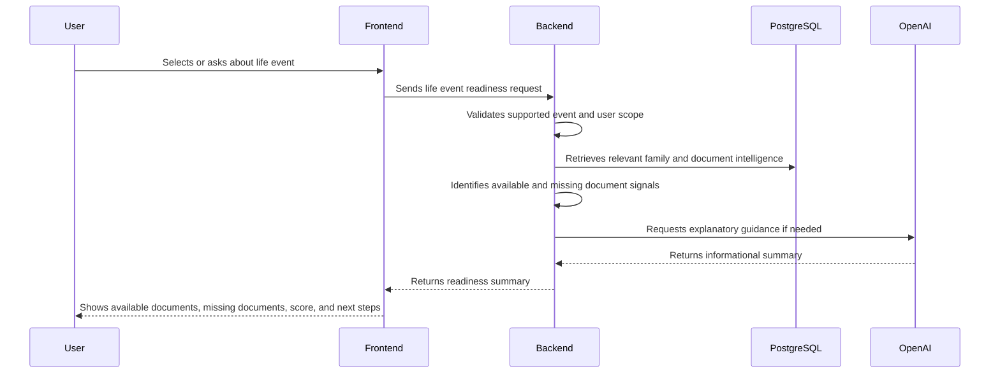

### Life Event Requirements

| Area | Requirement |
|---|---|
| Supported events | MVP should support a limited set of predefined life event scenarios |
| Readiness summary | Results must include available documents, missing documents, readiness score, and next steps |
| Informational guidance | Process summaries must be presented as guidance, not official instruction |
| Member awareness | Readiness checks must use the relevant family member's document context |

## 15. Readiness Score Flow

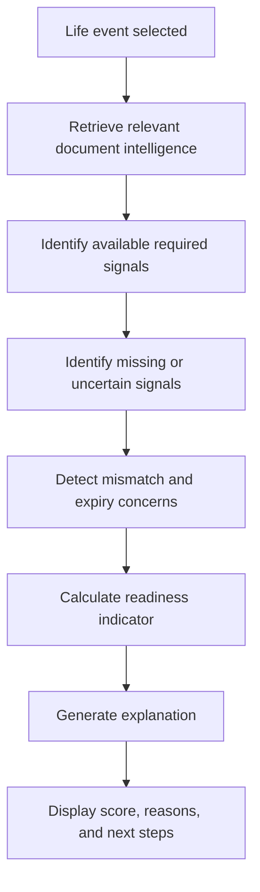

### Readiness Score Requirements

| Area | Requirement |
|---|---|
| Explainability | Score must include reasons, not just a number or label |
| Missing data | Missing or uncertain documents should reduce readiness confidence |
| Non-official status | Score must not imply official eligibility or approval |
| Supporting signals | Missing documents, mismatches, expiries, and analysis confidence may influence readiness |

## 16. Notification Flow

MVP notifications are in-app product notifications. External notification channels are future scope.

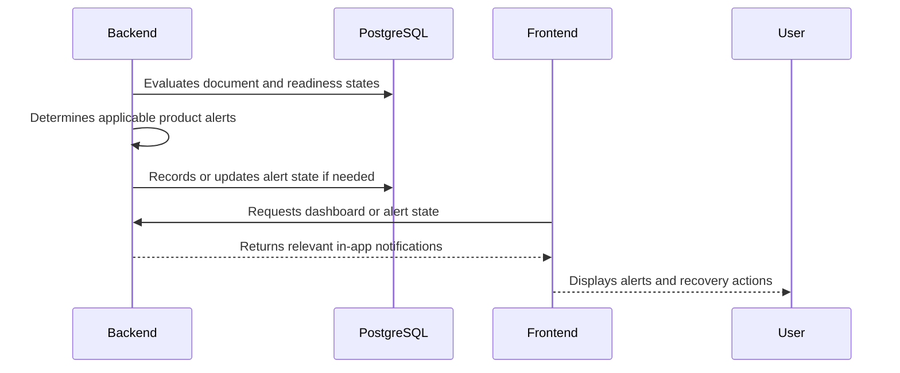

### Notification Types

| Notification | Trigger |
|---|---|
| Upload status | Upload succeeds, fails, or enters processing |
| Processing status | OCR or AI analysis is pending, completed, limited, or failed |
| Missing document alert | A readiness check identifies likely missing documents |
| Mismatch alert | Name or address inconsistency is detected |
| Expiry alert | A document is expired or nearing expiry |
| Assistant limitation | AI cannot answer reliably due to missing or uncertain context |

## 17. Error Handling Flow

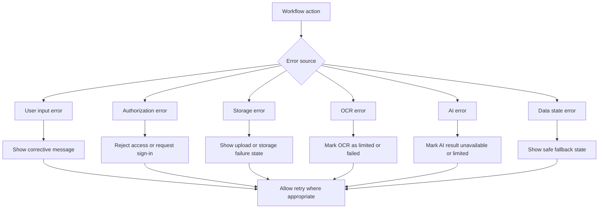

### Error Handling Requirements

| Error Type | Architectural Response |
|---|---|
| User input error | Return clear correction guidance |
| Authentication error | Require sign-in or session refresh |
| Authorization error | Deny access without exposing protected data |
| Upload/storage error | Preserve clear document state and allow retry |
| OCR error | Keep document visible while marking extraction as failed or limited |
| AI error | Avoid showing incomplete AI output as fact |
| External dependency error | Normalize failure into product-friendly status |

## 18. Security Architecture

Security is central because FamilyOS AI handles sensitive family documents and identity information.

| Area | Architectural Requirement |
|---|---|
| Authentication | Protected workflows require validated user identity |
| Authorization | Every workspace, family member, document, analysis result, and readiness output must be scoped to the authenticated user |
| Data isolation | Cross-workspace data access must be prevented at the backend layer |
| Secure storage coordination | Document assets and structured metadata must be linked through backend-controlled access patterns |
| External service minimization | Only necessary document context should be sent to OCR and AI providers |
| AI safety | AI outputs must be bounded, reviewed for product safety, and displayed with uncertainty where needed |
| Error safety | Errors must not reveal sensitive internal state or another user's data |
| Session safety | Expired or invalid sessions must fail closed |

## 19. Trust Boundaries

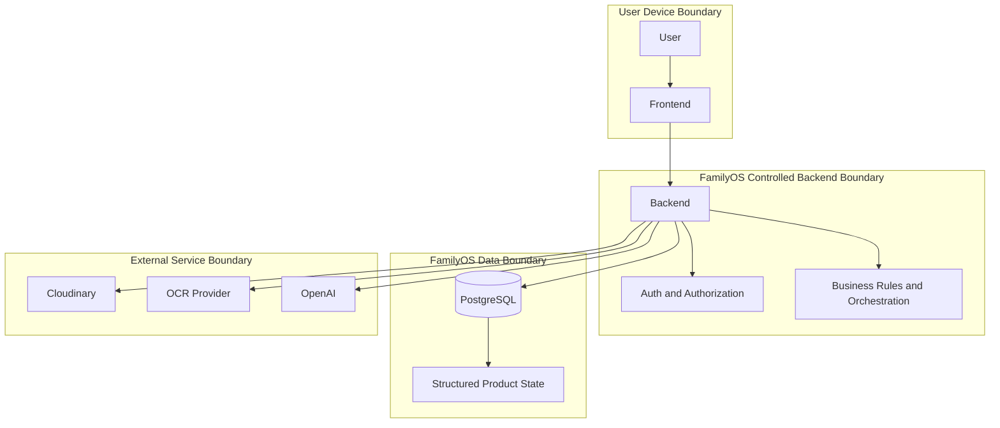

### Boundary Rules

| Boundary | Rule |
|---|---|
| User device to backend | Frontend requests are never trusted without backend validation |
| Backend to database | Data access must be scoped to authenticated user ownership |
| Backend to Cloudinary | Stored assets must be accessed through controlled backend workflows |
| Backend to OCR provider | Only documents eligible for extraction should be sent |
| Backend to OpenAI | Only necessary, authorized, bounded context should be sent |
| AI output to user | AI output must be treated as assistive and uncertain where appropriate |

## 20. External Integrations

| Integration | Purpose | Architectural Consideration |
|---|---|---|
| Cloudinary | Uploaded document storage | External asset storage must remain linked to backend-controlled product state |
| OpenAI API | AI document analysis, chat, readiness explanations | AI context must be bounded, authorized, and safety-reviewed |
| OCR Provider | Text extraction from uploaded documents | Provider should remain replaceable and failure-tolerant |
| Vercel | Frontend hosting | Deployment target for the web application |
| Railway | Backend hosting | Deployment target for backend application |
| Neon PostgreSQL | Managed PostgreSQL database | Stores structured application state |

## 21. Scalability Strategy

| Area | Strategy |
|---|---|
| Frontend scale | Use managed frontend hosting suitable for web SaaS traffic patterns |
| Backend scale | Keep backend stateless where practical so application instances can scale horizontally |
| Database scale | Use PostgreSQL as the structured source of truth and optimize access patterns in later design documents |
| File storage scale | Store document assets in Cloudinary rather than application servers |
| AI workload scale | Treat OCR and AI workflows as potentially long-running and status-driven |
| Cost control | Avoid unnecessary repeated AI calls by storing derived document intelligence where appropriate |
| Failure isolation | External service failures should degrade affected workflows without bringing down the whole product |

## 22. Future Extensibility

| Future Capability | Architectural Preparation |
|---|---|
| Advisor access | Maintain strong ownership and authorization boundaries from MVP |
| External reminders | Keep alert concepts separate from delivery channels |
| More life events | Treat life event readiness as extensible product logic |
| Multi-workspace support | Avoid assumptions that permanently restrict users to one workspace |
| Mobile apps | Keep backend workflows client-agnostic |
| Advanced verification | Separate AI interpretation from official verification concepts |
| Secure sharing | Preserve clear document ownership and access-control boundaries |
| Multi-language support | Keep OCR and AI provider choices replaceable where possible |

## 23. Architecture Decisions

| Decision | Rationale |
|---|---|
| Use web SaaS architecture for MVP | Aligns with the Project Blueprint and keeps delivery focused |
| Use backend as orchestration authority | Centralizes security, business rules, AI boundaries, and external service coordination |
| Store files outside PostgreSQL | Keeps binary assets separate from structured product state |
| Use PostgreSQL for structured state | Supports relational product data and future reporting needs |
| Treat OCR as provider-agnostic | Allows provider selection or replacement without changing product behavior |
| Treat AI output as assistive | Reduces risk of overclaiming and aligns with PRD safety requirements |
| Keep notifications in-app for MVP | Matches PRD scope and avoids external channel complexity |
| Defer API and schema design | Keeps this document focused on architecture-level interactions |

## 24. Risks

| Risk | Impact | Mitigation |
|---|---|---|
| AI analysis inaccuracies | Incorrect document insights or readiness guidance | Represent uncertainty, allow review, avoid official verification claims |
| OCR quality limitations | Poor extraction may reduce AI usefulness | Track OCR status and expose limited or failed extraction states |
| Sensitive data exposure | Loss of user trust and serious privacy risk | Enforce backend authorization and workspace isolation |
| External service outage | Upload, OCR, or AI workflows may fail temporarily | Normalize failures and allow retry where appropriate |
| AI cost growth | Operating cost may increase with usage | Store derived intelligence and avoid unnecessary repeated processing |
| Requirement variability for life events | Guidance may become incomplete or outdated | Present process summaries as informational and support future updates |
| Frontend-backend misalignment | Integration delays | Use this architecture plus later API contract documentation |
| Scope creep | MVP delay | Keep future enhancements separate from MVP architecture |

## 25. Assumptions

| Assumption | Description |
|---|---|
| MVP is web-first | Native mobile apps are not part of initial delivery |
| One account owner manages a family workspace | Shared collaborators and advisors are future scope |
| AI and OCR providers are available | Core document intelligence depends on external AI and OCR capabilities |
| Uploaded documents may be imperfect | The system must handle blurry, incomplete, rotated, or low-quality documents gracefully |
| Government guidance is informational | FamilyOS AI does not replace official portals or guarantee eligibility |
| External notification channels are future scope | MVP notifications are in-app only |
| Detailed contracts will follow | API, database, prompt, frontend, backend, and deployment documents will define lower-level details later |

