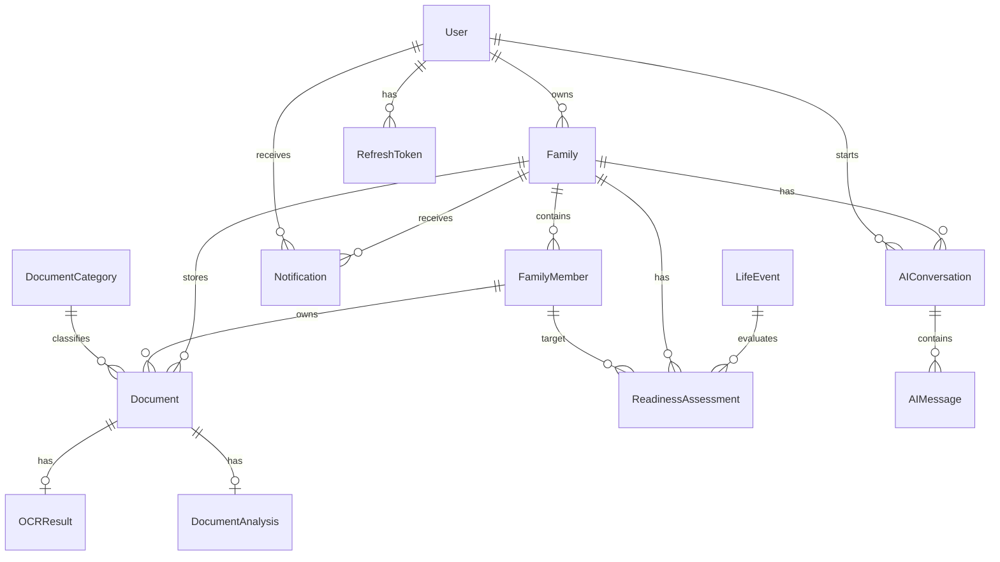
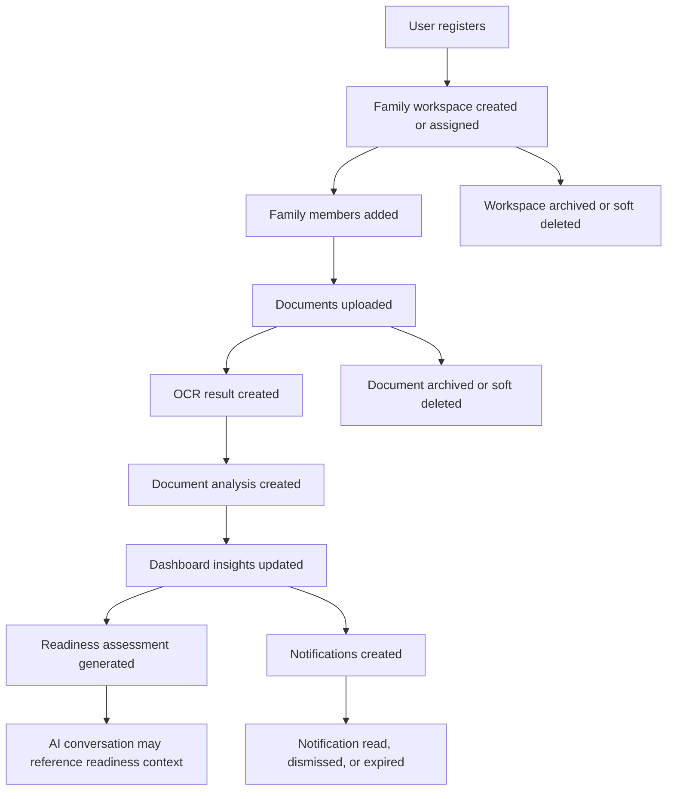

# FamilyOS AI Logical Database Design

## Document Control

| Item | Detail |
|---|---|
| Project | FamilyOS AI |
| Document | Logical Database Design |
| Version | 1.0 |
| Status | Draft for backend architecture review |
| References | `docs/01_Project_Blueprint.md`, `docs/project-blueprint.md`, `docs/02_PRD.md`, `docs/03_System_Architecture.md` |
| Audience | Backend, Architecture, Product, QA |

## 1. Introduction

This document defines the logical database design for the FamilyOS AI MVP. It describes the core entities, relationships, attributes, constraints, lifecycle expectations, integrity rules, indexing recommendations, security considerations, and future expansion paths required before writing the Prisma schema.

FamilyOS AI is a document readiness platform, not a generic file storage product. The data model therefore supports secure family workspaces, family members, uploaded documents, OCR results, AI analysis, life event readiness, assistant conversations, notifications, and authentication sessions.

This document does not contain Prisma schema, SQL, migrations, DTOs, APIs, endpoint contracts, or implementation code.

## 2. Database Design Goals

| Goal | Description |
|---|---|
| Support MVP product behavior | Enable authentication, family management, document upload, library, OCR, AI analysis, chat, life event readiness, reminders, and dashboard workflows |
| Protect sensitive data | Ensure family, document, analysis, and conversation data can be isolated per authenticated user and family workspace |
| Represent AI uncertainty | Store processing states, confidence signals, review states, and failure reasons without presenting AI output as official verification |
| Preserve document readiness context | Maintain enough structured information to support missing document detection, mismatch detection, expiry reminders, and readiness scoring |
| Enable clear lifecycle management | Track created, updated, processed, expired, revoked, archived, and deleted states where relevant |
| Prepare for future extensibility | Allow future advisor access, external reminders, more life events, document sharing, audit history, and advanced verification |

## 3. Design Principles

| Principle | Database Design Meaning |
|---|---|
| Ownership is explicit | User-owned and family-owned records must be traceable through clear relationships |
| Sensitive data is minimized | Store only product-required structured data and avoid unnecessary duplication of extracted personal information |
| Files and metadata are separate | Store document files in Cloudinary and structured document state in PostgreSQL |
| Processing is stateful | OCR, AI analysis, readiness, and notifications need clear statuses and failure states |
| Soft deletion is preferred | Sensitive user data should not disappear from logical relationships immediately unless retention policy requires hard deletion |
| AI output is not canonical identity truth | Extracted and AI-derived values are treated as interpreted document intelligence, not official verification |
| Future access control is anticipated | MVP ownership should not block later advisor or collaborator permissions |
| Database remains implementation-neutral | This design defines logical structure, not physical schema syntax |

## 4. Entity Relationship Overview

### Core Data Domains

| Domain | Entities | Purpose |
|---|---|---|
| Identity and access | User, RefreshToken | Account ownership and session continuity |
| Family workspace | Family, FamilyMember | Family organization and member-level document association |
| Document management | Document, DocumentCategory | Uploaded document records, library, categorization, and storage metadata |
| Document intelligence | OCRResult, DocumentAnalysis | Extracted text, AI interpretation, confidence, and processing states |
| Readiness | LifeEvent, ReadinessAssessment | Supported life events and readiness outputs |
| AI assistant | AIConversation, AIMessage | User questions and assistant responses |
| Product alerts | Notification | In-app upload, processing, missing document, mismatch, expiry, and assistant limitation alerts |

## 5. Entity Definitions

### 5.1 User

| Item | Detail |
|---|---|
| Purpose | Represents an authenticated account owner in FamilyOS AI |
| Description | A user owns one or more family workspaces over time. In the MVP, the product assumes one account owner manages the primary family workspace, while the model allows future expansion. |

#### Attributes

| Attribute | Description | Required |
|---|---|---|
| id | Unique identifier | Yes |
| fullName | User's display name | Yes |
| email | User's unique sign-in email | Yes |
| passwordHash | Secure representation of the user's password | Yes |
| status | Account state such as active, suspended, or deleted | Yes |
| emailVerifiedAt | Timestamp when email was verified, if supported | No |
| lastLoginAt | Timestamp of most recent successful login | No |
| createdAt | Record creation timestamp | Yes |
| updatedAt | Record update timestamp | Yes |
| deletedAt | Soft deletion timestamp | No |

#### Relationships

| Relationship | Cardinality | Description |
|---|---|---|
| User to Family | One-to-many | A user may own family workspaces |
| User to RefreshToken | One-to-many | A user may have multiple refresh token records |
| User to AIConversation | One-to-many | A user may start assistant conversations |
| User to Notification | One-to-many | A user may receive in-app notifications |

#### Constraints

| Constraint | Description |
|---|---|
| Unique email | Email must be unique among active user accounts |
| Required credentials | Active users must have authentication credentials |
| Soft delete aware uniqueness | Deleted users should not cause ambiguity for active account lookup |

### 5.2 Family

| Item | Detail |
|---|---|
| Purpose | Represents a secure family workspace |
| Description | A family groups members, documents, conversations, assessments, and notifications under a user-owned workspace boundary. |

#### Attributes

| Attribute | Description | Required |
|---|---|---|
| id | Unique identifier | Yes |
| ownerUserId | User who owns the family workspace | Yes |
| name | Family workspace name | Yes |
| status | Workspace state such as active, archived, or deleted | Yes |
| createdAt | Record creation timestamp | Yes |
| updatedAt | Record update timestamp | Yes |
| deletedAt | Soft deletion timestamp | No |

#### Relationships

| Relationship | Cardinality | Description |
|---|---|---|
| Family to User | Many-to-one | Each family workspace has one owner in MVP |
| Family to FamilyMember | One-to-many | A family contains members |
| Family to Document | One-to-many | A family contains uploaded documents |
| Family to AIConversation | One-to-many | A family has assistant conversations |
| Family to ReadinessAssessment | One-to-many | A family has readiness assessments |
| Family to Notification | One-to-many | A family has in-app notifications |

#### Constraints

| Constraint | Description |
|---|---|
| Owner required | Every family must belong to an existing user |
| Workspace isolation | Family records must be used as a core data boundary |
| Name required | Workspace should have a user-visible name |

### 5.3 FamilyMember

| Item | Detail |
|---|---|
| Purpose | Represents a person whose documents are managed in a family workspace |
| Description | Family members allow document readiness to be evaluated at a person level. A family member does not necessarily have login access in the MVP. |

#### Attributes

| Attribute | Description | Required |
|---|---|---|
| id | Unique identifier | Yes |
| familyId | Family workspace identifier | Yes |
| fullName | Member's full name as entered by the user | Yes |
| relationship | Relationship to the account owner or family context | No |
| dateOfBirth | Date of birth where needed for document readiness | No |
| primaryEmail | Optional contact email | No |
| primaryPhone | Optional contact phone | No |
| status | Member state such as active, archived, or deleted | Yes |
| createdAt | Record creation timestamp | Yes |
| updatedAt | Record update timestamp | Yes |
| deletedAt | Soft deletion timestamp | No |

#### Relationships

| Relationship | Cardinality | Description |
|---|---|---|
| FamilyMember to Family | Many-to-one | Each member belongs to one family |
| FamilyMember to Document | One-to-many | A member may have many documents |
| FamilyMember to ReadinessAssessment | One-to-many | A member may be the target of many readiness assessments |

#### Constraints

| Constraint | Description |
|---|---|
| Family required | A member cannot exist outside a family workspace |
| Name required | Member must have a displayable name |
| Soft delete handling | Deleted members should not appear in active readiness workflows |

### 5.4 Document

| Item | Detail |
|---|---|
| Purpose | Represents an uploaded document and its product state |
| Description | Document stores metadata, ownership, storage references, processing state, review state, and key lifecycle information for a file uploaded to Cloudinary. |

#### Attributes

| Attribute | Description | Required |
|---|---|---|
| id | Unique identifier | Yes |
| familyId | Family workspace identifier | Yes |
| familyMemberId | Associated family member, where applicable | No |
| categoryId | Document category, if known or user-selected | No |
| originalFileName | Original uploaded file name | Yes |
| displayName | User-visible document name | Yes |
| fileType | Uploaded file type or format | Yes |
| fileSize | Uploaded file size | No |
| storageProvider | Storage provider name | Yes |
| storageAssetId | Provider asset identifier or logical reference | Yes |
| storageUrlReference | Controlled reference to stored asset | No |
| uploadStatus | Upload state such as uploaded, failed, or removed | Yes |
| processingStatus | Overall processing state such as pending, processing, completed, limited, or failed | Yes |
| reviewStatus | User or system review state such as unreviewed, reviewed, or needs_review | Yes |
| issueStatus | Summary state such as none, missing_context, mismatch_detected, expiring, expired, or analysis_failed | No |
| issuedAt | Document issue date if known | No |
| expiresAt | Document expiry date if known | No |
| createdAt | Record creation timestamp | Yes |
| updatedAt | Record update timestamp | Yes |
| deletedAt | Soft deletion timestamp | No |

#### Relationships

| Relationship | Cardinality | Description |
|---|---|---|
| Document to Family | Many-to-one | Each document belongs to one family |
| Document to FamilyMember | Many-to-one optional | A document may belong to one family member |
| Document to DocumentCategory | Many-to-one optional | A document may be classified by category |
| Document to OCRResult | One-to-zero-or-one | A document may have one current OCR result |
| Document to DocumentAnalysis | One-to-zero-or-one | A document may have one current AI analysis |

#### Constraints

| Constraint | Description |
|---|---|
| Family required | Every document must belong to a family workspace |
| Storage reference required | Uploaded documents must have storage provider and asset reference when upload succeeds |
| Processing state required | Document workflows depend on explicit status |
| Member association optional | Some documents may be family-level or initially unassigned |
| Expiry optional | Not all documents have an expiry date |

### 5.5 DocumentCategory

| Item | Detail |
|---|---|
| Purpose | Defines logical document categories used for organization, detection, and readiness |
| Description | Categories represent product-level document types such as identity, address, travel, education, finance, insurance, or government records. |

#### Attributes

| Attribute | Description | Required |
|---|---|---|
| id | Unique identifier | Yes |
| name | Category name | Yes |
| description | Category description | No |
| normalizedKey | Stable product key for the category | Yes |
| isActive | Whether category is available for product workflows | Yes |
| createdAt | Record creation timestamp | Yes |
| updatedAt | Record update timestamp | Yes |

#### Relationships

| Relationship | Cardinality | Description |
|---|---|---|
| DocumentCategory to Document | One-to-many | A category may classify many documents |

#### Constraints

| Constraint | Description |
|---|---|
| Unique normalized key | Category key must be unique |
| Active filtering | Inactive categories should not be offered for new classification |

### 5.6 OCRResult

| Item | Detail |
|---|---|
| Purpose | Stores OCR extraction outcome for a document |
| Description | OCRResult records text extraction status, extracted text or reference, confidence signals, provider metadata, and failure information. |

#### Attributes

| Attribute | Description | Required |
|---|---|---|
| id | Unique identifier | Yes |
| documentId | Related document | Yes |
| provider | OCR provider name | Yes |
| status | OCR state such as pending, processing, completed, limited, or failed | Yes |
| extractedText | Extracted text where stored directly | No |
| textReference | Reference if extracted text is stored separately | No |
| languageHints | Detected or expected languages, if available | No |
| confidenceScore | Overall extraction confidence, if available | No |
| failureReason | Reason OCR failed or was limited | No |
| processedAt | Timestamp when OCR completed or failed | No |
| createdAt | Record creation timestamp | Yes |
| updatedAt | Record update timestamp | Yes |

#### Relationships

| Relationship | Cardinality | Description |
|---|---|---|
| OCRResult to Document | One-to-one | Each OCR result belongs to one document |

#### Constraints

| Constraint | Description |
|---|---|
| Document required | OCR result cannot exist without a document |
| One current OCR result | MVP expects one current OCR result per document |
| Status required | OCR-dependent workflows need explicit extraction status |
| Failure reason expected on failure | Failed or limited OCR should explain why when possible |

### 5.7 DocumentAnalysis

| Item | Detail |
|---|---|
| Purpose | Stores AI-derived understanding of a document |
| Description | DocumentAnalysis captures document type identification, extracted fields, confidence, mismatch signals, expiry signals, and analysis state. |

#### Attributes

| Attribute | Description | Required |
|---|---|---|
| id | Unique identifier | Yes |
| documentId | Related document | Yes |
| status | Analysis state such as pending, processing, completed, limited, or failed | Yes |
| detectedDocumentType | AI-detected document type | No |
| detectedCategoryId | Category inferred by AI, if mapped | No |
| extractedFields | Structured AI-derived key-value information | No |
| nameOnDocument | Name extracted from the document, if found | No |
| addressOnDocument | Address extracted from the document, if found | No |
| issuedDate | Issue date extracted from the document, if found | No |
| expiryDate | Expiry date extracted from the document, if found | No |
| confidenceScore | Overall AI analysis confidence | No |
| mismatchFlags | Name or address inconsistency indicators | No |
| analysisSummary | Human-readable analysis summary | No |
| failureReason | Reason analysis failed or was limited | No |
| analyzedAt | Timestamp when analysis completed or failed | No |
| createdAt | Record creation timestamp | Yes |
| updatedAt | Record update timestamp | Yes |

#### Relationships

| Relationship | Cardinality | Description |
|---|---|---|
| DocumentAnalysis to Document | One-to-one | Each current analysis belongs to one document |
| DocumentAnalysis to DocumentCategory | Many-to-one optional | Analysis may map to a recognized category |

#### Constraints

| Constraint | Description |
|---|---|
| Document required | Analysis cannot exist without a document |
| One current analysis | MVP expects one current analysis per document |
| Status required | Readiness and dashboard workflows depend on analysis status |
| AI uncertainty allowed | Extracted fields and confidence may be missing or partial |
| Not official verification | Analysis must not be treated as verified identity truth |

### 5.8 LifeEvent

| Item | Detail |
|---|---|
| Purpose | Represents a supported life event or government process scenario |
| Description | LifeEvent defines readiness scenarios such as applying for a driving license, passport renewal, school admission, or insurance claim. MVP supports a limited set. |

#### Attributes

| Attribute | Description | Required |
|---|---|---|
| id | Unique identifier | Yes |
| name | User-visible life event name | Yes |
| normalizedKey | Stable product key for the life event | Yes |
| description | High-level description | No |
| category | Event grouping such as government, travel, education, insurance, or legal | No |
| expectedDocumentRules | Logical document expectations used for readiness evaluation | No |
| isActive | Whether event is available in product workflows | Yes |
| createdAt | Record creation timestamp | Yes |
| updatedAt | Record update timestamp | Yes |

#### Relationships

| Relationship | Cardinality | Description |
|---|---|---|
| LifeEvent to ReadinessAssessment | One-to-many | A life event may have many readiness assessments |

#### Constraints

| Constraint | Description |
|---|---|
| Unique normalized key | Event key must be unique |
| Active filtering | Inactive events should not be offered in MVP workflows |
| Informational rules | Rules guide readiness and do not represent official government guarantees |

### 5.9 ReadinessAssessment

| Item | Detail |
|---|---|
| Purpose | Stores the result of a readiness check for a family or family member |
| Description | ReadinessAssessment captures available documents, missing documents, score, warnings, next steps, and summary for a selected life event. |

#### Attributes

| Attribute | Description | Required |
|---|---|---|
| id | Unique identifier | Yes |
| familyId | Family workspace identifier | Yes |
| familyMemberId | Target member, where member-specific | No |
| lifeEventId | Life event being assessed | Yes |
| requestedByUserId | User who initiated the assessment | Yes |
| status | Assessment state such as completed, limited, or failed | Yes |
| readinessScore | Numeric or categorized readiness indicator | No |
| readinessLevel | Human-readable readiness level | No |
| availableDocuments | Summary of relevant available documents | No |
| missingDocuments | Summary of likely missing documents | No |
| mismatchWarnings | Name or address mismatch warnings | No |
| expiryWarnings | Expiry-related warnings | No |
| nextSteps | Suggested user actions | No |
| processSummary | Informational process summary | No |
| confidenceScore | Overall confidence in the assessment | No |
| failureReason | Reason assessment failed or was limited | No |
| assessedAt | Timestamp when assessment was generated | Yes |
| createdAt | Record creation timestamp | Yes |
| updatedAt | Record update timestamp | Yes |
| deletedAt | Soft deletion timestamp | No |

#### Relationships

| Relationship | Cardinality | Description |
|---|---|---|
| ReadinessAssessment to Family | Many-to-one | Each assessment belongs to one family |
| ReadinessAssessment to FamilyMember | Many-to-one optional | Assessment may target one member |
| ReadinessAssessment to LifeEvent | Many-to-one | Assessment is for one life event |
| ReadinessAssessment to User | Many-to-one | Assessment is requested by one user |

#### Constraints

| Constraint | Description |
|---|---|
| Family required | Assessment must belong to a family workspace |
| Life event required | Assessment must be tied to a supported life event |
| Requesting user required | Assessment must trace back to the initiating user |
| Score explainability | If a score exists, supporting details should exist |
| Informational status | Assessment must not imply official eligibility or approval |

### 5.10 AIConversation

| Item | Detail |
|---|---|
| Purpose | Groups AI assistant messages in a conversation |
| Description | AIConversation represents a user-initiated assistant session within a family workspace. |

#### Attributes

| Attribute | Description | Required |
|---|---|---|
| id | Unique identifier | Yes |
| familyId | Family workspace identifier | Yes |
| userId | User who started the conversation | Yes |
| title | Conversation title or generated summary | No |
| status | Conversation state such as active, archived, or deleted | Yes |
| lastMessageAt | Timestamp of most recent message | No |
| createdAt | Record creation timestamp | Yes |
| updatedAt | Record update timestamp | Yes |
| deletedAt | Soft deletion timestamp | No |

#### Relationships

| Relationship | Cardinality | Description |
|---|---|---|
| AIConversation to Family | Many-to-one | Conversation belongs to one family |
| AIConversation to User | Many-to-one | Conversation is started by one user |
| AIConversation to AIMessage | One-to-many | Conversation contains many messages |

#### Constraints

| Constraint | Description |
|---|---|
| Family required | Conversations must be scoped to a workspace |
| User required | Conversations must be traceable to an initiating user |
| Soft delete aware | Deleted conversations should not appear in active chat history |

### 5.11 AIMessage

| Item | Detail |
|---|---|
| Purpose | Stores an individual user or assistant message |
| Description | AIMessage records user questions, assistant answers, role, bounded context summary, safety status, and failure state where applicable. |

#### Attributes

| Attribute | Description | Required |
|---|---|---|
| id | Unique identifier | Yes |
| conversationId | Parent conversation | Yes |
| role | Message role such as user, assistant, or system_status | Yes |
| content | Message text shown or submitted in the product | Yes |
| contextSummary | Summary of document context used, if applicable | No |
| safetyStatus | State such as safe, limited, refused, or failed | No |
| confidenceScore | Confidence signal for assistant response, if available | No |
| failureReason | Reason response failed or was limited | No |
| createdAt | Record creation timestamp | Yes |

#### Relationships

| Relationship | Cardinality | Description |
|---|---|---|
| AIMessage to AIConversation | Many-to-one | Each message belongs to one conversation |

#### Constraints

| Constraint | Description |
|---|---|
| Conversation required | Message cannot exist outside a conversation |
| Role required | Message must have a role |
| Content required | Message must contain user-visible or auditable content |
| Privacy boundary | Stored context summary should avoid unnecessary sensitive data duplication |

### 5.12 Notification

| Item | Detail |
|---|---|
| Purpose | Represents an in-app product notification or alert |
| Description | Notifications surface upload status, processing status, missing document alerts, mismatch alerts, expiry alerts, and assistant limitations. External channels are future scope. |

#### Attributes

| Attribute | Description | Required |
|---|---|---|
| id | Unique identifier | Yes |
| userId | User receiving the notification | Yes |
| familyId | Related family workspace | Yes |
| relatedDocumentId | Related document, if applicable | No |
| relatedFamilyMemberId | Related family member, if applicable | No |
| relatedAssessmentId | Related readiness assessment, if applicable | No |
| type | Notification type such as upload, processing, missing_document, mismatch, expiry, or assistant_limitation | Yes |
| severity | Severity such as info, warning, or critical | Yes |
| title | User-visible title | Yes |
| message | User-visible message | Yes |
| status | State such as unread, read, archived, or dismissed | Yes |
| actionLabel | Optional user-facing action label | No |
| actionReference | Optional logical destination reference | No |
| createdAt | Record creation timestamp | Yes |
| readAt | Timestamp when read | No |
| dismissedAt | Timestamp when dismissed | No |
| expiresAt | Optional notification expiry | No |

#### Relationships

| Relationship | Cardinality | Description |
|---|---|---|
| Notification to User | Many-to-one | Notification belongs to one receiving user |
| Notification to Family | Many-to-one | Notification is scoped to one family |
| Notification to Document | Many-to-one optional | Notification may reference a document |
| Notification to FamilyMember | Many-to-one optional | Notification may reference a member |
| Notification to ReadinessAssessment | Many-to-one optional | Notification may reference an assessment |

#### Constraints

| Constraint | Description |
|---|---|
| User and family required | Notifications must be scoped to recipient and workspace |
| Type required | Notification behavior depends on explicit type |
| Status required | Dashboard and notification views require read or unread state |
| Cross-scope integrity | Related records must belong to the same family scope |

### 5.13 RefreshToken

| Item | Detail |
|---|---|
| Purpose | Supports secure session continuation |
| Description | RefreshToken stores refresh session state for JWT-based authentication and logout/revocation behavior. |

#### Attributes

| Attribute | Description | Required |
|---|---|---|
| id | Unique identifier | Yes |
| userId | Related user | Yes |
| tokenHash | Secure hash of refresh token | Yes |
| status | Token state such as active, revoked, expired, or replaced | Yes |
| issuedAt | Token issue timestamp | Yes |
| expiresAt | Token expiry timestamp | Yes |
| revokedAt | Token revocation timestamp | No |
| replacedByTokenId | Replacement token reference, if rotated | No |
| deviceLabel | Optional device or client label | No |
| ipAddress | Optional originating IP metadata | No |
| userAgent | Optional user agent metadata | No |
| createdAt | Record creation timestamp | Yes |
| updatedAt | Record update timestamp | Yes |

#### Relationships

| Relationship | Cardinality | Description |
|---|---|---|
| RefreshToken to User | Many-to-one | Each token belongs to one user |
| RefreshToken to RefreshToken | Optional self-reference | A token may be replaced by a later token |

#### Constraints

| Constraint | Description |
|---|---|
| User required | Token cannot exist without a user |
| Token hash required | Raw refresh tokens must not be stored |
| Expiry required | Refresh tokens must have an expiration |
| Revocation state | Logout and suspicious token use require revocation support |

## 6. Entity Relationship Matrix

| Entity | User | Family | FamilyMember | Document | DocumentCategory | OCRResult | DocumentAnalysis | LifeEvent | ReadinessAssessment | AIConversation | AIMessage | Notification | RefreshToken |
|---|---|---|---|---|---|---|---|---|---|---|---|---|---|
| User | - | Owns | Through Family | Through Family | - | Through Document | Through Document | - | Requests | Starts | Through Conversation | Receives | Has |
| Family | Owned by | - | Contains | Contains | - | Through Document | Through Document | - | Has | Has | Through Conversation | Has | - |
| FamilyMember | Through Family | Belongs to | - | Has | - | Through Document | Through Document | - | Target of | - | - | May be referenced | - |
| Document | Through Family | Belongs to | May belong to | - | Classified by | Has | Has | - | Used by result summaries | May inform | May inform | May be referenced | - |
| DocumentCategory | - | - | - | Classifies | - | - | May be detected | - | May inform rules | - | - | - | - |
| OCRResult | Through Document | Through Document | Through Document | Belongs to | - | - | Supports | - | May inform | May inform | May inform | - | - |
| DocumentAnalysis | Through Document | Through Document | Through Document | Belongs to | May map to | Uses | - | - | Supports | May inform | May inform | May trigger | - |
| LifeEvent | - | - | - | - | May require | - | - | - | Has | May be discussed | May be discussed | - | - |
| ReadinessAssessment | Requested by | Belongs to | May target | Summarizes | Uses rules | May use | Uses | For | - | May be discussed | May be discussed | May trigger | - |
| AIConversation | Started by | Belongs to | - | May reference context | - | May reference context | May reference context | May discuss | May discuss | - | Contains | - | - |
| AIMessage | Through Conversation | Through Conversation | - | May include context | - | May include context | May include context | May discuss | May discuss | Belongs to | - | - | - |
| Notification | Belongs to | Belongs to | May reference | May reference | - | - | May be triggered by | - | May reference | - | - | - | - |
| RefreshToken | Belongs to | - | - | - | - | - | - | - | - | - | - | - | May replace |

## 7. Cardinality

| Relationship | Cardinality | Required? | Notes |
|---|---|---|---|
| User to Family | 1 to many | Family requires User | MVP may use one primary family per user, but model supports future expansion |
| User to RefreshToken | 1 to many | Token requires User | Supports multiple sessions and token rotation |
| Family to FamilyMember | 1 to many | Member requires Family | Family may initially have zero members |
| Family to Document | 1 to many | Document requires Family | Document can be unassigned to a member initially |
| FamilyMember to Document | 1 to many | Optional on Document | Some documents may be family-level or pending assignment |
| DocumentCategory to Document | 1 to many | Optional on Document | Unknown documents may not have a category |
| Document to OCRResult | 1 to 0 or 1 | OCR requires Document | MVP stores one current OCR result |
| Document to DocumentAnalysis | 1 to 0 or 1 | Analysis requires Document | MVP stores one current analysis |
| LifeEvent to ReadinessAssessment | 1 to many | Assessment requires LifeEvent | Only active events should be user-selectable |
| Family to ReadinessAssessment | 1 to many | Assessment requires Family | Supports dashboard and history |
| FamilyMember to ReadinessAssessment | 1 to many | Optional on Assessment | Some assessments may be family-level |
| User to ReadinessAssessment | 1 to many | Assessment requires requester | Supports traceability |
| Family to AIConversation | 1 to many | Conversation requires Family | Chat is workspace-scoped |
| AIConversation to AIMessage | 1 to many | Message requires Conversation | Messages are ordered by creation time |
| User to Notification | 1 to many | Notification requires User | MVP notification recipient is the account owner |

## 8. Data Lifecycle

### Lifecycle States by Entity

| Entity | Created When | Updated When | Archived or Deleted When |
|---|---|---|---|
| User | Account registration succeeds | Profile, login, status, or deletion state changes | User requests deletion or account is disabled |
| Family | Workspace is created | Workspace name or status changes | Workspace is archived or deleted |
| FamilyMember | User adds a member | Member details change | Member is removed from active workspace |
| Document | Upload succeeds enough to create a record | Storage, processing, analysis, review, issue, or expiry state changes | User removes document or workspace is deleted |
| OCRResult | OCR processing begins or completes | OCR status, text, confidence, or failure changes | Usually retained with document unless retention policy removes it |
| DocumentAnalysis | AI analysis begins or completes | Analysis status, extracted fields, confidence, or failure changes | Usually retained with document unless retention policy removes it |
| LifeEvent | Product defines supported event | Event rule or availability changes | Event is deactivated rather than deleted |
| ReadinessAssessment | User runs readiness check | Assessment status or generated summary changes | User or retention policy removes old assessments |
| AIConversation | User starts assistant interaction | Conversation title, status, or last message changes | User archives or deletes conversation |
| AIMessage | User or assistant sends message | Rare; only safety or status metadata should change | Retained or removed with conversation policy |
| Notification | Product alert is generated | Read, dismissed, expired, or archived state changes | Notification expires or retention policy removes it |
| RefreshToken | User signs in or token rotates | Token is revoked, expired, or replaced | Token retention period ends |

## 9. Soft Delete Strategy

| Entity | Soft Delete? | Reason |
|---|---|---|
| User | Yes | Preserve referential integrity and support account recovery or audit readiness |
| Family | Yes | Prevent orphaning family-scoped records |
| FamilyMember | Yes | Preserve historical document and assessment relationships |
| Document | Yes | Avoid accidental permanent deletion and preserve processing traceability |
| DocumentCategory | No, use inactive state | Categories should be deactivated rather than deleted |
| OCRResult | Usually no independent soft delete | Lifecycle follows parent document |
| DocumentAnalysis | Usually no independent soft delete | Lifecycle follows parent document |
| LifeEvent | No, use inactive state | Historical assessments should remain interpretable |
| ReadinessAssessment | Yes | User may remove old assessments while preserving integrity during retention window |
| AIConversation | Yes | Allows chat history hiding without immediate hard deletion |
| AIMessage | Usually follows conversation | Messages should not be independently deleted unless policy requires |
| Notification | No, use dismissed, archived, or expired state | Notifications are status-based records |
| RefreshToken | No, use revoked or expired state | Token history supports security investigation during retention period |

### Soft Delete Rules

| Rule | Description |
|---|---|
| Active queries exclude deleted records | Product views should not show soft-deleted records by default |
| Child records remain scoped | Soft-deleted parents must not break relationship integrity |
| Hard delete is policy-driven | Permanent deletion should follow privacy and retention policy |
| Deletion should be cascading in product behavior | Removing a family should hide related members, documents, conversations, assessments, and notifications |

## 10. Audit Fields Strategy

### Standard Audit Fields

| Field | Applies To | Purpose |
|---|---|---|
| createdAt | Most entities | Record creation time |
| updatedAt | Mutable entities | Last update time |
| deletedAt | Soft-deletable entities | Logical deletion time |
| createdByUserId | Optional for collaborative future entities | Actor who created the record |
| updatedByUserId | Optional for collaborative future entities | Actor who last changed the record |

### Audit Guidance

| Area | Guidance |
|---|---|
| MVP simplicity | Use timestamp audit fields consistently even if actor-level audit is deferred |
| Future advisors | Actor-level audit should be added before shared advisor or collaborator access |
| AI traceability | OCR and AI records should store processed timestamps and provider references |
| Security traceability | Refresh tokens should record issued, revoked, expired, and replaced states |

## 11. Indexing Recommendations

These are logical indexing recommendations, not SQL definitions.

| Entity | Recommended Index | Reason |
|---|---|---|
| User | email | Fast sign-in lookup and uniqueness enforcement |
| User | status | Filtering active accounts |
| Family | ownerUserId | Retrieve workspaces for a user |
| FamilyMember | familyId | List members in a workspace |
| FamilyMember | familyId + fullName | Search and duplicate review within a family |
| Document | familyId | Retrieve documents for dashboard and library |
| Document | familyMemberId | Retrieve documents by member |
| Document | categoryId | Filter document library by category |
| Document | processingStatus | Find pending, failed, or completed documents |
| Document | expiresAt | Support expiry reminders and dashboard alerts |
| OCRResult | documentId | Retrieve OCR result for a document |
| OCRResult | status | Find pending or failed OCR work |
| DocumentAnalysis | documentId | Retrieve analysis for a document |
| DocumentAnalysis | status | Find pending or failed analysis work |
| DocumentAnalysis | detectedCategoryId | Support category-based readiness checks |
| LifeEvent | normalizedKey | Stable lookup for supported events |
| LifeEvent | isActive | Filter selectable events |
| ReadinessAssessment | familyId | Retrieve assessment history by workspace |
| ReadinessAssessment | familyMemberId | Retrieve member-specific assessments |
| ReadinessAssessment | lifeEventId | Retrieve assessments by event |
| ReadinessAssessment | assessedAt | Sort and retrieve latest assessments |
| AIConversation | familyId | Retrieve family chat history |
| AIConversation | userId | Retrieve user's conversations |
| AIMessage | conversationId + createdAt | Retrieve ordered message history |
| Notification | userId + status | Retrieve unread or active notifications |
| Notification | familyId + type | Retrieve family alert types |
| Notification | expiresAt | Expire or hide outdated notifications |
| RefreshToken | userId | Retrieve active sessions for user |
| RefreshToken | tokenHash | Validate refresh token securely |
| RefreshToken | expiresAt | Clean up expired tokens |

## 12. Data Integrity Rules

| Rule | Description |
|---|---|
| Workspace scope integrity | Family-scoped records must belong to the same family when linked together |
| User ownership integrity | User access must be resolved through family ownership in MVP |
| Document storage integrity | A successfully uploaded document must have a valid storage provider and storage asset reference |
| OCR dependency integrity | OCRResult must reference an existing document |
| Analysis dependency integrity | DocumentAnalysis must reference an existing document and should depend on OCR availability or a recognized fallback |
| Readiness dependency integrity | ReadinessAssessment must reference a family, requester, and life event |
| Notification reference integrity | Related notification entities must belong to the same family scope |
| Token security integrity | Refresh tokens must store hashes, not raw token values |
| Active reference integrity | Active workflows should not use soft-deleted family members or documents |
| Historical readability | Historical assessments should remain understandable even if categories or life events are later deactivated |

## 13. Validation Rules

| Entity | Validation Rule |
|---|---|
| User | Email must be valid format and unique among active users |
| User | Password hash must be present for active password-based accounts |
| Family | Name must not be empty |
| FamilyMember | Full name must not be empty |
| FamilyMember | Date of birth cannot be in the future |
| Document | Original file name, display name, file type, storage provider, and storage asset reference are required after successful upload |
| Document | File size must be within product-supported limits |
| Document | Expiry date, if present, should be a valid date |
| DocumentCategory | Normalized key must be unique and stable |
| OCRResult | Status must be one of the supported OCR lifecycle states |
| OCRResult | Failed or limited OCR should include a failure reason where available |
| DocumentAnalysis | Status must be one of the supported analysis lifecycle states |
| DocumentAnalysis | Confidence score, if present, must use a consistent scale |
| DocumentAnalysis | Extracted date fields must be valid dates when available |
| LifeEvent | Normalized key must be unique and stable |
| ReadinessAssessment | Readiness score, if numeric, must use a consistent documented range |
| ReadinessAssessment | Completed assessments should include available documents, missing documents, or an explanation of limited data |
| AIConversation | Must belong to a valid family and user |
| AIMessage | Role must be a supported message role |
| AIMessage | Content must not be empty for user-visible messages |
| Notification | Type, severity, status, title, and message are required |
| RefreshToken | ExpiresAt must be later than issuedAt |
| RefreshToken | Revoked tokens must include revokedAt |

## 14. Security Considerations

| Area | Consideration |
|---|---|
| Sensitive personal data | Documents, extracted fields, analysis results, and chat content may contain identity information |
| Workspace isolation | Every family-scoped query and relationship must preserve user ownership boundaries |
| Raw token storage | Raw refresh tokens must never be stored |
| AI context minimization | Avoid persisting unnecessary copies of sensitive AI prompt context |
| Extracted text sensitivity | OCR text may contain highly sensitive data and should be protected like document content |
| Document asset access | Cloudinary references should not become unrestricted public access paths in product behavior |
| Soft-deleted records | Deleted records must not leak into active product views |
| Error handling | Database errors must not expose internal identifiers or sensitive data to users |
| Future advisor access | Future permission model must be added before exposing family data to external advisors |

## 15. Data Retention Strategy

| Data Type | MVP Retention Approach |
|---|---|
| User account | Retain while account is active; soft delete on user deletion request pending final policy |
| Family workspace | Retain while user account is active; soft delete when removed |
| Family members | Retain while family is active; soft delete when removed |
| Document metadata | Retain while document is active; soft delete when removed |
| Document files | Retain in Cloudinary while document is active; remove or archive according to deletion policy |
| OCR results | Retain with document while useful for analysis and readiness |
| Document analysis | Retain with document to avoid repeated AI processing and support dashboard/readiness |
| Readiness assessments | Retain for user history until deleted or expired by retention policy |
| AI conversations | Retain for user chat history until archived, deleted, or expired by policy |
| Notifications | Retain until read, dismissed, expired, or cleaned by policy |
| Refresh tokens | Retain active tokens until expiry or revocation; keep revoked or expired records for limited security retention |

## 16. Future Database Expansion

| Future Need | Potential Expansion |
|---|---|
| Advisor access | Add advisor identities, invitations, permissions, and access grants |
| Workspace collaboration | Add workspace membership and role-based permissions |
| External reminders | Add notification delivery channels, delivery attempts, and user notification preferences |
| Secure sharing | Add share links, access scopes, expiry, and recipient tracking |
| Full audit trail | Add immutable audit events for sensitive actions |
| Multiple OCR or AI runs | Add versioned OCRResult and DocumentAnalysis history |
| Advanced document verification | Add verification provider results separate from AI analysis |
| More life events | Expand LifeEvent rules and requirement definitions |
| Manual corrections | Add user-confirmed document fields separate from AI-extracted fields |
| Multi-language support | Add language metadata and localized life event content |
| Payments | Add subscription, billing customer, and entitlement entities if monetization is introduced |

## 17. Risks

| Risk | Impact | Mitigation |
|---|---|---|
| Overstoring sensitive extracted data | Increased privacy and security exposure | Store only data required for product behavior and apply retention controls |
| AI-derived data treated as verified truth | Incorrect readiness or mismatch conclusions | Store confidence and status fields and label analysis as assistive |
| Missing workspace scoping | Cross-family data leakage risk | Require family relationships and ownership checks across family-scoped entities |
| Large OCR text storage | Database size and performance issues | Consider text references or retention limits if OCR payloads grow |
| Ambiguous document ownership | Incorrect readiness results | Require family scope and encourage family member association |
| Life event rule changes | Historical assessments may become stale | Store assessment output snapshots and support reassessment |
| Notification noise | Users may ignore important alerts | Track status, severity, and expiry to keep alerts relevant |
| Token misuse | Unauthorized access risk | Store token hashes, expiry, revocation, and replacement state |

## 18. Assumptions

| Assumption | Description |
|---|---|
| PostgreSQL is the structured source of truth | Application records and derived document intelligence are stored relationally |
| Cloudinary stores document files | Database stores references and metadata, not binary file content |
| MVP uses one account owner per workspace | Collaboration and advisor access are future scope |
| OCR and AI outputs may be partial | Database must represent pending, limited, failed, and uncertain states |
| Life events are predefined in MVP | Users select or ask about supported life event scenarios |
| In-app notifications are sufficient for MVP | Email, SMS, WhatsApp, and calendar delivery are future scope |
| API and Prisma design will follow | This logical model will guide later Prisma schema and API contract documents |

