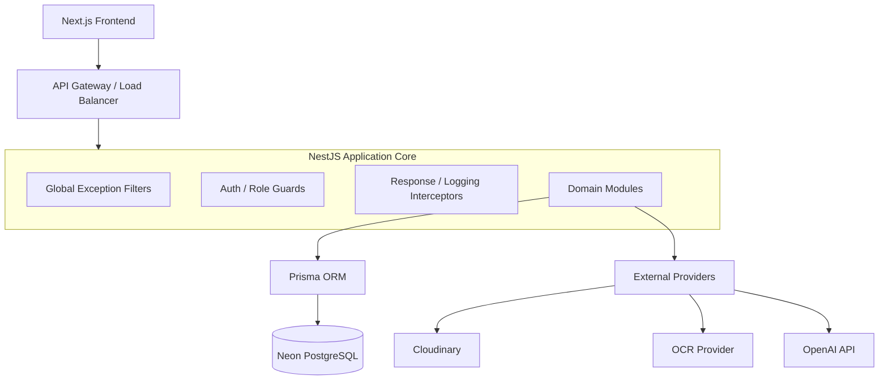
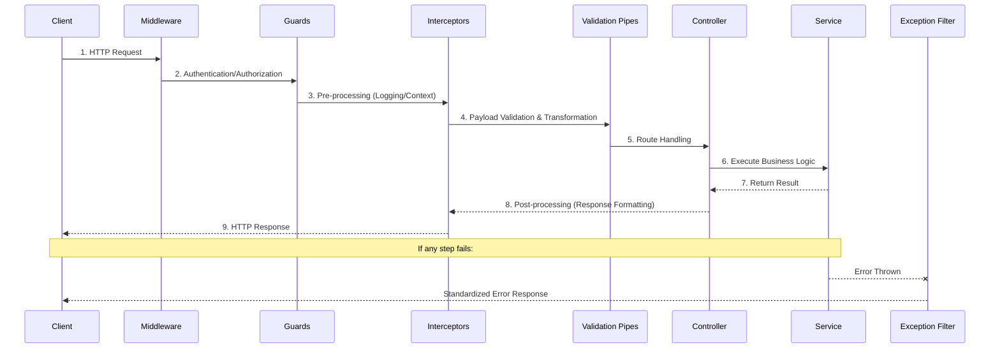
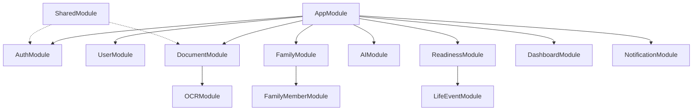
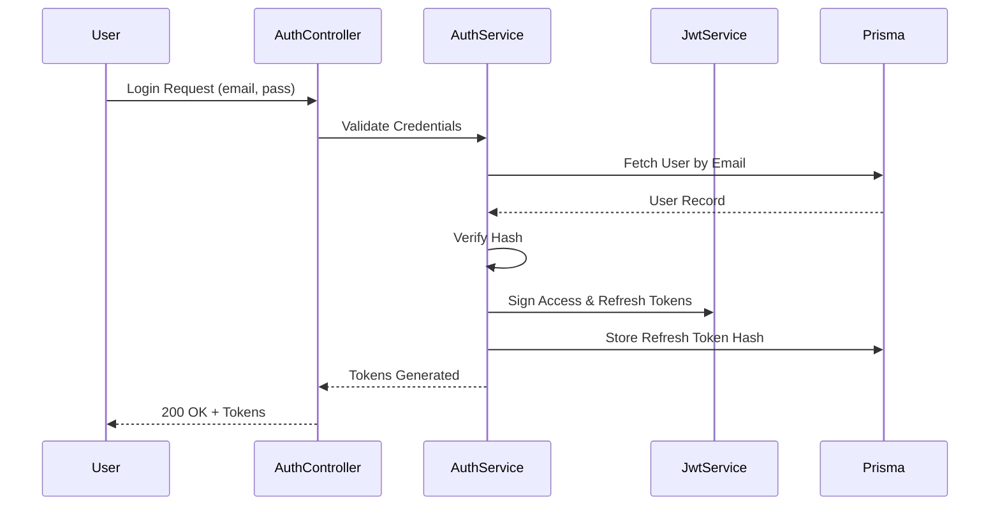
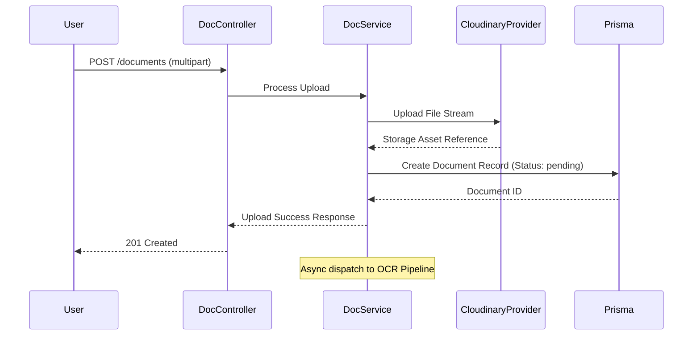
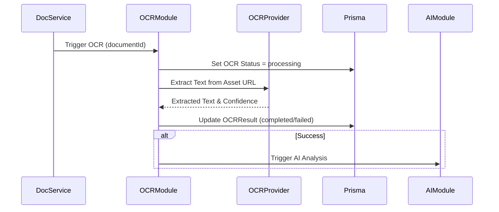
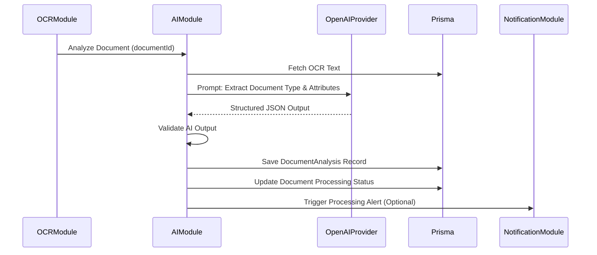
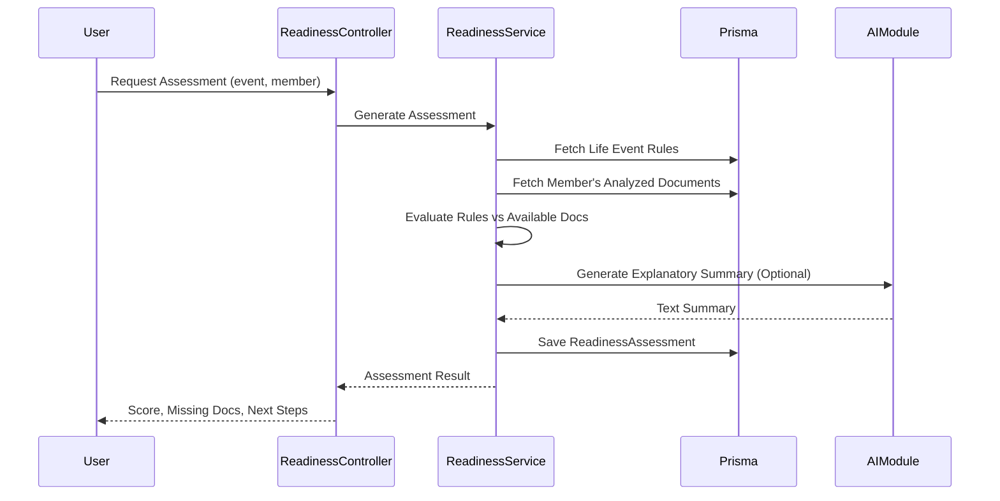

# FamilyOS AI Backend Architecture

## 1. Introduction

This document defines the backend architecture for the FamilyOS AI MVP. It acts as an architectural guide detailing how the NestJS backend application is structured, how modules interact, and how requests flow through the system. 

It translates the product requirements, system architecture, database design, and API specifications into a structured backend blueprint. This document focuses on responsibilities, boundaries, and flow, explicitly avoiding low-level implementation details such as code, schemas, and DTOs.

## 2. Backend Design Principles

| Principle | Architectural Meaning |
|---|---|
| Domain-Driven Design (DDD) Concepts | Modules are organized around business domains (e.g., Family, Document, Readiness) rather than technical layers. |
| Separation of Concerns | Clear boundaries between routing (Controllers), business logic (Services), and data access (Repositories). |
| Dependency Injection | Leverage NestJS IoC container to manage dependencies, promoting testability and loose coupling. |
| Contract-First | Controllers enforce strict input/output boundaries using validation and standard response structures. |
| Fail Fast & Safely | Validate inputs early, handle errors gracefully using global filters, and never leak internal stack traces. |
| Stateless Design | The backend remains stateless. Session data is managed via JWTs and persisted in PostgreSQL, enabling horizontal scaling. |

## 3. Architectural Style

The FamilyOS AI backend follows a **Modular Monolith** architecture built on NestJS. 
- **Modular:** Code is grouped into cohesive feature modules representing distinct domains.
- **Monolith:** Deployed as a single scalable service for the MVP, avoiding premature microservice complexity while keeping boundaries clean enough to split if required in the future.
- **Layered:** Each module enforces a layered architecture internally (Controller -> Service -> Repository).

## 4. High-Level Backend Architecture

## 5. Request Lifecycle

The standard lifecycle of a request entering the NestJS backend follows a strict sequence of layers to guarantee security, validation, and consistent processing.

## 6. Project Structure

The project structure emphasizes domain boundaries. Each module encapsulates its own controllers, services, and domain-specific logic.

| Directory | Purpose |
|---|---|
| `src/main.ts` | Application entry point and global bootstrapping. |
| `src/app.module.ts` | Root module aggregating all domain modules. |
| `src/common/` | Shared utilities, global exceptions, standard response interceptors, custom decorators, and common guards. |
| `src/config/` | Centralized configuration loading and validation (environment variables). |
| `src/modules/` | Contains all feature-specific domain modules. |
| `src/providers/` | Wrappers for external service integrations (Cloudinary, OpenAI, OCR). |

## 7. Module Breakdown

The backend is partitioned into the following logical modules.

### Module Responsibilities

| Module | Primary Responsibility |
|---|---|
| **Auth Module** | Handles user registration, login, JWT token issuance, refresh token rotation, and logout workflows. |
| **User Module** | Manages user profiles, preferences, and account status. |
| **Family Module** | Handles family workspace creation, updates, and isolation boundaries. |
| **Family Member Module** | Manages individuals within a family workspace (CRUD operations). |
| **Document Module** | Orchestrates document uploads, library listing, metadata updates, and coordinates with external storage. |
| **OCR Module** | Encapsulates integration with the external OCR provider, tracking extraction status and confidence. |
| **AI Module** | Manages OpenAI API interactions, document intelligence extraction, and AI assistant chat logic. |
| **Life Event Module** | Provides available life event scenarios and their requisite document rules. |
| **Readiness Module** | Evaluates document availability against life event rules to generate readiness assessments and scores. |
| **Notification Module** | Evaluates triggers and manages in-app alert generation, listing, and state (unread/read). |
| **Dashboard Module** | Aggregates data across families, documents, and alerts to serve summary views. |
| **Shared Module** | Exports common utilities, Prisma service, and base classes required across multiple domains. |

## 8. Layered Architecture

Within each domain module, the application enforces a strict layered architecture.

| Component | Responsibility | Rule |
|---|---|---|
| **Controllers** | Route requests, extract parameters, and return responses. | Must not contain business logic. Must delegate to Services. |
| **Services** | Execute business logic, orchestrate workflows, and apply domain rules. | Must not depend on the HTTP context (Request/Response objects). |
| **Repositories** | Handle data access patterns. | In MVP, the `PrismaService` often acts as a generic repository, but complex queries should be encapsulated. |
| **Providers** | Integrate with external APIs (Cloudinary, OpenAI). | Must abstract away vendor-specific SDK logic. |
| **Guards** | Enforce authentication and authorization (e.g., JwtAuthGuard, FamilyOwnershipGuard). | Run before route handlers to protect sensitive data. |
| **Interceptors** | Transform responses and manage execution context (e.g., standardized response wrapper). | Apply globally to ensure consistent API outputs. |
| **Filters** | Catch and normalize exceptions. | Ensure internal errors are masked and validation errors are cleanly formatted. |
| **Middleware** | Perform early request processing. | Used sparingly (e.g., raw body parsing for webhooks, basic logging). |

## 9. Authentication & Authorization Flow

**Authorization Strategy:**
- **Authentication:** `JwtAuthGuard` verifies the Access Token globally.
- **Workspace Isolation:** Custom guards (e.g., `FamilyOwnershipGuard`) intercept requests with a `familyId` path parameter, querying the database to ensure the authenticated user owns that specific workspace before allowing the controller to execute.

## 10. File Upload Pipeline

## 11. OCR Processing Pipeline

## 12. AI Processing Pipeline

## 13. Readiness Assessment Flow

## 14. Notification Flow

The Notification Module operates reactively. Rather than controllers directly calling the notification service, domain services can emit internal application events (via `@nestjs/event-emitter`).

1. **Event Trigger:** `DocumentService` completes analysis and emits `document.analyzed`.
2. **Event Listener:** `NotificationService` listens for `document.analyzed`.
3. **Evaluation:** Evaluates if mismatch or expiry conditions are met.
4. **Persistence:** Creates a `Notification` record in the database.
5. **Retrieval:** User fetches notifications via `NotificationController`.

## 15. Error Handling Strategy

Errors are handled consistently via a global exception filter (`GlobalExceptionFilter`).

- **Validation Errors:** Handled by `ValidationPipe`. Transformed into standardized `400 Bad Request` format specifying invalid fields.
- **Business Rule Errors:** Custom application exceptions (e.g., `ConflictException`, `NotFoundException`) are caught and formatted into standard JSON error responses.
- **Internal Errors:** Unhandled exceptions (`500`) are logged for debugging, but the client receives a generic "Internal Server Error" message to prevent leaking stack traces or sensitive data.

## 16. Logging Strategy

- **HTTP Logging:** Interceptors log incoming requests and response times.
- **Error Logging:** The global exception filter logs stack traces for 500 errors.
- **Domain Logging:** Services log major state changes (e.g., "Document uploaded", "OCR failed") using a structured JSON logger (e.g., `pino` or NestJS built-in logger).
- **Sensitive Data:** Personal information, passwords, and tokens are scrubbed or excluded from logs.

## 17. Validation Strategy

- **Input Validation:** Enforced using `class-validator` and `class-transformer` decorators on DTOs. NestJS `ValidationPipe` is applied globally.
- **Environment Validation:** Startup configuration is validated to ensure critical variables (DB URL, API keys) are present before the app boots.
- **AI Output Validation:** Structured AI outputs from OpenAI are parsed and validated against expected schemas to handle hallucinations safely.

## 18. Configuration Management

Configuration is centralized using `@nestjs/config`. 
- Secrets and environment-specific settings are loaded from `.env`.
- Configurations are strongly typed and injected via a `ConfigService`.
- External service keys (Cloudinary, OpenAI) are strictly managed here.

## 19. Background Jobs / Async Processing

For the MVP, asynchronous processing (like OCR and AI analysis after upload) is handled using internal background dispatch or simple event emitters (`@nestjs/event-emitter`) rather than complex message queues like Redis/BullMQ. 
- **Upload Flow:** The HTTP request returns success immediately after storage upload and database record creation.
- **Async Execution:** The OCR and AI tasks run asynchronously in the background. If the application restarts mid-process, documents remain in a `pending` state (which can be retried or swept in future iterations).

## 20. Security Considerations

| Area | Architectural Response |
|---|---|
| Injection Attacks | Use Prisma ORM to prevent SQL injection. Validate all inputs via DTOs. |
| Cross-Site Scripting (XSS) | Sanitize AI chat outputs; rely on frontend frameworks to escape rendering. |
| Authorization | Enforce `FamilyOwnershipGuard` on all family-scoped routes. Ensure ID tampering does not expose other workspaces. |
| Token Security | Passwords hashed (bcrypt). Refresh tokens hashed before storage. Short-lived access tokens. |
| File Upload Safety | Validate MIME types, restrict file sizes, and store files on Cloudinary, not the local filesystem. |

## 21. Performance Considerations

- **Database Indexes:** Prisma schema will define indexes on foreign keys (`familyId`), status fields, and lookup keys to ensure fast querying.
- **Pagination:** Enforced at the controller/service level for all list endpoints to bound memory usage.
- **N+1 Problem Avoidance:** Services use Prisma `include` thoughtfully, avoiding deep nested joins unless necessary.

## 22. Scalability Strategy

- **Statelessness:** The backend relies entirely on the database and JWTs, allowing multiple instances of the NestJS application to run concurrently (e.g., on Railway) behind a load balancer.
- **External Storage:** Files are handled by Cloudinary, ensuring the backend server does not face disk space exhaustion or heavy I/O bottlenecks.
- **Decoupled AI:** AI processing is heavily I/O bound. The event-driven internal approach isolates HTTP request response times from slow OpenAI API calls.

## 23. Coding Standards

- **TypeScript:** Strict mode enabled. No implicit `any`.
- **Dependency Direction:** Controllers depend on Services. Services depend on Repositories/Providers. Dependencies point inward toward business logic.
- **Naming Conventions:** Classes use PascalCase, methods use camelCase, modules suffixed with `Module`, services with `Service`.
- **Async/Await:** Preferred over raw Promises.

## 24. Risks

| Risk | Architectural Mitigation |
|---|---|
| Long-running OpenAI requests tying up worker threads. | Execute AI requests asynchronously, decoupled from the main HTTP response loop. |
| Third-party API rate limits (OCR/OpenAI). | Handle `429 Too Many Requests` gracefully. Log failures and allow manual retry via UI if background process fails. |
| Unauthorized access due to nested resource routing. | Implement strict guard validation ensuring the authenticated user owns the parent `familyId` in the URL path for every request. |

## 25. Assumptions

- The backend will be deployed to a PaaS (like Railway) capable of running Node.js applications.
- PostgreSQL (via Neon) provides sufficient performance for MVP relational data needs without requiring caching layers like Redis.
- Asynchronous tasks in MVP will tolerate process-restart loss (i.e., a document might stick in `processing` state if the server restarts during analysis).
