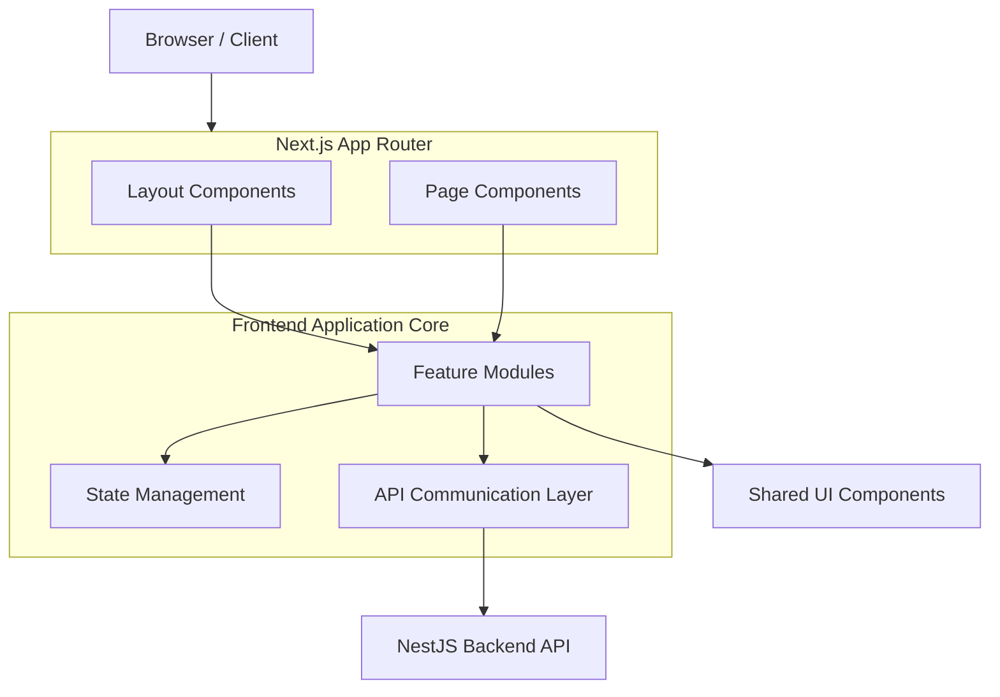
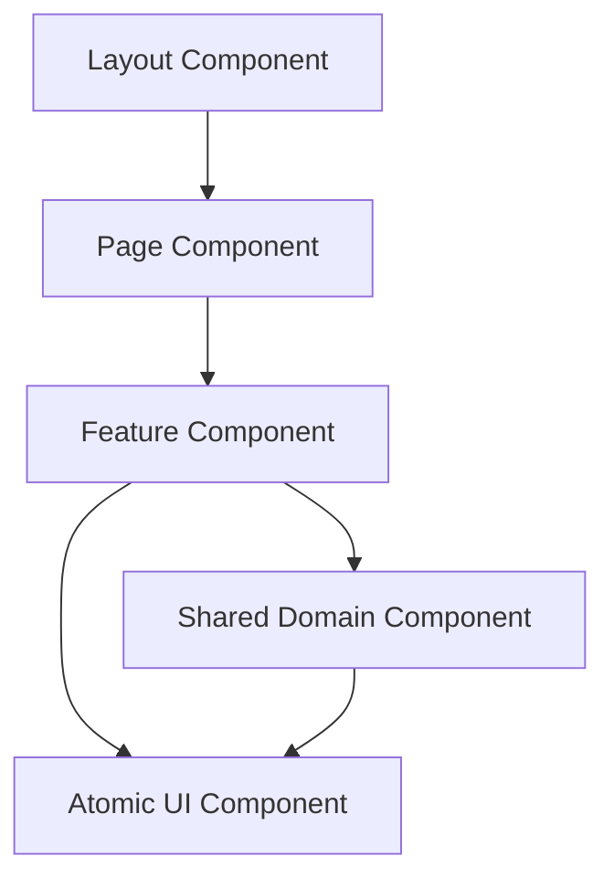
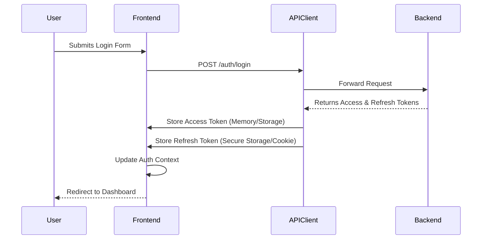
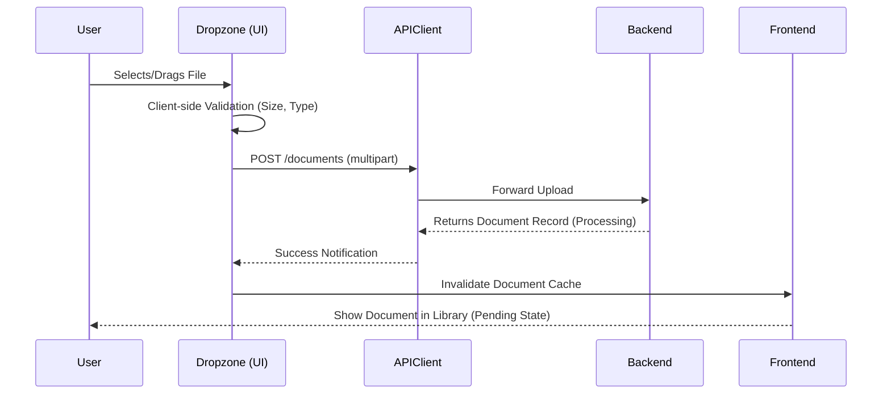
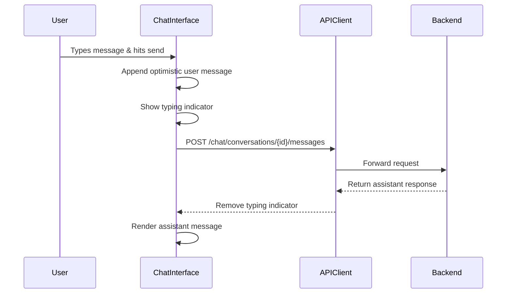
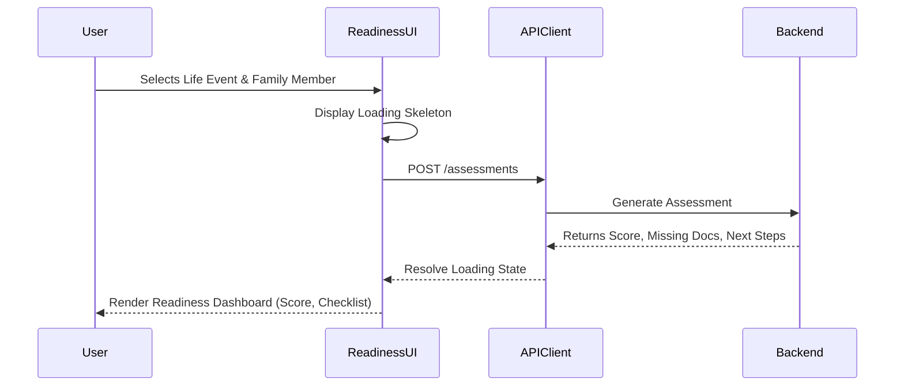

# FamilyOS AI Frontend Architecture

## 1. Introduction

This document defines the frontend architecture for the FamilyOS AI MVP. It acts as an architectural guide detailing how the Next.js application will be organized, how components will interact, and how state and routing will be managed.

It translates the product requirements, system architecture, API specifications, and design guidelines into a structured frontend blueprint. This document focuses on boundaries, routing, state, and flow, explicitly avoiding low-level implementation details such as code, hooks, context implementations, and component code blocks.

## 2. Frontend Design Principles

| Principle | Architectural Meaning |
|---|---|
| Server-First Rendering | Leverage Next.js App Router for Server Components (RSC) to reduce client-side bundle size, fetch data efficiently, and improve initial load times. |
| Co-location of Logic | Group components, hooks, and types by feature domain rather than globally separating by technical layer, keeping related code together. |
| Component Isolation | Build small, reusable, and testable components with clear inputs (props) and outputs (events), avoiding tight coupling to global state. |
| Optimistic Updates | Provide immediate UI feedback for user actions (like adding a family member or deleting a document) while background operations complete. |
| Fail Gracefully | Handle API errors, missing data, and uncertain AI outputs gracefully using error boundaries and fallback UI states. |
| Design System Driven | Utilize a consistent set of UI primitives (Tailwind CSS, Radix UI/Shadcn-like patterns) to maintain visual consistency across all feature modules. |

## 3. Architectural Style

The FamilyOS AI frontend utilizes the **Next.js App Router** architecture, blending server-side rendering (SSR), static site generation (SSG), and client-side rendering (CSR).
- **Feature-Based Structure:** Code is organized by domain features rather than functional types (e.g., separating `documents` logic from `family` logic).
- **Client/Server Boundary:** Strict delineation between Server Components (for data fetching and SEO) and Client Components (for interactivity and state).

## 4. High-Level Frontend Architecture



## 5. Application Structure

The application prioritizes a domain-centric folder structure to maximize maintainability.

| Directory | Purpose |
|---|---|
| `app/` | Next.js App Router directory containing routes, layouts, pages, loading states, and error boundaries. |
| `features/` | Domain-specific logic, components, hooks, and local state (e.g., `features/auth`, `features/documents`). |
| `components/` | Global shared UI components (buttons, inputs, modals, typography). |
| `lib/` | Shared utilities, API client instances, and formatting helpers. |
| `hooks/` | Global custom hooks not bound to a specific feature. |
| `store/` | Global state context definitions. |
| `types/` | Global TypeScript definitions and shared API response interfaces. |

## 6. Route Architecture (App Router)

The App Router structures the application via the filesystem.

```mermaid
flowchart TD
    Root[/app/] --> AuthGroup[(auth)]
    Root --> Dashboard[/dashboard/]
    Root --> Family[/family/]
    Root --> Documents[/documents/]
    Root --> Readiness[/readiness/]
    
    AuthGroup --> Login[/login/]
    AuthGroup --> Register[/register/]
    
    Documents --> DocUpload[/upload/]
    Documents --> DocDetails[/[id]/]
    
    Family --> Members[/members/]
    Family --> Settings[/settings/]
```

| Route Path | Description | Access |
|---|---|---|
| `/` | Landing page or redirect to dashboard if authenticated. | Public |
| `/(auth)/login` | User login screen. | Public |
| `/(auth)/register` | User registration screen. | Public |
| `/dashboard` | Aggregated view of family readiness, missing docs, and alerts. | Protected |
| `/family/members` | Management of family members. | Protected |
| `/documents` | Document library list view. | Protected |
| `/documents/upload` | Document upload workflow. | Protected |
| `/documents/[id]` | Document detail view (OCR results, AI analysis). | Protected |
| `/readiness` | Life event selection and readiness assessment output. | Protected |
| `/chat` | AI assistant conversational interface. | Protected |

## 7. Layout Architecture

Layouts provide persistent UI wrappers around routes.

- **Root Layout:** Defines the HTML structure, global fonts, and global context providers (e.g., Theme, Auth context).
- **Auth Layout:** Provides minimal framing for login and registration screens, emphasizing the form.
- **Dashboard Layout:** Surrounds protected routes, incorporating the primary navigation sidebar, user profile dropdown, and global alert banners.

## 8. Feature Modules

Features are isolated modules containing their own components, API calls, and logic.

| Module | Responsibilities |
|---|---|
| **Authentication** | Login, registration, token storage, protected route redirection, and user session management. |
| **Dashboard** | Fetching aggregated workspace metrics, displaying recent alerts, and routing users to high-priority actions. |
| **Family** | Viewing and updating workspace settings and isolation context. |
| **Family Members** | Listing, adding, editing, and deleting family members. |
| **Document Library** | Listing documents with pagination, filtering by member/category, and sorting. |
| **Document Upload** | Handling `multipart/form-data` uploads, drag-and-drop UI, and tracking upload progress. |
| **AI Chat** | Maintaining message history, handling conversational input, and rendering assistant responses with loading states. |
| **Life Event Assistant** | Presenting supported life events and capturing user selection for readiness checks. |
| **Readiness** | Rendering readiness scores, listing missing documents, and presenting AI-generated next steps. |
| **Notifications** | Fetching, displaying, and dismissing in-app alerts within a global dropdown or dedicated view. |
| **Shared Components** | Providing atomic UI elements independent of any specific domain. |

## 9. Component Architecture



| Component Level | Definition | Rule |
|---|---|---|
| **Layout Components** | Wrappers providing persistent UI (headers, sidebars). | Should primarily render children and maintain layout state. |
| **Page Components** | The entry point for a route. | Generally Server Components. Responsible for initial data fetching and passing data down. |
| **Feature Components** | Domain-specific blocks (e.g., `DocumentList`, `UploadDropzone`). | Client Components where interactivity is needed. Keep business logic close. |
| **Shared Components** | Reusable domain items (e.g., `MemberSelectDropdown`). | Abstracted when needed by multiple features. |
| **UI Components** | Atomic, generic UI (e.g., `Button`, `Input`, `Modal`). | Strictly presentational. Must not fetch data or hold domain logic. |

## 10. State Management Strategy

To prevent unnecessary complexity, state management is partitioned by its lifecycle and scope.

| State Type | Mechanism | Description |
|---|---|---|
| **Local State** | React `useState` / `useReducer` | Component-specific UI state (e.g., modal open/close, toggle switches, local loading flags). |
| **Form State** | React Hook Form | Manages form inputs, validation triggers, and submission state efficiently without re-rendering the whole component tree. |
| **Server State** | SWR or React Query | Handles fetching, caching, synchronizing, and updating data from the backend API. Handles loading and error states for network requests. |
| **Global State** | React Context API | Reserved for truly global, infrequently changing state (e.g., current authenticated user, theme preference). |

## 11. API Communication Layer

- **HTTP Client:** Axios or native `fetch` wrapped in a centralized API client utility.
- **Interceptors:** The API client automatically attaches the JWT Access Token to all requests.
- **Token Rotation:** The API client intercepts `401 Unauthorized` responses, attempts to refresh the token transparently, and retries the original request. If refresh fails, it redirects to the login screen.
- **Base URL:** Centrally configured via environment variables.

## 12. Authentication Flow



## 13. File Upload Flow



## 14. AI Chat Flow



## 15. Readiness Assessment Flow



## 16. Error Handling Strategy

- **API Errors:** The centralized API client catches HTTP errors and normalizes them.
- **Form Errors:** 400 Bad Request validation errors from the backend are parsed and mapped directly to React Hook Form field errors.
- **Global Error Boundaries:** Next.js `error.tsx` files wrap route segments to catch unexpected rendering errors, displaying a generic fallback UI instead of crashing the application.
- **Toast Notifications:** Ephemeral error states (e.g., "Failed to upload document") are displayed via global toast notifications.

## 17. Loading & Skeleton Strategy

- **Route Transitions:** Next.js `loading.tsx` files are used to display instant loading UI while server components fetch data.
- **Skeletons:** Preferred over generic spinners. Content-specific skeleton components (e.g., `DocumentListSkeleton`) mimic the shape of the data being loaded to reduce perceived layout shift.
- **Inline Loading:** Buttons and forms manage their own localized loading states (e.g., disabling a submit button and showing a spinner icon during submission).

## 18. Validation Strategy

- **Client-Side:** Zod schemas are used in combination with React Hook Form to validate inputs before submission, providing instant user feedback.
- **Shared Schemas:** Where possible, Zod schemas should mirror backend validation rules.
- **Server-Side Fallback:** The frontend gracefully handles any server-side validation rejections, mapping them back to the UI seamlessly.

## 19. Accessibility Strategy

- **Semantic HTML:** Use proper tags (`<nav>`, `<main>`, `<article>`, `<label>`).
- **ARIA Attributes:** Implement ARIA roles and labels for dynamic elements, especially modals, dropdowns, and chat interfaces.
- **Keyboard Navigation:** Ensure all interactive elements (buttons, links, form fields, dropzones) are reachable and usable via keyboard.
- **Contrast & Color:** Ensure text and interactive elements meet WCAG contrast requirements, avoiding reliance on color alone for critical status indicators (e.g., readiness scores).

## 20. Responsive Design Strategy

- **Mobile First:** UI components are styled for mobile viewports by default using Tailwind CSS, scaling up using `sm:`, `md:`, and `lg:` breakpoints.
- **Layout Adjustments:** 
  - The dashboard sidebar collapses into a hamburger menu on small screens.
  - Tables (e.g., document library) convert to stacked cards on mobile devices.
  - Chat interfaces utilize the full viewport on mobile to maximize readability.

## 21. Performance Optimization

- **Server Components:** Maximize use of React Server Components to reduce JavaScript shipped to the browser.
- **Image Optimization:** Use `next/image` for automatic resizing, WebP formatting, and lazy loading of any static assets or secure document thumbnails.
- **Code Splitting:** Rely on Next.js automatic route-based code splitting.
- **Bundle Size:** Audit dependencies. Avoid importing massive libraries if a lighter alternative or native browser API suffices.

## 22. SEO Strategy

While FamilyOS AI is a secure, authenticated platform, SEO principles apply to public pages.
- **Public Routes:** Generate dynamic `<title>` and `<meta name="description">` tags using Next.js Metadata API for login, registration, and landing pages.
- **Protected Routes:** Ensure protected routes explicitly block indexing via `<meta name="robots" content="noindex">`.

## 23. Security Considerations

| Area | Architectural Response |
|---|---|
| JWT Storage | Access tokens kept in memory where possible; Refresh tokens managed via secure HTTP-only cookies if backend supports it, or secure local storage. |
| XSS Protection | React automatically escapes string variables. Use `dangerouslySetInnerHTML` strictly with sanitized HTML (if ever needed for AI markdown parsing). |
| CSRF Protection | Rely on Authorization Bearer tokens and SameSite cookie policies. |
| Content Security Policy | Implement basic CSP headers in Next.js config to restrict script sources. |
| Sensitive Output | Never expose raw token payloads in the UI. Explicitly handle uncertain AI outputs with warning labels to manage user trust. |

## 24. Coding Standards

- **TypeScript:** Strict mode enabled. Define clear interfaces for all component props and API responses. No `any`.
- **Component Structure:** One component per file. Use functional components with hooks.
- **Styling:** Use Tailwind CSS utility classes. Extract highly repeated patterns into reusable UI components rather than complex CSS files.
- **File Naming:** Use `kebab-case` for folders and `PascalCase` for component files (e.g., `features/document-library/DocumentCard.tsx`).

## 25. Risks

| Risk | Architectural Mitigation |
|---|---|
| Large client bundle sizes from AI/Markdown parsing libraries. | Dynamically import heavy libraries (e.g., `next/dynamic`) only where needed (like the Chat route). |
| UI blocking during long AI requests. | Utilize optimistic UI updates and clear skeleton/loading states so the app feels responsive even when API calls are slow. |
| Form state complexity leading to performance drops. | Strictly isolate form rendering using React Hook Form to prevent unnecessary re-renders of parent layouts. |

## 26. Assumptions

- The frontend will be deployed on Vercel, maximizing the performance benefits of Next.js App Router, edge caching, and serverless functions.
- The UI will be built using a robust, accessible component library foundation (like Shadcn UI / Radix) integrated with Tailwind CSS to accelerate development.
- The backend API will strictly adhere to the contract established in the API Specification, providing predictable JSON responses.
