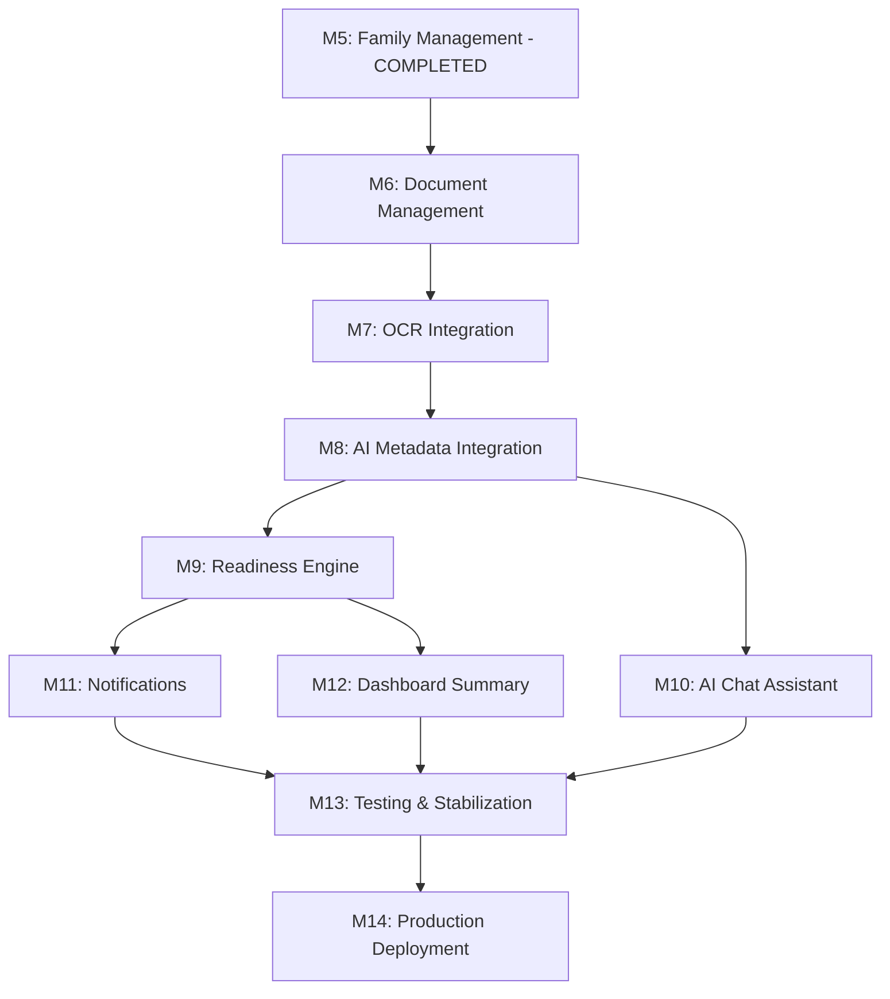

# Product Development Roadmap

This document outlines the master development roadmap for the remaining lifecycle of the FamilyOS AI MVP. It describes completed and remaining milestones, dependency mappings, and specific roadmap tracks across Frontend, Backend, AI, and Production Deployment.

---

## 1. Milestone Status Summary

### Completed Milestones
- **M1: Project Setup**: Repository structured. NestJS skeleton established. Config pipeline configured.
- **M2: Backend Foundation**: Database initialized with Prisma Client and PostgreSQL integration.
- **M3: Frontend Foundation**: Skeleton Next.js layout and client shell initialized.
- **M4: Authentication**: JWT login, user registration, token rotation, and invalidation active.
- **M5: Family Management**: Workspace CRUD and Member profile CRUD active. Parent hierarchy validation enforced.

### Remaining Milestones
- **M6: Document Management**: Cloudinary signed uploads, document CRUD, and library retrieval.
- **M7: OCR Integration**: Background text extraction and OCR Result caching.
- **M8: AI Integration**: OpenAI prompt design, JSON classification, and metadata review.
- **M9: Readiness Engine**: Rule evaluator, scoring engine, and checklist generator.
- **M10: AI Chat Assistant**: Conversational agent leveraging context windows over parsed metadata.
- **M11: Notifications**: Alert generation for expirations, missing documents, and name mismatches.
- **M12: Dashboard**: Summary statistics aggregation.
- **M13: Testing & Stabilization**: End-to-end user path validation and performance optimization.
- **M14: Production Deployment**: Neon, Cloudinary, and Railway production configurations.

---

## 2. Dependency Graph & Development Order

The remaining milestones have strong logical couplings. Document uploads must precede OCR; OCR text must precede AI extraction; structured metadata must precede Readiness assessment and Conversational analysis.

---

## 3. Development Roadmaps By Track

### 3.1 Backend Roadmap
1. **Milestone 6 (Document Vault CRUD)**: Build out storage providers, Multer upload filters, signed URL generation, and metadata updating endpoints.
2. **Milestone 7 (OCR Pipeline)**: Integrate background OCR extraction triggers. Implement caching for OCR results.
3. **Milestone 8 (AI Metadata Extraction)**: Develop LLM completion orchestration. Define JSON extraction templates for passport, PAN, and Aadhaar card formats.
4. **Milestone 9 (Readiness Core)**: Implement scoring logic and life-event checklist generators.
5. **Milestone 10 (AI Assistant Chat)**: Implement conversation thread persistence, message formatting, and prompt-context builders.
6. **Milestone 11 (Notifications & Reminders)**: Create cron-based scanner for expirations and event-driven alert triggers.

### 3.2 Frontend Roadmap
1. **Milestone 6 (Vault UI)**: Design the document grid/table layout with search, sorting, and tag-based filters.
2. **Milestone 6 (Upload Flow)**: Integrate file dropzone UI, upload progress bars, and document-member linkage forms.
3. **Milestone 8 (Metadata Verification Screen)**: Build a side-by-side verification view showing the uploaded document alongside the AI-extracted fields for manual correction.
4. **Milestone 9 (Readiness Dashboard)**: Design the life-event selection dropdown, readiness dials (scores), and requirement checklist grids.
5. **Milestone 10 (AI Assistant UI)**: Create the conversational sidebar chat interface, featuring message logs and quick-prompt chips.
6. **Milestone 11 (Alert Center)**: Integrate a notification dropdown showing warnings for mismatches, expirations, and missing documents.

### 3.3 AI Roadmap
1. **OCR Text Processing**: Optimize image pre-processing (scaling, rotating) on the client/server to ensure maximum OCR readability.
2. **LLM Prompt Engineering**: Develop prompts with few-shot examples for passport, Aadhaar, PAN card, and driver's licenses, enforcing JSON output schemas.
3. **Inconsistency Resolution**: Implement matching algorithms (Cosine similarity, Levenshtein distance) to identify subtle name and address spelling variations across documents.
4. **Context Window Management**: Design truncation strategies for chat logs to ensure user questions remain under LLM token boundaries while preserving relevant document facts.

### 3.4 Production & Deployment Roadmap
1. **Neon DB Scaling**: Apply connection pooling (pgbouncer) to Neon connection URLs to prevent socket exhaustion during concurrent API workloads.
2. **Cloudinary Asset Optimization**: Configure folder structures, restricted access permissions (signed delivery), and automatic image transformations.
3. **Railway Environment Verification**: Establish Railway pipelines with automatic branch builds. Secure production environment variables.
4. **Monitoring & Logging**: Inject centralized diagnostic logging to track background OCR and OpenAI API failures.
