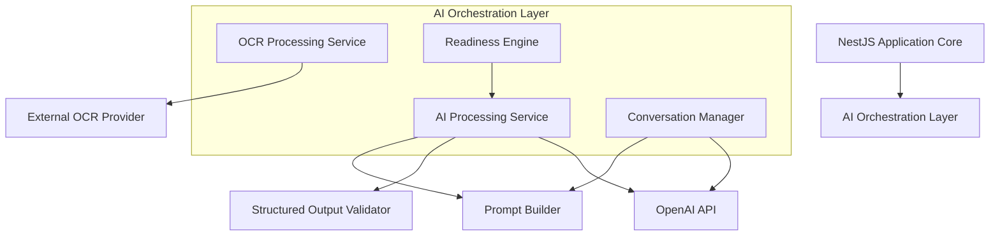
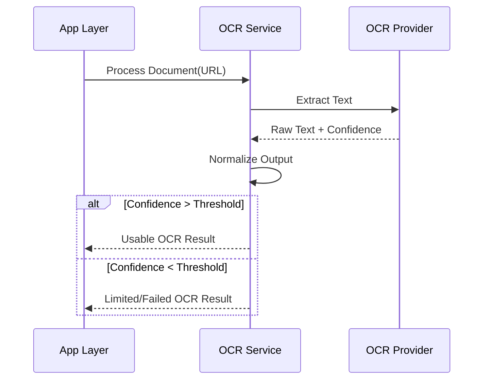
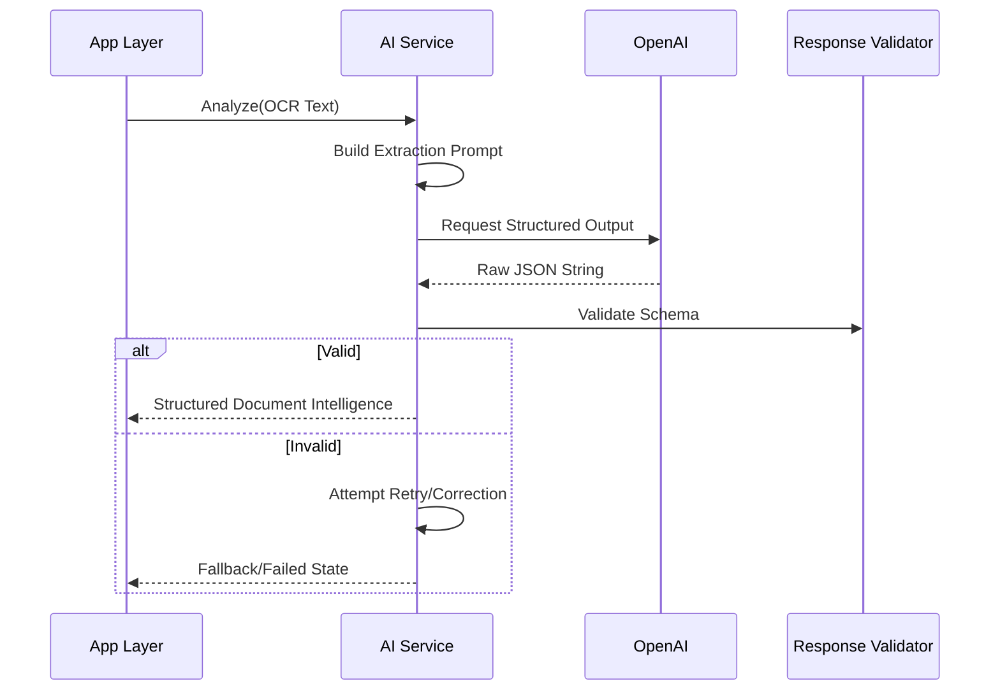
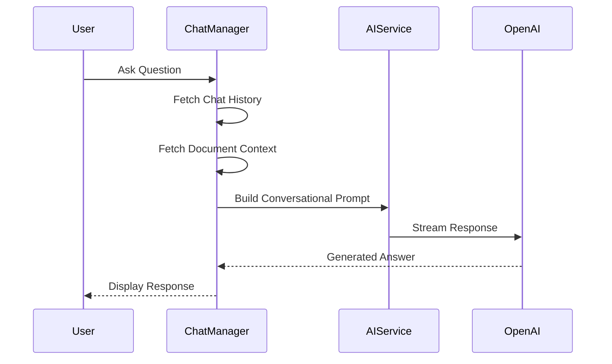
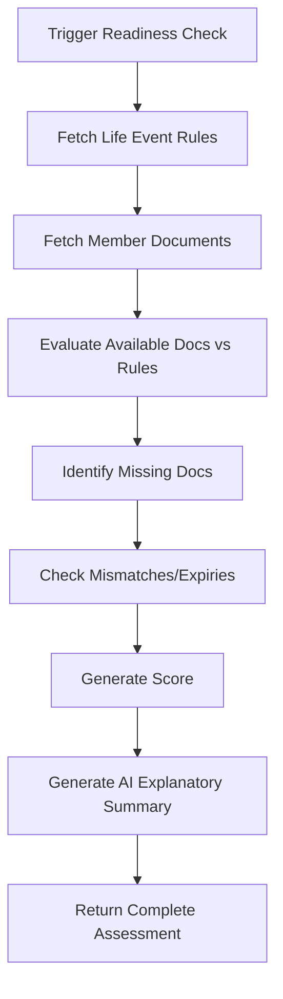
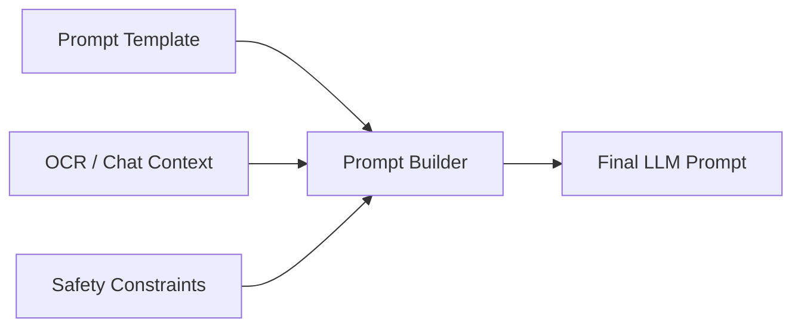
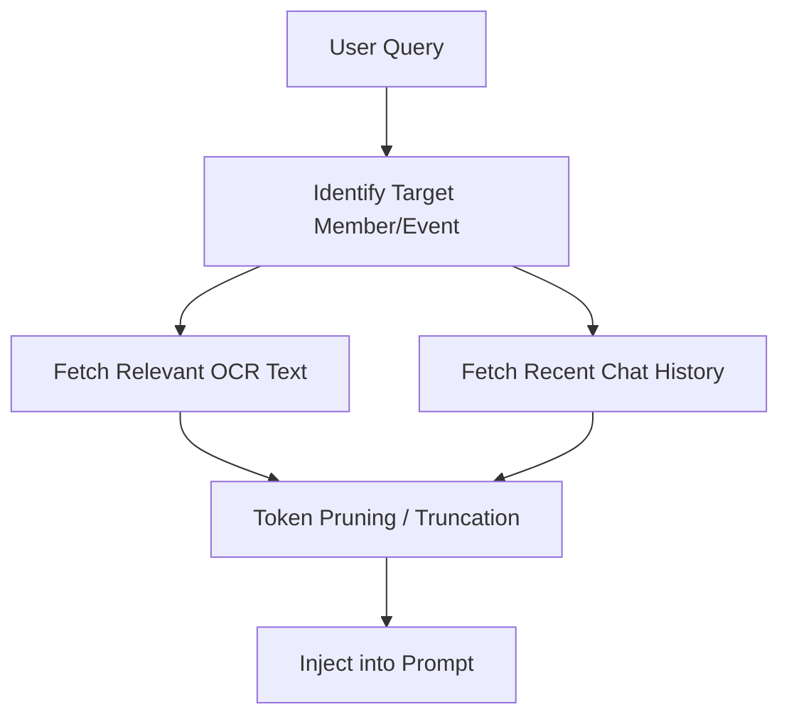
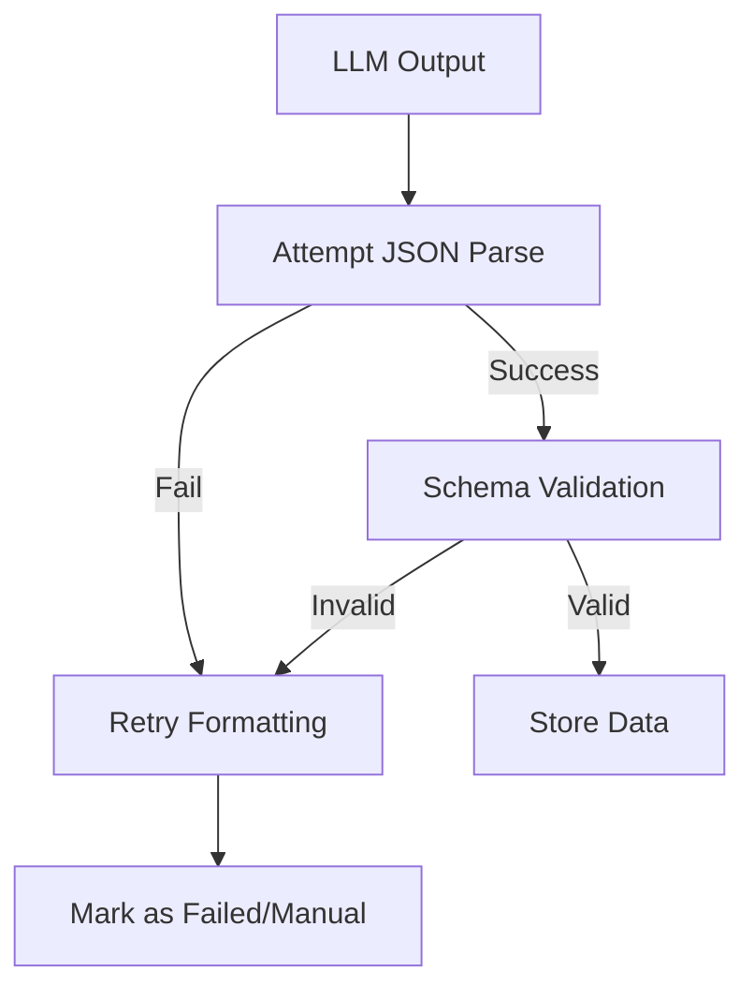

# FamilyOS AI Architecture

## 1. Introduction

This document defines the AI architecture for the FamilyOS AI MVP. It details how OCR data is transformed into structured intelligence, how conversational AI assists families, how readiness for life events is evaluated, and how the platform guarantees security, consistency, and reliability. 

This document serves as an architectural blueprint for AI capabilities and explicitly excludes low-level implementation details such as code, concrete prompt strings, schema definitions, and vendor-specific SDK usage.

## 2. AI Design Principles

| Principle | Description |
|---|---|
| Bounded Context | AI models operate strictly within the boundaries of the authenticated user's workspace, referencing only uploaded family documents. |
| Structured First | Outputs are strictly formatted as JSON to ensure deterministic parsing and integration with application logic. |
| Deterministic Fallbacks | AI acts as an enhancement layer. If AI fails, the system degrades gracefully into a manual document vault. |
| Explainable Intelligence | AI outputs (like readiness scores and mismatch detection) must be accompanied by explicit reasons and confidence levels. |
| Safety & Privacy | Sensitive data is minimized in prompts. Responses are sanitized. Hallucinations are mitigated through rigorous structured prompting. |
| Decoupled Processing | AI services are isolated from critical path HTTP requests to prevent blocking the UI. |

## 3. AI Architecture Overview

The AI Architecture bridges the gap between raw unstructured document uploads and the structured intelligence required by the FamilyOS business logic.

## 4. AI Capabilities

### OCR Processing
Extracts raw text and bounding boxes from uploaded images or PDFs. Handles document degradation, rotation, and multi-page complexities.

### Document Classification
Analyzes raw OCR text to classify the document into predefined categories (e.g., Identity, Finance, Travel) and specific types (e.g., Aadhaar, Passport).

### Field Extraction
Locates and extracts specific attributes such as names, dates of birth, issue dates, and document identification numbers from raw OCR text.

### Structured JSON Extraction
Transforms free-form text from OCR into strictly typed, predefined JSON schemas suitable for database ingestion and business logic evaluation.

### Name Matching
Compares extracted names across multiple documents belonging to the same family member to identify discrepancies (e.g., missing surnames, spelling variations).

### Address Matching
Evaluates addresses across documents to identify outdated, mismatched, or conflicting residency data.

### Missing Document Detection
Identifies absent documents required for specific life events based on predefined rules and currently uploaded workspace inventory.

### Expiry Detection
Extracts expiry dates and calculates temporal validity to trigger renewal alerts.

### Readiness Assessment
Aggregates missing documents, expiry warnings, and mismatches to generate a unified readiness score for a targeted life event.

### AI Chat Assistant
A conversational interface grounded exclusively in the family's document vault, capable of answering queries regarding document availability, status, and gaps.

### Life Event Guidance
Generates high-level, informational summaries explaining the general process and prerequisites for supported government or life events.

## 5. AI Components

| Component | Responsibility |
|---|---|
| **OCR Provider** | External service responsible for generating machine-readable text from binary files. |
| **AI Processing Service** | Core orchestrator that coordinates prompt building, API calls to the LLM, and structured parsing of the response. |
| **Prompt Builder** | Dynamically constructs prompts by merging templates with contextual data (e.g., OCR text, user queries). |
| **Prompt Templates** | Versioned definitions of system and user prompts designed for specific AI tasks. |
| **Response Validator** | Validates the raw string output from the LLM against expected structural constraints (e.g., Zod schemas). |
| **JSON Parser** | Safely attempts to parse and sanitize the validated string into a programmatic JSON object. |
| **Confidence Scoring Engine** | Evaluates metadata returned by the LLM or internal heuristics to assign a confidence score to extracted fields. |
| **Readiness Engine** | Evaluates deterministic business rules against extracted AI data to determine life event preparedness. |
| **Conversation Manager** | Manages chat history windowing, role assignment, and context injection for the conversational assistant. |

## 6. AI Processing Pipelines

### OCR Pipeline

### AI Analysis Pipeline

### Chat Pipeline

### Readiness Assessment Flow

## 7. Prompt Engineering Strategy

- **System Prompts:** Establish the persona, boundaries, and strict output formats. System prompts explicitly forbid the AI from offering legal advice or hallucinating data not present in the context.
- **User Prompts:** Represent the specific task (e.g., "Extract fields from this text" or the user's chat query).
- **Context Injection:** Raw OCR text or workspace metadata is injected using clear delimiters (e.g., XML tags or markdown blocks) to prevent prompt injection.
- **Structured Output Prompts:** Instructions explicitly demand JSON formats, often providing examples (Few-Shot prompting) of the required schema.
- **Prompt Versioning:** Prompts are treated as code. They are versioned and stored centrally (e.g., in configuration files or a dedicated registry) rather than hardcoded inline.
- **Prompt Safety:** Instructions explicitly mandate returning empty fields or `null` if data cannot be confidently found, preventing hallucinations.

## 8. Context Management

Context management is critical to staying within token limits while providing accurate AI responses.

- **Conversation History:** Chat context uses a sliding window (e.g., last 5 messages) or summarization to prevent exceeding context limits.
- **Family Context:** Context is strictly scoped to the authenticated user's workspace.
- **Document Context:** Only relevant documents (e.g., documents belonging to the queried family member) are injected into the context.
- **Token Management:** The system estimates token counts before calling the API. If context exceeds the limit, older chat history or less relevant document text is truncated.

## 9. Structured AI Outputs

To integrate AI with traditional backend logic, outputs must be strictly structured.

- **JSON Schema Strategy:** The system defines exact JSON schemas for extraction tasks.
- **Validation:** Raw strings from the LLM are parsed and validated against expected schemas (e.g., using Zod).
- **Confidence Thresholds:** The LLM is instructed to output a confidence score for its extractions. Outputs below a threshold trigger a "Needs Review" status.
- **Retry Strategy:** If parsing fails, a specialized retry prompt containing the validation error is sent back to the LLM to correct the JSON.
- **Fallback Handling:** If retries fail, the system degrades gracefully, marking the document analysis as failed and relying on manual user entry.

## 10. AI Safety

| Concept | Architectural Strategy |
|---|---|
| **Hallucination Mitigation** | Force "null" outputs when data is absent. Use few-shot prompting. Ground chat strictly in uploaded documents. |
| **Prompt Injection** | Use clear delimiters for user input and OCR text. Prioritize system instructions over user input. |
| **Data Privacy** | Context is scoped strictly to the authenticated user. No cross-workspace data is ever included in a prompt. |
| **Sensitive Info Handling** | AI outputs are stored securely. Models are not trained on user data (via enterprise API agreements). |
| **Content Moderation** | Chat inputs can be scanned for abusive or out-of-bounds requests before hitting the core LLM. |
| **Output Validation** | AI claims about readiness are double-checked by deterministic business rules before display. |

## 11. Performance Strategy

- **Async Execution:** Heavy AI tasks (OCR, Field Extraction) are executed asynchronously via background events, immediately returning a `202 Accepted` or `processing` status to the frontend.
- **Parallel Processing:** Independent document analyses can run concurrently.
- **Caching Opportunities:** Static life event summaries and rules can be cached to avoid repeated LLM generation.
- **Token Optimization:** OCR text is cleaned (removing excessive whitespace, irrelevant characters) before prompt injection to save tokens and speed up generation.
- **Cost Optimization:** Use faster, cheaper models (e.g., GPT-4o-mini) for simple classification, reserving larger models for complex conversational reasoning.

## 12. Monitoring & Observability

- **AI Logs:** Log prompt versions, model names, and execution times.
- **Token Usage:** Track prompt and completion tokens per request to monitor costs.
- **Error Monitoring:** Track schema validation failures and parse errors to identify prompt degradation.
- **Quality Monitoring:** Track the frequency of "Low Confidence" outputs and user-initiated manual corrections to measure extraction accuracy over time.

## 13. AI Limitations

- **OCR Degradation:** AI analysis is inherently limited by the quality of the underlying OCR extraction. Bad images yield bad intelligence.
- **Non-Deterministic Nature:** Despite structured prompting, LLMs can occasionally alter output formats or hallucinate. The system relies heavily on the Response Validator to catch this.
- **Latency:** Conversational AI and full-document extraction take time. The architecture must mask this latency with optimistic UI updates and loading states.
- **No Official Authority:** The AI cannot guarantee legal compliance or official government application success.

## 14. Future AI Enhancements

| Feature | Architectural Pathway |
|---|---|
| **Multilingual Support** | Utilize LLMs capable of cross-lingual reasoning to translate non-English documents into English metadata. |
| **Vision Models** | Bypass traditional OCR by passing document images directly to multimodal LLMs (e.g., GPT-4V) for simultaneous extraction and analysis. |
| **Agentic Workflows** | Enable the AI to take multi-step actions, such as fetching missing information from external public APIs or proactively organizing the vault. |
| **Multi-Model Support** | Introduce an LLM routing layer to dynamically select between OpenAI, Anthropic, or local open-source models based on task complexity and cost. |

## 15. Risks

| Risk | Mitigation |
|---|---|
| **API Rate Limits** | Implement exponential backoff, retry queues, and graceful degradation in the UI if limits are hit. |
| **Format Instability** | Strict Zod validation and automated prompt-correction loops for malformed JSON. |
| **Context Window Overflow** | Implement robust token counting and truncation logic before sending prompts to the API. |
| **Cost Overruns** | Monitor token usage per family. Restrict the size of uploaded documents or the depth of conversational history. |

## 16. Assumptions

- The selected external OCR provider can output reasonably accurate plain text.
- The chosen LLM API supports structured JSON output modes (e.g., OpenAI JSON mode or tool calling).
- The enterprise API agreement with the LLM provider ensures user data is not used for model training.
- Asynchronous event-driven processing is sufficient for the MVP without requiring a heavy distributed message queue infrastructure.
