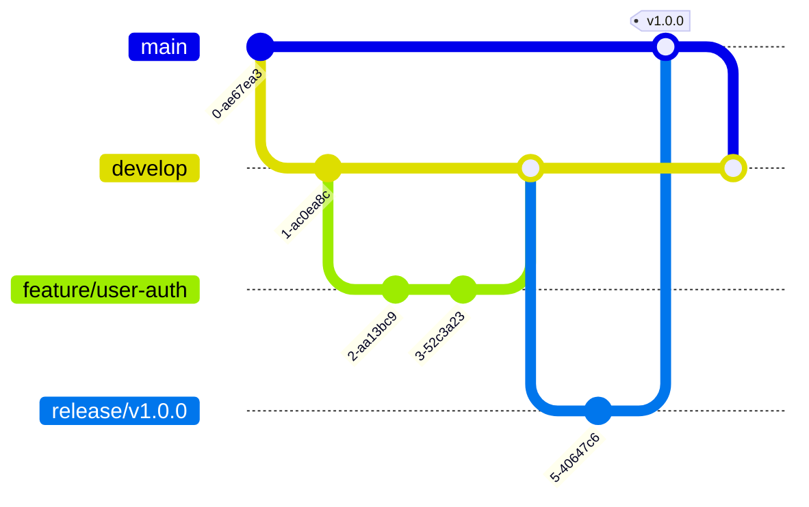
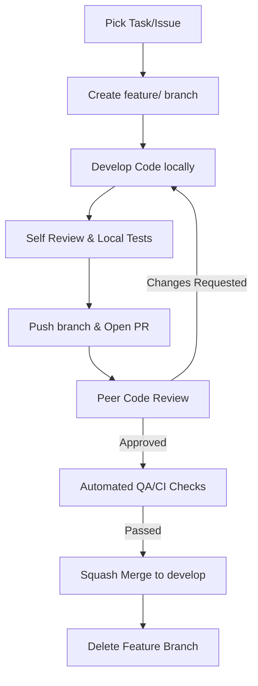
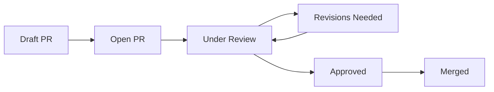
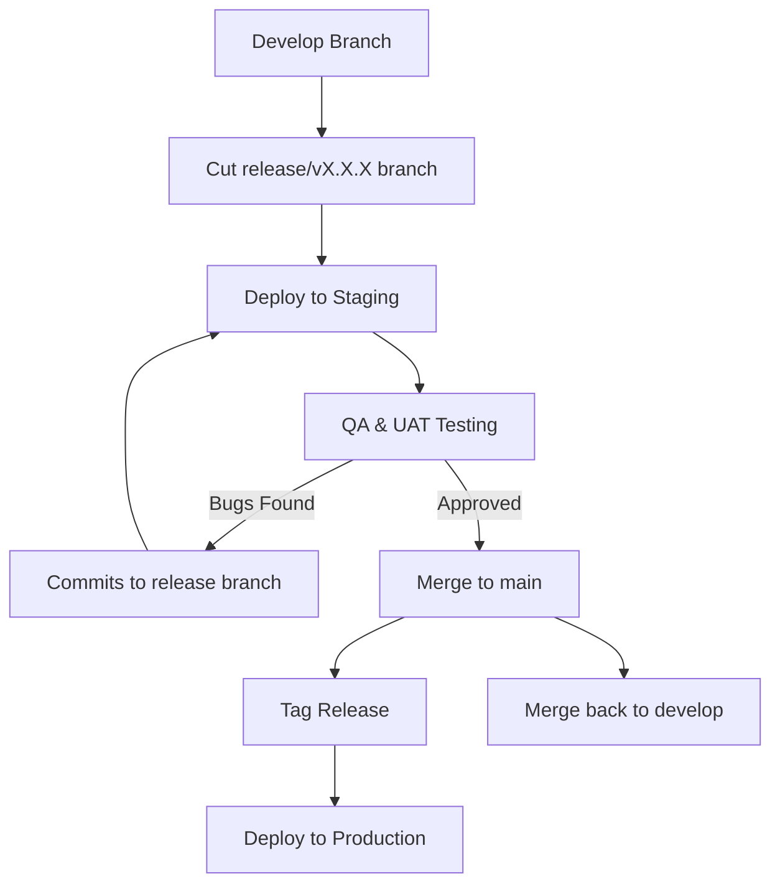

# FamilyOS AI Git Workflow

## 1. Introduction

This document defines the Git workflow, branching strategy, and collaboration standards for the FamilyOS AI repository. It serves as the primary governance document for code management, ensuring that multiple developers can contribute efficiently while maintaining high code quality, consistent release cycles, and a clean repository history. 

This workflow applies to all frontend, backend, AI, and documentation contributions within the project.

## 2. Git Workflow Principles

| Principle | Description |
|---|---|
| Single Source of Truth | The `main` branch always represents the current production state. The `develop` branch represents the upcoming release. |
| Traceability | Every commit, branch, and Pull Request (PR) must trace back to a specific task, ticket, or issue. |
| Continuous Integration | All branches must pass automated testing, linting, and build checks before merging. |
| Code Review by Default | No code is merged into `develop` or `main` without at least one approved peer review. |
| Clean History | Branch histories are simplified via squash merges to maintain a readable and revertible commit log. |

## 3. Repository Strategy

FamilyOS AI utilizes a **Monorepo** structure. All components of the system (frontend, backend, AI orchestration, and documentation) reside within a single Git repository.

| Area | Strategy |
|---|---|
| **Monorepo Considerations** | A monorepo ensures atomic commits across frontend and backend, simplifies dependency management, and keeps API contracts in sync. |
| **Backend & Frontend** | Code is logically separated into `/frontend` (Next.js) and `/backend` (NestJS) directories, allowing isolated builds and tests while sharing root-level configurations. |
| **Documentation** | All architectural and process documentation resides in the `/docs` directory. Documentation is versioned alongside the code it describes. |

## 4. Branching Strategy

The repository follows a modified GitFlow strategy optimized for continuous delivery.

| Branch Type | Naming Convention | Lifetime | Purpose | Merge Target |
|---|---|---|---|---|
| **Main** | `main` | Infinite | Represents the stable, production-ready state of the application. | N/A |
| **Develop** | `develop` | Infinite | The integration branch for features preparing for the next release. | `main` (via release branch) |
| **Feature** | `feature/<issue-id>-<short-desc>` | Short | Development of new features or enhancements. | `develop` |
| **Bugfix** | `bugfix/<issue-id>-<short-desc>` | Short | Resolution of non-critical bugs found in development or staging. | `develop` |
| **Hotfix** | `hotfix/<issue-id>-<short-desc>` | Short | Emergency fixes for critical issues in production. | `main` and `develop` |
| **Release** | `release/v<semantic-version>` | Temporary | Stabilization and final QA for an upcoming production deployment. | `main` and `develop` |
| **Experiment**| `experiment/<short-desc>` | Temporary | Proofs of concept or R&D. Should never be merged directly. | N/A |

## 5. Development Workflow

The standard lifecycle for feature development ensures quality from inception to deployment.

1. **Pick Task:** Assign an issue from the tracking system.
2. **Create Branch:** Branch off the latest `develop`.
3. **Develop:** Write code, tests, and documentation.
4. **Self Review:** Review the diff locally before pushing.
5. **Pull Request:** Open a PR against `develop`.
6. **Code Review:** Peers review the PR. Address feedback.
7. **QA:** CI checks run automatically on the PR.
8. **Merge:** Upon approval and passing CI, squash merge the PR.
9. **Delete Branch:** Clean up the repository by deleting the merged branch.

## 6. Commit Standards

Commits must tell a clear story of the repository's history. We adhere to **Conventional Commits**.

| Format | `type(scope): subject` |
|---|---|
| **Types** | `feat` (new feature), `fix` (bug fix), `docs` (documentation), `style` (formatting), `refactor` (code restructuring), `test` (adding tests), `chore` (maintenance). |
| **Scope** | Optional. Indicates the area affected (e.g., `auth`, `api`, `ui`). |
| **Subject** | Imperative, present tense description (e.g., "add", not "added"). No period at the end. |

**Examples:**
- `feat(auth): implement JWT refresh token rotation`
- `fix(ui): resolve overflow issue on mobile dashboard`
- `docs: update API specification for family endpoints`

**Best Practices:**
- **Atomic Commits:** Each commit should represent a single logical change. Do not mix refactoring with new feature additions in the same commit.
- **Frequency:** Commit often locally, but clean up the history (via interactive rebase) before opening a PR if the commits are noisy.

## 7. Pull Request Standards

Pull Requests are the gatekeepers of code quality. 

### Required Sections (PR Template)
1. **Description:** What does this PR do? Why is it needed?
2. **Related Issue:** Link to the tracking ticket.
3. **Type of Change:** Checkbox for feature, bugfix, docs, etc.
4. **Testing Instructions:** How can a reviewer manually test this?
5. **Screenshots/Recordings:** Required for UI changes.

### Approval Rules
- At least **one approving review** from a peer is required.
- **Architect approval** is required for PRs affecting core configurations, database schemas, or API contracts.
- All CI status checks must pass.
- The PR branch must be up to date with the target branch.

## 8. Code Review Guidelines

Reviewers evaluate PRs against the following dimensions:

| Dimension | Expectations |
|---|---|
| **Architecture** | Does the code adhere to the defined Domain-Driven Design (backend) and Feature-Module structure (frontend)? |
| **Readability** | Is the code self-documenting? Are variables named clearly? |
| **Security** | Are inputs validated? Is authorization enforced via Guards? Is sensitive data handled correctly? |
| **Performance** | Are database queries optimized (avoiding N+1)? Are frontend components memoized where appropriate? |
| **Testing** | Are unit/integration tests included for new logic? Do existing tests pass? |
| **Documentation** | Have inline comments and `/docs` markdown files been updated to reflect the changes? |
| **API Compliance** | Does the code strictly adhere to the `05_API_Specification.md` contract? |
| **UI Consistency** | Does the frontend match the designated design system and accessibility standards? |

## 9. Merge Strategy

The official merge strategy for feature branches into `develop` is **Squash Merge**.

**Justification:**
Squash merging condenses all commits from a feature branch into a single, comprehensive commit on the target branch. This guarantees a linear, easily readable history on `develop` and `main`. It allows developers to commit frequently and messily on their local feature branches without polluting the shared history, making rollbacks (reverts) trivial if a feature introduces a critical regression.

## 10. Conflict Resolution

Conflicts occur when multiple developers edit the same lines of code or files simultaneously.

- **Prevention:** Pull latest changes from `develop` frequently. Communicate with team members if working on shared, core modules (e.g., `SharedModule` or global layouts).
- **Resolution:** The author of the PR is responsible for resolving conflicts. They must pull the target branch, resolve the conflicts locally, test the application, and force-push the updated branch.
- **Validation:** After resolving a conflict, all tests and CI checks must be re-run and pass before the PR can be merged.

## 11. Versioning Strategy

FamilyOS AI uses **Semantic Versioning (SemVer)** formatted as `MAJOR.MINOR.PATCH`.

| Component | Trigger |
|---|---|
| **MAJOR** | Incompatible API changes, massive architectural overhauls, or major UI redesigns. |
| **MINOR** | Addition of new features in a backward-compatible manner. |
| **PATCH** | Backward-compatible bug fixes and minor optimizations. |

- **Release Tags:** Every merge from a release branch into `main` is tagged with the version number (e.g., `v1.2.0`).
- **Changelog:** An automated changelog is generated based on Conventional Commit messages during the release preparation phase.

## 12. Release Process

The release process moves code systematically from development to production.

1. **Development:** Features are accumulated in `develop`.
2. **Staging:** A `release/vX.X.X` branch is cut from `develop` and deployed to the staging environment for Quality Assurance (QA) and User Acceptance Testing (UAT). Only bug fixes are allowed on this branch.
3. **Production:** Once approved, the release branch is merged into `main`, tagged, and deployed to production. It is simultaneously merged back into `develop` to ensure bug fixes are not lost.

## 13. Documentation Workflow

Documentation is treated as code.
- Architectural changes must be accompanied by updates to the relevant `/docs` markdown files.
- PRs containing solely documentation updates use the `docs:` commit prefix and can bypass heavy CI testing, but still require peer review to ensure clarity and accuracy.
- Documentation must never contradict the established schemas, APIs, or architectural blueprints unless the PR explicitly deprecates the old standard.

## 14. Branch Protection Rules

To enforce this workflow, repository settings must enforce strict branch protection on `main` and `develop`.

| Rule | Configuration |
|---|---|
| **Require Pull Request Reviews** | Minimum 1 approval. Dismiss stale approvals when new commits are pushed. |
| **Require Status Checks to Pass** | Build, Lint, and Test actions must pass before merging is allowed. |
| **Require Branches to be Up to Date** | PR branches must integrate the latest target branch changes before merging. |
| **Block Direct Pushes** | No user or administrator can push directly to `main` or `develop`. |
| **Force Pushes Prohibited** | Force pushing to `main` or `develop` is strictly disabled. |

## 15. Risks

| Risk | Mitigation |
|---|---|
| **Monorepo Bottlenecks** | CI pipelines can become slow if changes in the frontend trigger backend tests. Mitigation: Implement path-based CI triggers (e.g., only run backend tests if `/backend` files change). |
| **Long-Lived Feature Branches** | High risk of massive merge conflicts. Mitigation: Enforce small, atomic PRs and frequent rebasing against `develop`. |
| **Release Delays** | Bugs found in the release branch block deployment. Mitigation: Maintain high unit test coverage and strict PR reviews before code reaches `develop`. |

## 16. Assumptions

- The project uses GitHub, GitLab, or Bitbucket, which supports branch protection rules, PR templates, and automated CI status checks.
- Developers are familiar with basic Git operations (branching, rebasing, resolving conflicts).
- Automated CI/CD pipelines will be implemented to enforce the status checks outlined in this document.
