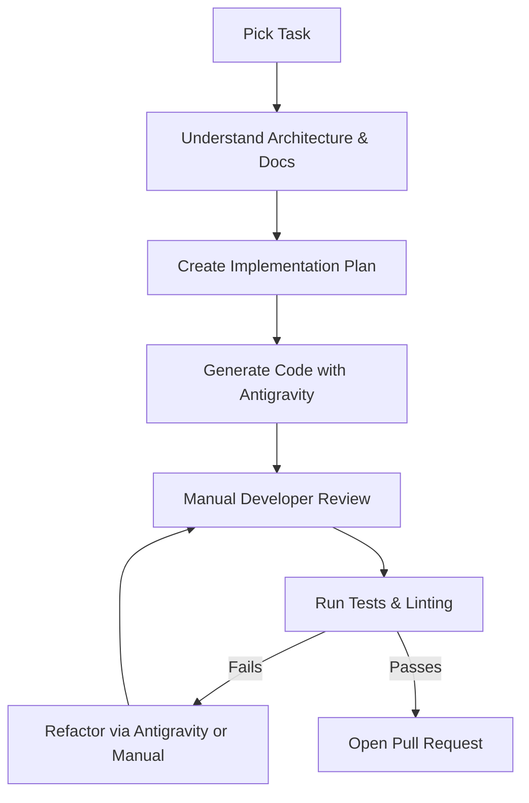
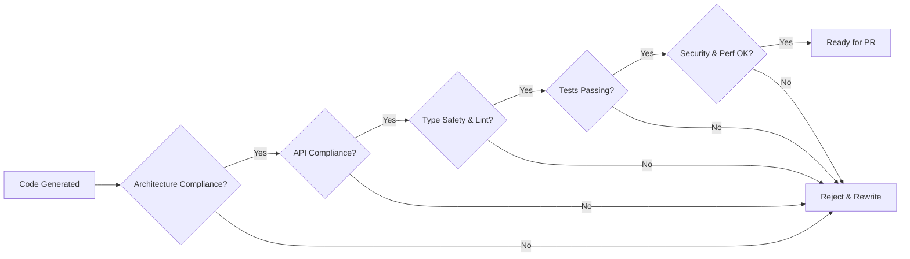

# FamilyOS AI Antigravity Development Guide

## 1. Introduction

This document serves as the definitive engineering manual for building FamilyOS AI using the Antigravity AI coding assistant. It establishes the workflows, standards, implementation sequences, and collaboration protocols required to harness AI-assisted development efficiently while maintaining strict adherence to the project's architectural blueprints.

This guide ensures that human developers and AI assistants operate synergistically, delivering high-quality, scalable, and secure enterprise software.

## 2. Development Philosophy

The development of FamilyOS AI is governed by the following core principles:

| Principle | Description |
|---|---|
| **Documentation-First Development** | All major architectural and design decisions are documented in the `/docs` directory *before* any implementation begins. The AI relies on this documentation as its ground truth. |
| **Architecture-First Implementation** | Code is generated to conform exactly to the established blueprints (`03_System_Architecture.md`, `06_Backend_Architecture.md`, `07_Frontend_Architecture.md`). The AI must never invent rogue patterns. |
| **Small Incremental Changes** | Work is broken down into small, atomic tasks. AI generations are easier to review, test, and merge when they are scoped to a single logical change. |
| **Continuous Validation** | AI-generated code is presumed faulty until proven correct. Developers rigorously validate every output against business logic, security constraints, and architectural rules. |
| **AI-Assisted (Not Automated)** | Antigravity is a pair-programming partner. Human developers retain absolute responsibility for repository quality, logic correctness, and security. |

## 3. Antigravity Usage Guidelines

To maximize the effectiveness of the Antigravity AI assistant, developers must follow these usage guidelines:

| Guideline | Practice |
|---|---|
| **When to Use** | Use Antigravity for generating boilerplate, refactoring, unit tests, and implementing well-documented business logic. Avoid using it for initial, unreviewed architectural design pivots. |
| **Effective Prompts** | Provide explicit, context-rich instructions. Always instruct Antigravity to reference specific approved documentation (e.g., API specifications) before writing code. |
| **Repository Awareness** | Ensure Antigravity is operating within the correct workspace scope. Explicitly state target directories (e.g., `/frontend/features/auth` vs `/backend/src/modules/auth`) to avoid context confusion. |
| **Context Management** | Do not overwhelm the AI with entire codebases. Provide only the necessary file paths or interfaces required for the immediate task to maintain sharp AI focus. |
| **Working with Existing Architecture** | Instruct the AI to strictly inherit patterns from existing adjacent modules rather than introducing new dependencies or structural styles. |
| **Preventing Hallucinations** | Request exact API contracts and restrict the AI from inventing non-existent endpoints or database fields. |
| **Verifying Output** | Never commit unreviewed AI code. Check types, edge cases, error handling, and hardcoded values before accepting changes. |

## 4. Implementation Order

FamilyOS AI must be built in a structured, dependency-aware sequence to minimize rework and integration friction.

| Phase | Component | Dependencies | Description |
|---|---|---|---|
| **1** | Project Setup | None | Initialize Monorepo, configure Next.js, NestJS, Prisma, ESLint, Prettier, and CI pipelines. |
| **2** | Database Layer | Phase 1 | Apply Prisma schema based on `04_Database_Design.md`. Setup migrations and Neon connection. |
| **3** | Authentication | Phase 2 | Implement JWT, register, login, refresh, logout, and User module. |
| **4** | Family Workspace | Phase 3 | Implement Family module creation, isolation guards, and Family Member CRUD. |
| **5** | Shared UI & Layouts | Phase 4 | Build frontend Root Layout, Dashboard Layout, and shared atomic UI components. |
| **6** | Documents & Storage | Phase 4 | Implement Document CRUD, Cloudinary integration, and multipart uploads. |
| **7** | OCR & AI Foundations | Phase 6 | Integrate OCR provider, OpenAI API, Prompt Builder, and Document Analysis webhooks. |
| **8** | Readiness Engine | Phase 7 | Implement Life Event rules, missing document detection, and Readiness scoring. |
| **9** | AI Chat | Phase 7 | Implement Conversational AI, context windowing, and chat UI. |
| **10** | Notifications & Dashboard | Phase 8 | Implement event emitters for alerts, dashboard metric aggregation, and UI display. |
| **11** | Polish & Deployment | Phase 10 | Final E2E testing, SEO, accessibility audits, and Vercel/Railway production deployments. |

## 5. Coding Standards

All code generated by developers or Antigravity must adhere to the following standards:

| Standard | Rule |
|---|---|
| **TypeScript** | Strict mode mandatory. No implicit or explicit `any`. Define strong interfaces for all inputs/outputs. |
| **Naming Conventions** | `camelCase` for variables/functions. `PascalCase` for classes, components, and interfaces. `kebab-case` for file/folder names. |
| **Folder Organization** | Adhere strictly to the Domain-Driven Design (backend) and Feature-Based (frontend) structures defined in architectural documents. |
| **File Organization** | One component, service, or interface per file. Export exclusively from `index.ts` files (barrel exports) at the module boundary. |
| **Imports** | Use absolute path aliases (e.g., `@/components`, `@/modules`) rather than deeply nested relative paths. |
| **Error Handling** | Catch errors at the module boundary. Use standard HTTP exception filters (backend). Do not swallow errors; log them or display them gracefully to the user. |
| **Logging** | Use structured JSON logging. Do not log sensitive user data, passwords, or raw tokens. |
| **Comments** | Avoid obvious comments. Use JSDoc format for public interfaces, complex algorithms, or non-obvious business rules. |
| **Documentation** | Update architectural markdown files immediately if structural changes occur during implementation. |

## 6. Development Workflow

1. **Pick Task:** Select an issue from the backlog.
2. **Understand Architecture:** Consult the relevant documentation (e.g., API Spec, Frontend Architecture).
3. **Create Implementation Plan:** Mentally or explicitly map out the necessary files and patterns.
4. **Generate Code:** Use Antigravity to scaffold or implement the logic.
5. **Manual Review:** The human developer reviews the AI output line-by-line.
6. **Testing:** Write and run unit/integration tests to verify the implementation.
7. **Refactoring:** Adjust code to fix bugs or align with style guidelines.
8. **Pull Request:** Submit for peer review following the Git Workflow.

## 7. AI Collaboration Rules

To ensure repository integrity, the following collaboration rules apply:

| Responsibility | AI Assistant (Antigravity) | Human Developer |
|---|---|---|
| **Generation** | Allowed to generate boilerplate, implementation logic, unit tests, and documentation drafts. | Retains ultimate ownership. Must verify every generated line. |
| **Architecture** | Must conform to provided documents. | Must ensure AI does not invent unauthorized architectural patterns. |
| **Security** | Implements standard security patterns if instructed. | Must conduct explicit security reviews for injection, auth bypass, and data leaks. |
| **Performance** | Can suggest optimizations. | Must verify algorithmic complexity and database query efficiency (e.g., N+1 issues). |

## 8. Quality Gates

Before any AI-assisted code is pushed or merged, it must pass these local quality gates:

- **Architecture Compliance:** Does it fit the DDD or Feature-Module structure?
- **API Compliance:** Does it exactly match the `05_API_Specification.md`?
- **Database Consistency:** Does it match the logical schema in `04_Database_Design.md`?
- **Security Validation:** Are Guards and sanitizers in place?
- **Type Safety:** Does `tsc --noEmit` pass?
- **Testing:** Are tests written and passing?
- **Documentation:** Are interfaces properly commented?
- **Performance:** Are database calls batched or optimized?

## 9. Testing Expectations

| Test Level | Expectation |
|---|---|
| **Unit Tests** | Required for all complex business logic (e.g., Readiness rules, Token verification). Antigravity should be leveraged to generate these. |
| **Integration Tests** | Required for critical API endpoints and database interactions. |
| **End-to-End (E2E)** | Focused on primary user journeys (Registration, Document Upload, Readiness Check). |
| **Manual Verification** | Developers must manually test AI-generated UI components in the browser and API endpoints via tools like Postman before opening a PR. |

## 10. Common Development Patterns

| Area | Recommended Pattern |
|---|---|
| **Backend Modules** | Controller parses input -> Service processes logic -> Prisma handles DB -> Controller formats output. |
| **Frontend Features** | Server Component fetches data -> Client Component handles interactivity -> Shared atomic UI components render visuals. |
| **API Integration** | Centralized Axios/Fetch client with interceptors for automatic JWT attachment and token refresh logic. |
| **Forms** | Use React Hook Form paired with Zod schemas for client-side validation that mirrors backend validation. |
| **Authentication** | JwtAuthGuard applied globally (backend); unprotected routes explicitly marked. Next.js middleware used for route protection (frontend). |
| **File Uploads** | Direct stream to Cloudinary via backend provider; return reference URL to database immediately. |
| **AI Workflows** | Decouple heavy OpenAI calls from HTTP response loops via background event emitters. |

## 11. Anti-Patterns

Developers and AI assistants must strictly avoid the following anti-patterns:

- **Skipping Architecture:** Generating full-stack features without verifying against the approved PRD or DB Design.
- **Duplicating Logic:** Creating new utility functions when one already exists in the `SharedModule` or `lib/` directory.
- **Hardcoding Values:** Hardcoding API URLs, secret keys, or test credentials instead of using environment variables.
- **Ignoring Validation:** Trusting client input without backend DTO validation.
- **Breaking API Contracts:** Altering JSON response structures without first updating the `05_API_Specification.md`.
- **Blind Trust:** Merging AI-generated code without reading and understanding its implications.

## 12. Definition of Done

Every feature is considered "Done" only when all checkboxes are met:

- [ ] Code is fully implemented according to architectural blueprints.
- [ ] Code is manually reviewed by the developer for logic and security flaws.
- [ ] TypeScript compiles with no errors (`any` types are eliminated).
- [ ] Linter rules pass with zero warnings.
- [ ] Unit/Integration tests are written and pass successfully.
- [ ] Endpoints match the API Specification exactly.
- [ ] User Interface adheres to the design system and is responsive.
- [ ] Relevant documentation has been updated.
- [ ] The Pull Request has been opened and reviewed by a peer.

## 13. Risks

| Risk | Mitigation |
|---|---|
| **AI Hallucinations in Core Logic** | Strict Type Checking, Zod validation, and human code review act as the primary defense lines. |
| **Context Overload** | Keep Antigravity prompts scoped to individual files or small modules rather than asking it to generate entire epics at once. |
| **Architectural Drift** | Enforce Quality Gates that specifically check compliance against the `/docs` directory blueprints. |

## 14. Assumptions

- Developers have access to the Antigravity AI assistant and understand its interface.
- The project documentation (`/docs`) represents the single source of truth for all implementations.
- Continuous Integration (CI) systems will enforce the Quality Gates (Linting, Testing, Building) automatically.
