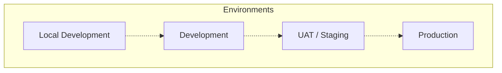
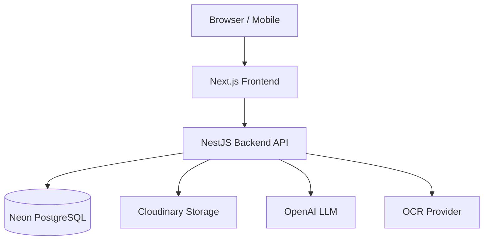
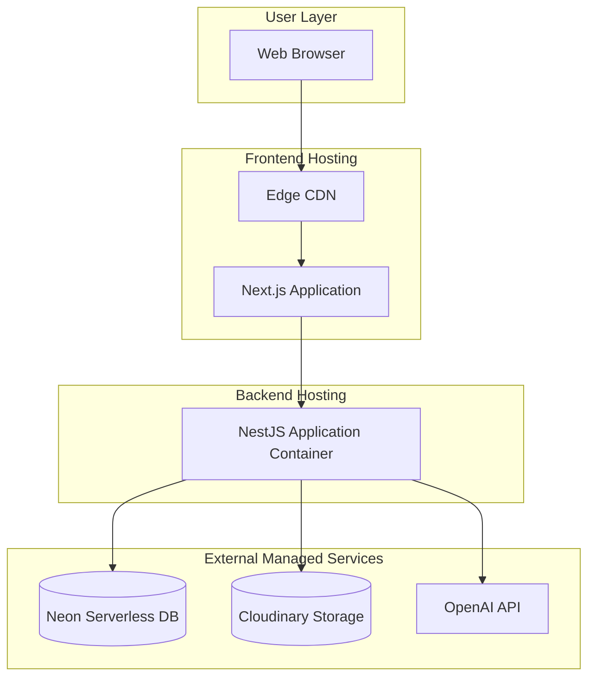
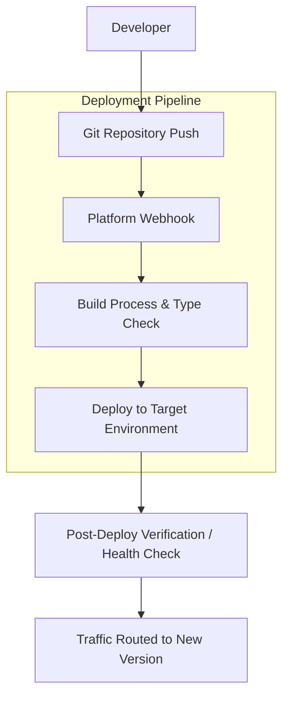
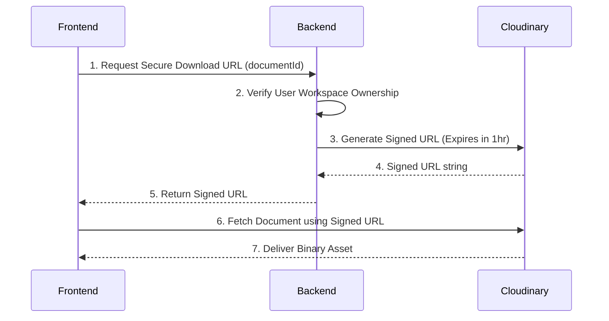
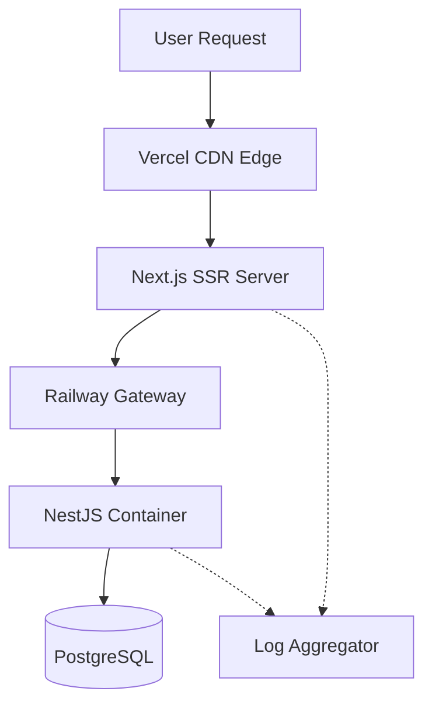

# FamilyOS AI Deployment Architecture

## 1. Introduction

This document defines the deployment architecture and operational strategy for the FamilyOS AI MVP. It details how the Next.js frontend, NestJS backend, and supporting external services (Neon PostgreSQL, Cloudinary, OpenAI, and OCR providers) are hosted, configured, secured, monitored, and maintained across multiple environments.

The purpose of this guide is to provide a comprehensive, platform-agnostic blueprint for deploying the platform reliably, securely, and scalably without detailing specific scripts or CI/CD implementation code.

## 2. Deployment Principles

The deployment architecture is guided by the following principles:

| Principle | Description |
|---|---|
| **Cloud-First Deployment** | The MVP leverages managed PaaS (Platform as a Service) and Serverless offerings to minimize infrastructure management overhead and accelerate delivery. |
| **Environment Isolation** | Development, UAT, and Production environments are strictly isolated at the network, database, and credential levels to prevent cross-contamination. |
| **Stateless Services** | Application servers (Next.js and NestJS) maintain zero internal state. Sessions and data are managed entirely via JWTs and PostgreSQL. |
| **Infrastructure Simplicity** | Avoid premature complexity. The MVP relies on proven, easily configured platforms (Vercel, Railway) rather than complex Kubernetes clusters. |
| **Security-First Deployment** | All traffic is encrypted in transit (HTTPS). Secrets are injected at runtime. Storage buckets and databases block public access. |
| **Scalability** | The architecture supports horizontal scaling for web and API layers, and connection pooling for the database. |

## 3. Environment Strategy

FamilyOS AI progresses through four distinct environments to ensure quality and stability.

| Environment | Purpose | Infrastructure | Database | Storage | AI Services | Configuration | Access Control |
|---|---|---|---|---|---|---|---|
| **Local Development** | Developer workstations for active coding. | Local Node.js instances. | Local Docker PostgreSQL or shared Dev DB. | Cloudinary (Dev Tier) | OpenAI (Dev Keys) | `.env.local` | Developer machines only. |
| **Development** | Continuous integration target. Automatically deploys `develop` branch. | Vercel (FE) / Railway (BE) | Neon PostgreSQL (Dev Branch) | Cloudinary (Dev Folder) | OpenAI (Dev Keys) | PaaS UI Secrets | Internal team only. |
| **UAT (Staging)** | QA and user acceptance testing. Mirrors production exactly. Deploys `release/*`. | Vercel (FE) / Railway (BE) | Neon PostgreSQL (UAT Branch) | Cloudinary (UAT Folder) | OpenAI (Test Keys) | PaaS UI Secrets | Internal team & QA testers via password protection. |
| **Production** | Live environment for end-users. Deploys `main`. | Vercel (FE) / Railway (BE) | Neon PostgreSQL (Prod Branch) | Cloudinary (Prod Folder) | OpenAI (Prod Keys) | PaaS UI Secrets | Public Internet (HTTPS). |

### Environment Architecture Diagram

## 4. Infrastructure Overview

The deployment architecture consists of tightly integrated but physically separated components.

| Component | Technology | Description |
|---|---|---|
| **Frontend** | Next.js App Router | Handles UI rendering, server-side data fetching, and client interactivity. |
| **Backend** | NestJS API | Serves business logic, database transactions, and orchestrates AI/OCR workflows. |
| **Database** | Neon PostgreSQL | Serverless relational database for persistent application state and user data. |
| **Storage** | Cloudinary | Cloud-based media management for secure document storage and on-the-fly transformations. |
| **AI Processing** | OpenAI API | Provides LLM capabilities for document analysis and conversational assistance. |
| **OCR Provider** | External OCR Service | Extracts raw text from document binaries. |

### Infrastructure Components Diagram

## 5. Hosting Architecture

The MVP minimizes operational overhead by leveraging managed hosting platforms.

| Platform | Component | Responsibility |
|---|---|---|
| **Vercel** | Next.js Frontend | Edge routing, global CDN distribution, static asset hosting, Serverless function execution (SSR), and automated PR preview deployments. |
| **Railway** | NestJS Backend | Containerized application hosting, horizontal scaling, background process execution, and internal network routing. |
| **Neon** | PostgreSQL Database | Serverless database scaling, automated backups, read-replicas, and environment branching for Dev/UAT. |
| **Cloudinary** | File Storage | Secure binary asset storage, CDN delivery via signed URLs, and file lifecycle management. |

### Overall Deployment Architecture Diagram

## 6. Environment Variables

Configuration is injected exclusively via environment variables to maintain the twelve-factor app methodology. Secrets are never hardcoded.

| Category | Typical Variables |
|---|---|
| **Application** | Node Environment, Frontend URL, Backend URL, API Port. |
| **Authentication** | JWT Secrets, Token Expiration times. |
| **Database** | PostgreSQL Connection String (Database URL). |
| **Storage** | Cloudinary Cloud Name, API Key, API Secret. |
| **AI** | OpenAI API Key, default model configuration. |
| **OCR** | OCR Provider API Key and Endpoint URL. |
| **Security** | CORS allowed origins, Rate Limit thresholds. |

## 7. Deployment Flow

Deployments are automated through Git integrations provided by the hosting platforms.

1. **Developer:** Commits code and merges a Pull Request according to the Git Workflow.
2. **Git Repository:** GitHub triggers webhooks to Vercel and Railway.
3. **Build:** Platforms pull the code, install dependencies, run type checks, and compile the application.
4. **Deployment:** The compiled artifacts are deployed to isolated containers or serverless functions.
5. **Verification:** Automated health checks verify the `/health` endpoint before routing traffic.
6. **Release:** Traffic is seamlessly shifted to the new deployment with zero downtime.

## 8. Database Deployment Strategy

- **Migrations:** Prisma migrations are applied automatically during the backend build/deploy phase (e.g., via a pre-start script on Railway) before the application accepts traffic.
- **Seed Data:** Essential seed data (e.g., Supported Life Events definitions) is synchronized via idempotent scripts during the deployment pipeline.
- **Rollback Considerations:** Database changes should strictly be backward-compatible (e.g., adding columns, never dropping columns immediately). This allows application code rollbacks without requiring complex database restores.
- **Backup Strategy:** Neon provides automated point-in-time recovery (PITR) and daily snapshots.

## 9. Storage Strategy

- **Document Uploads:** The backend API handles the upload stream, piping binary data directly to Cloudinary to prevent overwhelming Railway container memory.
- **Secure File Access:** Files stored in Cloudinary are set to "authenticated" or "private". The frontend accesses documents via temporary, time-limited signed URLs generated by the NestJS backend.
- **File Lifecycle:** Cloudinary folders are partitioned by environment (e.g., `familyos-dev/`, `familyos-prod/`) to prevent asset leakage between environments.

### Storage Flow Diagram

## 10. Security Strategy

- **HTTPS:** Enforced automatically by Vercel and Railway at the edge. No unencrypted HTTP traffic is allowed.
- **JWT & Secrets Management:** Secrets are managed securely via the Vercel and Railway UI dashboards. They are injected at runtime and never visible in logs.
- **CORS:** The NestJS backend is configured to accept Cross-Origin Resource Sharing (CORS) requests strictly from the verified Vercel frontend domains.
- **Rate Limiting:** Applied at the NestJS level to prevent abuse of the OpenAI and OCR external dependencies.
- **Environment Isolation:** Database connection strings and API keys are strictly unique per environment.
- **Content Security Policy (CSP):** The Next.js frontend implements CSP headers to prevent XSS and restrict external script loading.

## 11. Monitoring & Logging

- **Application Logs:** NestJS uses structured JSON logging. Railway automatically aggregates container `stdout/stderr` for searching and alerting.
- **Error Monitoring:** A centralized error tracking tool (e.g., Sentry) is recommended for capturing unhandled exceptions on both Frontend and Backend.
- **Health Checks:** The `/api/v1/health` endpoint is polled by Railway and external monitors (e.g., UptimeRobot) to ensure API availability.
- **Performance Monitoring:** Vercel Analytics monitors frontend Web Vitals.
- **AI Usage Monitoring:** OpenAI dashboards are actively monitored for token consumption anomalies and rate limit warnings.

### Request Flow Diagram

## 12. Backup & Recovery

- **Database Backups:** Fully managed by Neon. Development/UAT databases can be cloned from Production snapshots instantly via Neon's branching feature if debugging requires production data.
- **File Recovery:** Cloudinary automatic backups protect against accidental asset deletion. Soft-deletion is implemented in the database to prevent orphaned files.
- **Disaster Recovery (DR):** Because the infrastructure is entirely defined by code (Git) and managed platforms, DR consists of updating DNS and re-deploying to fresh Vercel/Railway projects using restored database credentials.
- **Recovery Time Objective (RTO):** MVP targets < 4 hours.

## 13. Scaling Strategy

- **Horizontal Scaling:** Railway automatically scales the NestJS containers based on CPU and memory utilization. Vercel scales serverless functions infinitely by default.
- **Stateless Backend:** Because session state is JWT-based, load balancers can route requests to any available backend container.
- **Database Growth:** Neon Serverless automatically scales compute resources up during heavy load and scales to zero during inactivity. Connection pooling (PgBouncer) handles high concurrency.
- **AI Workload Scaling:** AI processing is heavily I/O bound. The backend architecture utilizes asynchronous events so background threads can await OpenAI responses without blocking incoming web traffic.
- **Storage Growth:** Cloudinary automatically scales to accommodate growing asset libraries with virtually unlimited capacity.

## 14. Risks

| Risk | Mitigation |
|---|---|
| **Vendor Lock-in** | Ensure business logic relies on standard Node.js/NestJS constructs, not Vercel/Railway proprietary SDKs. |
| **Cold Starts** | Neon and Vercel serverless functions experience cold starts. Keep API endpoints lightweight; configure minimum instances on Railway if backend latency spikes. |
| **Deployment Failures** | Ensure database migrations are strictly backward-compatible. Maintain zero-downtime deployment capabilities on Railway. |

## 15. Assumptions

- Vercel and Railway offer sufficient geographic regions to comply with any data residency requirements.
- The external OCR provider operates over secure HTTPS APIs and offers adequate SLA guarantees.
- Neon Serverless PostgreSQL scaling handles the bursty nature of AI application queries.
