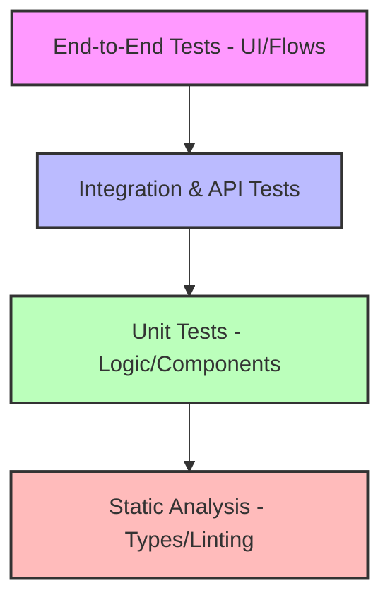
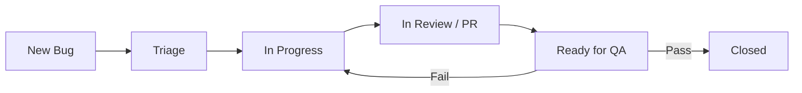
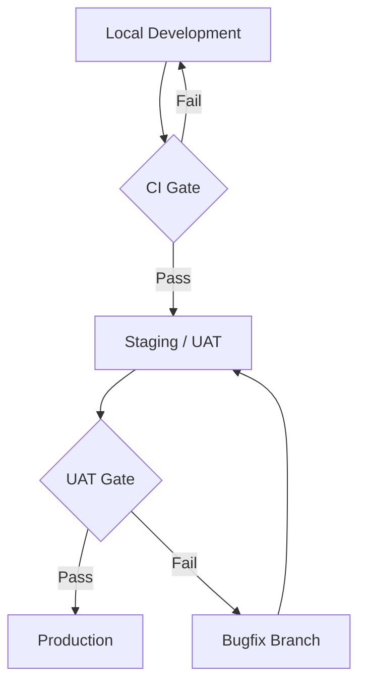

# FamilyOS AI Testing Strategy

## 1. Introduction

This document defines the comprehensive testing strategy for the FamilyOS AI MVP. It establishes the testing methodology, coverage requirements, quality gates, and defect management processes necessary to ensure the delivery of a secure, reliable, scalable, and high-quality software product.

As an AI-powered enterprise application, FamilyOS AI requires rigorous validation of both traditional web application layers and non-deterministic AI capabilities. This document serves as the authoritative guide for all quality assurance activities across the software development lifecycle.

## 2. Testing Principles

The FamilyOS AI testing strategy is governed by the following core principles:

| Principle | Description |
|---|---|
| **Shift-Left Testing** | Quality is embedded early in the development lifecycle. Code reviews, static analysis, and automated unit tests occur before code is merged. |
| **Test Pyramid** | The automation strategy emphasizes a broad base of fast, reliable unit tests, supported by integration tests, and capped by a minimal set of critical end-to-end (E2E) UI tests. |
| **Risk-Based Testing** | Testing effort is prioritized based on business impact and failure probability. Core flows (e.g., Auth, Readiness Assessments, AI extractions) receive the highest coverage. |
| **Automation-First** | Manual testing is reserved for exploratory testing, usability assessments, and edge-case AI evaluations. All standard functional and regression testing must be automated. |
| **Continuous Testing** | Automated test suites are integrated into the CI/CD pipeline and execute on every Pull Request and release deployment. |
| **AI-Aware Testing** | AI outputs are inherently probabilistic. Testing relies on validating structured outputs (schemas), confidence thresholds, and deterministic fallbacks rather than exact string matches. |

## 3. Testing Scope

Testing activities comprehensively cover all application layers and business domains:

| Domain | In-Scope Focus Areas |
|---|---|
| **Frontend** | Component rendering, state management, routing, accessibility, responsive design, form validation, and error boundaries. |
| **Backend** | Business logic, service layer, guards, authorization, background processing, and error handling. |
| **APIs** | Request/response validation, authentication headers, contract compliance, and error payloads. |
| **Database** | Migration integrity, relationship constraints, soft-delete functionality, and query performance (N+1 prevention). |
| **Authentication** | Registration, login, token rotation, logout, and unauthorized access prevention. |
| **Document Management** | File uploads to Cloudinary, metadata association, file type validation, and secure retrieval via signed URLs. |
| **OCR** | Mocking OCR provider responses, validating text extraction handling, and handling failed extractions. |
| **AI** | Validating structured JSON parsing, prompt instruction adherence, hallucination mitigation, and chat context windowing. |
| **Readiness Engine** | Deterministic evaluation of life event rules against available document metadata. |
| **Notifications** | Triggering events, generating alerts, and marking notifications as read. |
| **Dashboard** | Data aggregation accuracy and metric summarization. |
| **Deployment** | Infrastructure configuration verification, environment variable validation, and post-deploy health checks. |

## 4. Testing Levels

The testing hierarchy ensures progressive validation from local logic to full-system integration.

| Level | Purpose | Ownership | Execution Timing |
|---|---|---|---|
| **Static Analysis** | Catches syntax, typing, and formatting errors via TypeScript and ESLint. | Developer | Pre-commit / CI PR Gate |
| **Unit Testing** | Isolates and validates individual functions, components, and services. | Developer | Local Dev / CI PR Gate |
| **Integration Testing** | Verifies interaction between modules, databases, and mocked external services. | Developer / QA | CI PR Gate / Pre-merge |
| **API Testing** | Validates HTTP endpoints, payloads, status codes, and authorization rules. | Developer / QA | CI PR Gate / Release |
| **End-to-End Testing** | Simulates complete user journeys through the browser against a fully deployed environment. | QA Automation | Pre-release / Nightly |
| **User Acceptance Testing** | Manual validation by stakeholders against business requirements. | Product/Stakeholders | Staging / Pre-production |
| **Smoke Testing** | Rapid execution of critical path E2E tests to verify environment health. | QA Automation | Post-deployment |
| **Regression Testing** | Execution of all automated suites to ensure new changes do not break existing functionality. | CI/CD Pipeline | Every merge / release |

## 5. Frontend Testing Strategy

| Component | Strategy |
|---|---|
| **Components** | Test isolated atomic components for proper prop handling and rendering. Mock hooks and context. |
| **Forms** | Validate client-side Zod schemas, error state rendering, and submission handling. |
| **Validation** | Ensure boundary values, required fields, and format constraints trigger appropriate UI warnings. |
| **Routing** | Test protected route redirects, layout rendering, and parameter parsing. |
| **State** | Test complex local state transitions (e.g., multi-step forms) and global context updates. |
| **Accessibility** | Run automated accessibility audits (a11y) to verify ARIA attributes, keyboard navigation, and contrast. |
| **Responsive UI** | E2E tests must execute critical flows in both desktop and simulated mobile viewports. |

## 6. Backend Testing Strategy

| Component | Strategy |
|---|---|
| **Services** | Core business logic (e.g., Readiness evaluation) must have 100% unit test coverage. External dependencies (Prisma, Cloudinary) must be mocked. |
| **Controllers** | Test route handling, parameter extraction, and delegation to services. |
| **Guards** | Unit test `FamilyOwnershipGuard` and `JwtAuthGuard` extensively to ensure workspace isolation. |
| **Validation** | Verify DTO constraints reject invalid payloads before reaching the service layer. |
| **Database Interactions** | Integration tests spin up an ephemeral test database to verify complex Prisma queries, relationships, and cascades. |
| **Background Processing** | Mock event emitters to verify async tasks (e.g., OCR triggering) are dispatched correctly. |
| **Error Handling** | Force exceptions in mocked services to verify the global exception filter formats standard error responses. |

## 7. API Testing Strategy

| Component | Strategy |
|---|---|
| **Request Validation** | Submit malformed JSON, missing headers, and invalid types to verify 400 Bad Request responses. |
| **Response Validation** | Ensure all success responses conform to the standard `{ success, data, meta }` wrapper. |
| **Authentication** | Test endpoints with missing, expired, and malformed JWTs to verify 401 Unauthorized responses. |
| **Authorization** | Attempt to access resources belonging to Family A using a token for Family B to verify 403 Forbidden responses. |
| **Error Responses** | Validate that internal server errors (500) do not leak stack traces or sensitive database details. |
| **Contract Compliance** | Utilize automated contract testing to ensure the API matches the `05_API_Specification.md`. |

## 8. AI Testing Strategy

Testing non-deterministic LLMs requires specialized approaches focused on structure and boundaries rather than exact text matching.

| Component | Strategy |
|---|---|
| **OCR Validation** | Mock the OCR provider to return varying qualities of text (perfect, garbled, empty) to test the backend's handling of bad data. |
| **Structured Output Validation** | Use test fixtures containing simulated LLM JSON responses. Verify the application successfully validates (Zod) and parses the JSON, or triggers a retry/fallback if the LLM hallucinates malformed syntax. |
| **Prompt Regression** | Maintain a suite of historical "golden" OCR text inputs. When prompts are updated, verify the AI still successfully extracts the mandatory fields against the golden dataset. |
| **Confidence Thresholds** | Mock the AI returning low confidence scores to verify the UI correctly flags the document for "Manual Review". |
| **Hallucination Detection** | Assert that the AI chat does not invent documents. Test by asking the AI about a fictitious document and ensuring it responds that the document is not in the vault. |
| **Retry & Fallback Behavior** | Force schema validation failures to verify the system attempts a retry prompt and degrades gracefully if the retry fails. |
| **Token Usage Monitoring** | Assert that prompt construction logic correctly truncates chat history to prevent exceeding token limits. |

## 9. Security Testing

| Component | Strategy |
|---|---|
| **Authentication** | Test refresh token rotation logic and session invalidation on logout. |
| **Authorization (IDOR)** | Implement automated security tests that systematically attempt Insecure Direct Object Reference (IDOR) attacks across all parameterized family endpoints. |
| **Input Validation** | Test for SQL injection and NoSQL injection payloads in search queries and form inputs. |
| **File Uploads** | Verify the API rejects executable files, validates MIME types, and enforces size limits. |
| **OWASP Considerations** | Run automated DAST (Dynamic Application Security Testing) tools in staging to check for XSS, misconfigured headers, and CSRF vulnerabilities. |
| **Rate Limiting** | Spam API endpoints in a controlled test environment to verify 429 Too Many Requests responses trigger correctly. |

## 10. Performance Testing

| Component | Strategy |
|---|---|
| **API Latency** | Ensure core endpoints (Dashboard, Document Library) resolve under 200ms at the 95th percentile under standard load. |
| **Concurrent Users** | Execute load tests simulating multiple users concurrently uploading documents to ensure connection pooling holds. |
| **AI Response Time** | Monitor the latency of OpenAI calls. Ensure the UI provides loading feedback to mask LLM processing times. |
| **Upload Performance** | Measure time-to-first-byte (TTFB) and stream efficiency when pushing large PDFs to Cloudinary. |
| **Database Performance** | Monitor query execution times. Test readiness assessments against simulated vaults with 100+ documents to check for N+1 query degradation. |

## 11. Test Data Strategy

| Strategy | Description |
|---|---|
| **Seed Data** | Automated scripts populate the development and staging databases with core required data (e.g., standard Life Events). |
| **Mock Data** | Third-party services (OpenAI, Cloudinary) are entirely mocked during Unit and CI Integration testing to prevent flaky tests and avoid API costs. |
| **AI Test Fixtures** | A static repository of sample OCR text outputs and expected JSON structures is maintained to test the extraction logic deterministically. |
| **Environment Isolation** | Test execution must utilize an isolated database schema that is spun up and torn down per test run to prevent state leakage. |
| **Data Cleanup** | Automated E2E tests running against Staging must clean up all generated families, users, and documents during their teardown phase. |

## 12. Defect Management

| Attribute | Definition |
|---|---|
| **Severity** | Technical impact. (Critical, High, Medium, Low). |
| **Priority** | Business urgency. (P0, P1, P2, P3). |
| **Bug Lifecycle** | Tracked via standard issue management (e.g., Jira, GitHub Issues) following the diagram above. |
| **Verification** | A bug cannot be closed until the original reporter or QA engineer verifies the fix in the Staging/UAT environment. |
| **Closure** | All critical and high-severity bugs must include an automated regression test upon closure to prevent recurrence. |

## 13. Test Environments

| Environment | Expectation |
|---|---|
| **Local** | Developer machines run isolated unit tests and fast integration tests using a local or Dockerized database. External APIs are mocked. |
| **Development** | CI pipeline runs the complete automated test suite (Unit, Integration) against every PR. |
| **UAT (Staging)** | An exact replica of production. E2E tests, API contract tests, and manual exploratory testing occur here. Uses test API keys for external services. |
| **Production Validation** | Only non-destructive smoke tests are executed post-deployment to verify environment health. No heavy load or security scanning is performed on production. |

## 14. Quality Gates

Code is promoted through environments only when specific release criteria are met.

| Gate | Release Criteria |
|---|---|
| **Development (CI Gate)** | Code compiles, ESLint passes, 100% of unit/integration tests pass. No severe security vulnerabilities detected by static analysis. Peer code review approved. |
| **UAT (Staging Gate)** | E2E test suite passes. QA manual exploratory testing sign-off. Product Owner verifies feature meets acceptance criteria. No open P0 or P1 defects. |
| **Production Gate** | Zero downtime deployment succeeds. Post-deployment smoke tests pass. Application health checks return 200 OK. |

## 15. Risks

| Risk | Mitigation |
|---|---|
| **Flaky E2E Tests** | Implement automatic retries in E2E frameworks. Use explicit waits instead of hardcoded timeouts. Rely more heavily on API/Integration tests for coverage. |
| **Cost of AI Testing** | Mock OpenAI API calls in automated CI suites. Only hit live AI endpoints during manual UAT or targeted nightly integration runs. |
| **Test Data Pollution** | Strictly enforce teardown hooks in E2E tests. Re-seed the UAT database periodically to maintain a pristine state. |

## 16. Assumptions

- The team utilizes modern automated testing frameworks (e.g., Jest/Vitest for unit, Playwright/Cypress for E2E).
- The CI/CD platform supports parallel test execution to maintain fast feedback loops.
- Staging/UAT environments match production infrastructure identically (excluding capacity/scale) to ensure valid E2E results.
- Automated API and E2E tests have the ability to generate clean test user accounts programmatically.
