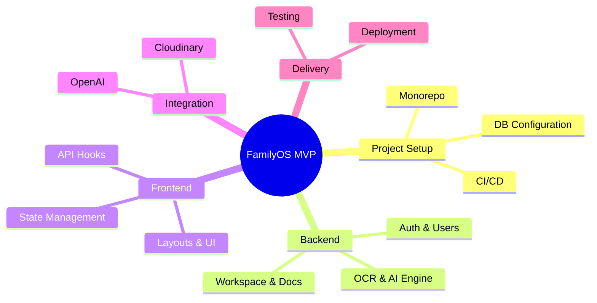
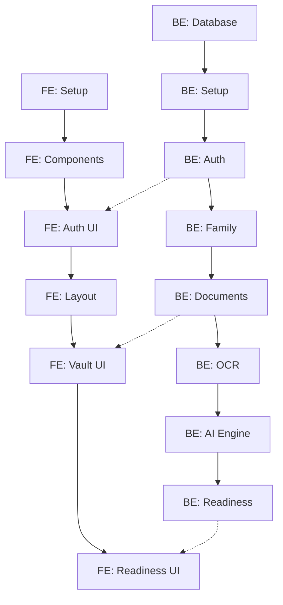
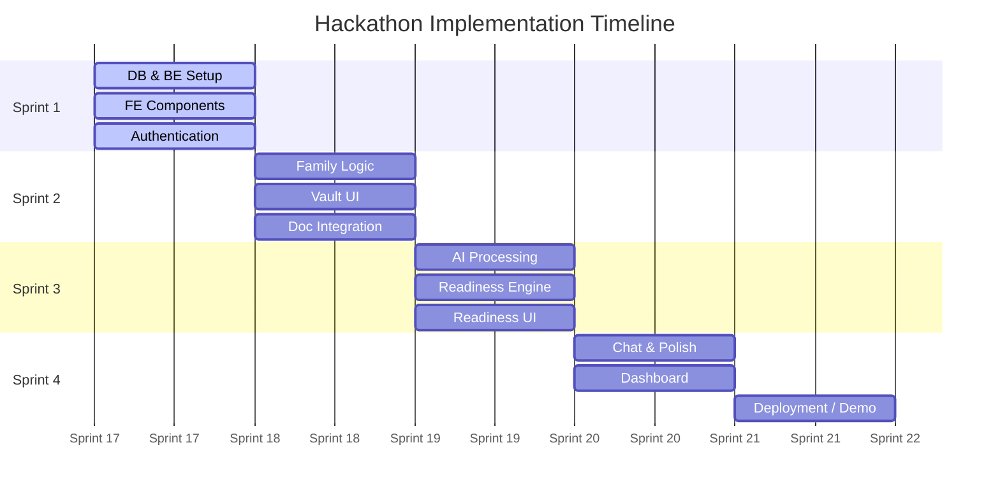

# FamilyOS AI Project Task Breakdown

## 1. Introduction

This document provides the definitive implementation roadmap for the FamilyOS AI MVP. Designed specifically for a rapid-execution hackathon environment, it breaks the project down into actionable, sequential tasks distributed between two primary roles: Backend Developer and Frontend Developer.

This roadmap aligns strictly with all approved architectural blueprints (System, Database, API, Frontend, Backend, AI, Deployment, and Testing). It defines task ownership, explicit dependencies, estimated effort, and expected deliverables to ensure both developers can work in parallel without blocking one another.

## 2. Project Milestones

The project is divided into structured milestones to ensure continuous delivery and integration.

| Milestone | Description | Target Owner | Deliverable |
|---|---|---|---|
| **M1: Project Setup** | Monorepo, CI/CD, and skeleton apps configured. | Both | Deployable skeleton app. |
| **M2: Backend Foundation** | Database, Prisma schema, and base NestJS modules. | Backend | Empty DB with schema applied. |
| **M3: Frontend Foundation** | Next.js layout, routing, and shared UI components. | Frontend | Navigable empty UI shell. |
| **M4: Authentication** | JWT login/registration flow. | Both | Secure login and protected routes. |
| **M5: Family Management** | CRUD for Family Workspace and Members. | Both | Working Family Settings UI. |
| **M6: Document Management** | Uploading and listing documents via Cloudinary. | Both | Working Document Vault UI. |
| **M7: OCR Integration** | Background text extraction from uploads. | Backend | Populated OCR text in DB. |
| **M8: AI Integration** | OpenAI structured extraction and chat logic. | Both | AI metadata parsing and Chat UI. |
| **M9: Readiness Engine** | Evaluating documents against life event rules. | Backend | Readiness score algorithm. |
| **M10: Dashboard** | Aggregated metrics and readiness views. | Frontend | Working Dashboard overview. |
| **M11: Notifications** | Trigger-based internal alerts. | Both | Notification dropdown. |
| **M12: Testing** | E2E flows, API testing, and bug fixing. | Both | Stable release candidate. |
| **M13: Deployment** | Final Vercel, Railway, and DB production setup. | Backend | Live production URL. |
| **M14: Demo Preparation** | Seed data, demo script, and final polish. | Both | Presentation-ready MVP. |

## 3. Work Breakdown Structure (WBS)

The hierarchical breakdown of work required to deliver the MVP.

| WBS ID | Category | Sub-Tasks |
|---|---|---|
| **1.0** | **Project Setup** | 1.1 Repo Init, 1.2 BE Scaffold, 1.3 FE Scaffold, 1.4 DB Setup |
| **2.0** | **Backend APIs** | 2.1 Auth, 2.2 Family, 2.3 Documents, 2.4 OCR, 2.5 AI, 2.6 Readiness |
| **3.0** | **Frontend UI** | 3.1 Auth UI, 3.2 Layout, 3.3 Vault UI, 3.4 Chat UI, 3.5 Dashboard UI |
| **4.0** | **Integration** | 4.1 Cloudinary, 4.2 OpenAI, 4.3 OCR Service, 4.4 BE/FE Hooks |
| **5.0** | **Delivery** | 5.1 QA, 5.2 Prod Deployment, 5.3 Demo Prep |

### WBS Diagram

## 4. Backend Task Breakdown

| Task ID | Task Name | Description | Dependencies | Priority | Effort | Deliverables |
|---|---|---|---|---|---|---|
| **BE-01** | Database Schema | Translate `04_Database_Design.md` to Prisma. | None | High | Medium | `schema.prisma` and initial migration. |
| **BE-02** | App Skeleton | Setup NestJS, ValidationPipe, Global Exceptions. | BE-01 | High | Low | Base NestJS app running locally. |
| **BE-03** | Auth Module | Implement JWT, Login, Register, Refresh. | BE-02 | High | Medium | Auth API endpoints. |
| **BE-04** | Family Module | Family CRUD, FamilyOwnershipGuard. | BE-03 | High | Medium | Protected Family APIs. |
| **BE-05** | Members Module | CRUD for Family Members within a workspace. | BE-04 | High | Low | Member APIs. |
| **BE-06** | Document Module | Document DB CRUD and Cloudinary upload logic. | BE-05 | High | High | Document APIs, Signed URLs. |
| **BE-07** | OCR Service | Background OCR extraction trigger and storage. | BE-06 | Medium | Medium | OCR text saved to DB. |
| **BE-08** | AI Service | LLM integration for JSON extraction from OCR. | BE-07 | High | High | Structured doc metadata. |
| **BE-09** | Readiness Engine | Logic comparing parsed docs to Life Event rules. | BE-08 | High | High | Assessment API. |
| **BE-10** | Chat Module | Conversational API with context windowing. | BE-08 | Medium | Medium | Chat history and generation API. |
| **BE-11** | Notifications | Event emitters triggering alerts (e.g., expiry). | BE-09 | Low | Low | Notification API. |
| **BE-12** | Deployment Prep | Vercel/Railway environment config and health check. | None | High | Low | Clean deployment pipeline. |

## 5. Frontend Task Breakdown

| Task ID | Task Name | Description | Dependencies | Priority | Effort | Deliverables |
|---|---|---|---|---|---|---|
| **FE-01** | App Scaffold | Setup Next.js, Tailwind, global layout, fonts. | None | High | Low | Empty Next.js App. |
| **FE-02** | Shared Components | Build Button, Input, Modal, Table components. | FE-01 | High | Medium | UI Component library. |
| **FE-03** | Auth UI | Login, Register forms and JWT interceptor client. | BE-03, FE-02 | High | Medium | Working auth flow. |
| **FE-04** | Layout & Nav | Dashboard sidebar, protected route wrapper. | FE-03 | High | Low | Authenticated app shell. |
| **FE-05** | Family UI | Family settings and Member CRUD forms. | BE-05, FE-04 | High | Medium | Members list and add modal. |
| **FE-06** | Vault UI | Document library list, filters, sorting. | BE-06, FE-05 | High | High | Document grid/table. |
| **FE-07** | Upload Flow | Dropzone, multipart upload, loading states. | BE-06, FE-06 | High | Medium | Working file uploader. |
| **FE-08** | Chat UI | Message list, input box, optimistic updates. | BE-10, FE-04 | Medium | Medium | Chat interface. |
| **FE-09** | Readiness UI | Select life event, display score and checklist. | BE-09, FE-04 | High | High | Readiness dashboard. |
| **FE-10** | Main Dashboard | Aggregate alerts and summary metrics. | BE-11, FE-09 | Medium | Low | Dashboard overview screen. |
| **FE-11** | E2E Testing | Basic E2E checks on main flows. | All | Low | Low | Cypress/Playwright tests. |

## 6. Integration Tasks

These tasks require active collaboration between both developers.

| Task ID | Task Name | Description | Owners |
|---|---|---|---|
| **INT-01** | Auth Handshake | Verify JWTs are properly stored and sent via Frontend. | BE + FE |
| **INT-02** | Cloudinary Pipeline | Ensure FE can upload and securely download images. | BE + FE |
| **INT-03** | AI Data Flow | Verify raw OCR maps correctly to the FE UI via the AI schema. | BE + FE |
| **INT-04** | E2E Walkthrough | Perform a full user journey test in the staging environment. | BE + FE |

## 7. Parallel Development Plan

The roadmap is structured to allow the Backend and Frontend developers to work simultaneously with minimal blocking.

- **Parallel:** FE-01 and FE-02 can start immediately alongside BE-01 and BE-02.
- **Strict Dependencies:** FE cannot complete Auth (FE-03) until BE completes JWT (BE-03), though FE can build the static forms beforehand.
- **Critical Path:** Database -> Auth -> Documents -> AI Processing -> Readiness -> Readiness UI.

### Task Dependency Graph

### Critical Path

| Order | Critical Task | Owner | Risk |
|---|---|---|---|
| 1 | DB Schema & Auth | Backend | High. Blocks all API calls. |
| 2 | Document Upload & Storage | Backend | High. Prerequisite for all AI tasks. |
| 3 | AI Prompt & Schema Design | Backend | High. Prerequisite for Readiness logic. |
| 4 | Readiness Engine | Backend | High. Core value proposition. |
| 5 | Readiness UI Integration | Frontend | Medium. Relies on complex JSON structures. |

## 8. Sprint Plan

Given the compressed timeframe of a hackathon, work is divided into four rapid phases (Sprints).

| Sprint | Goal | Backend Focus | Frontend Focus | Integration Deliverable |
|---|---|---|---|---|
| **Sprint 1: Foundation** | Secure app skeleton and auth. | BE-01, BE-02, BE-03 | FE-01, FE-02, FE-03 | Working login and DB connection. |
| **Sprint 2: Core Data** | Family and Document CRUD. | BE-04, BE-05, BE-06 | FE-04, FE-05, FE-06 | Working document vault. |
| **Sprint 3: The Brains** | AI, OCR, and Readiness processing. | BE-07, BE-08, BE-09 | FE-07, FE-09 | Working Readiness check. |
| **Sprint 4: Polish** | Chat, Dashboard, and Deployment. | BE-10, BE-11, BE-12 | FE-08, FE-10, FE-11 | Live, demo-ready application. |

### Sprint Timeline

## 9. Risk Areas

| Risk Area | Mitigation Strategy |
|---|---|
| **Frontend waiting on Backend APIs** | Backend must rapidly generate mock JSON responses or utilize tools like Swagger/Postman to define the exact contract before the logic is finished. |
| **OpenAI / OCR integration taking too long** | Define strict JSON schemas early. If APIs fail, fallback to hardcoded mock JSON to ensure UI development can proceed. |
| **Deployment Failures at Deadline** | Execute Sprint 1 deployment immediately. Ensure the empty app builds and deploys successfully before adding complexity. |

## 10. Definition of Done

The FamilyOS MVP is considered complete when:
1. Users can register, log in, and create a family workspace.
2. Users can upload a document, and the backend successfully saves the file to Cloudinary.
3. The AI successfully extracts at least one metadata field from a document via OCR.
4. The Readiness Assessment UI correctly evaluates a mock or real document against a Life Event rule.
5. The application is deployed and accessible via a public production URL.
6. A clean, realistic set of seed data exists in the production database for the demo.

## 11. Assumptions

- Both developers have equal bandwidth and are dedicated full-time to the hackathon.
- API keys for Neon, Cloudinary, OpenAI, and OCR providers are already provisioned and available.
- The Git Workflow and Antigravity Development Guidelines are strictly followed to prevent merge conflicts and architecture drift.
