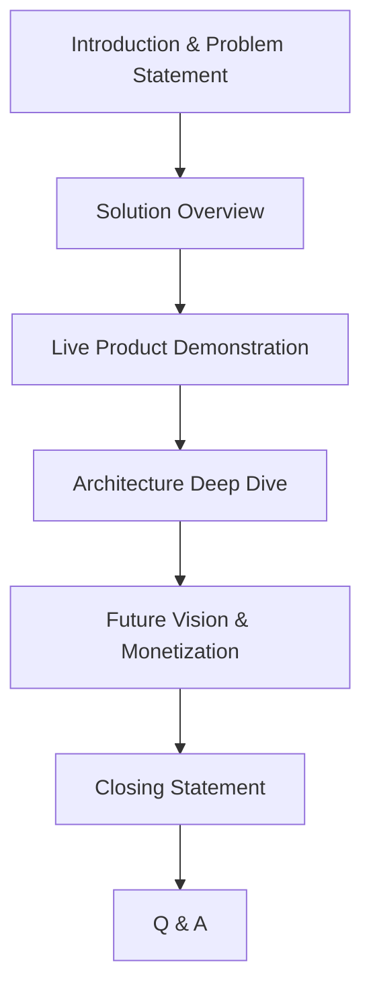
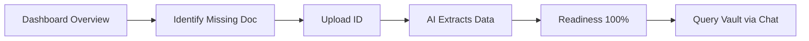
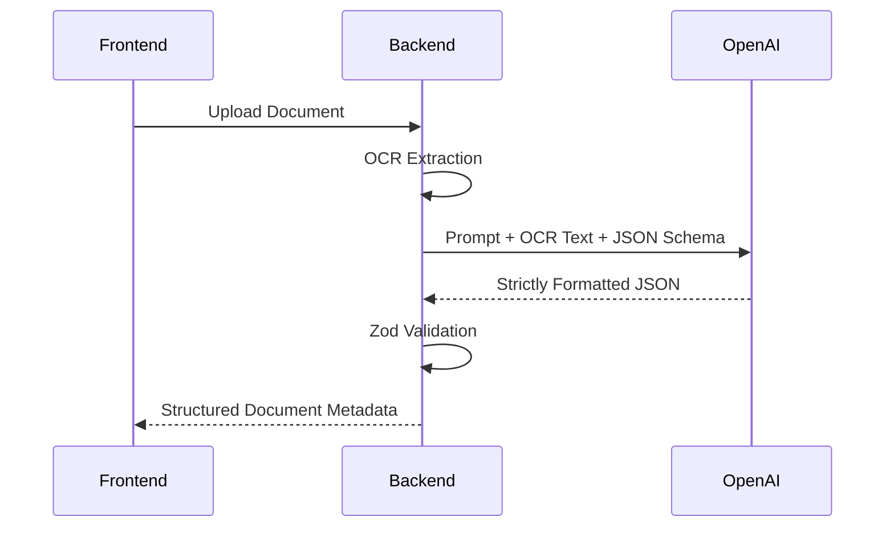

# FamilyOS AI Demo Strategy

## 1. Introduction

This document outlines the official demonstration strategy for FamilyOS AI during the hackathon finals. It defines how the team will present the product to judges and stakeholders, ensuring a clear articulation of the problem, the AI-driven solution, the underlying architecture, and the business value. 

This playbook serves as a tactical guide to delivering a flawless, engaging, and technically impressive demonstration that highlights both user experience and backend engineering excellence.

## 2. Demo Objectives

The demonstration must achieve the following strategic objectives:

- **Demonstrate Business Value:** Clearly show how FamilyOS solves the urgent, high-stakes problem of family document management and readiness.
- **Showcase AI Capabilities:** Highlight that AI is not a gimmick, but a functional, structured intelligence engine driving real outcomes (OCR, extraction, readiness scoring).
- **Demonstrate Technical Excellence:** Prove that the MVP is built on scalable, secure, enterprise-grade architecture (Next.js, NestJS, DDD).
- **Show Usability:** Prove that the UI is intuitive enough for non-technical family members to use.
- **Highlight Scalability:** Explain how the monorepo and cloud-native deployment strategy supports rapid future growth.
- **Build Confidence:** Navigate the live demo smoothly, handling any latency or edge cases with professionalism.

## 3. Demo Audience

The presentation must cater to diverse perspectives within the judging panel.

| Audience | Primary Concern | What to Highlight |
|---|---|---|
| **Technical Judges** | Architecture, scalability, security, clean code. | The NestJS Domain-Driven Design, JWT security, structured JSON AI pipelines, and strict testing gates. |
| **Product Judges** | User experience, problem-solution fit, retention. | The intuitive UI, the pain of finding lost documents, and the "aha" moment of the Readiness score. |
| **Business/Investors** | Market size, monetization potential, moat. | The massive TAM of family organization, the stickiness of the vault, and future premium advisor features. |
| **General Audience** | Relatability and clarity. | A relatable family story (e.g., applying for a passport). |

## 4. Demo Story

A successful demo relies on a compelling narrative arc rather than just clicking through features.

1. **The Problem:** Begin with a relatable, high-stress scenario (e.g., discovering an expired passport hours before a flight, or scrambling for a birth certificate).
2. **Current Pain:** Emphasize that current solutions (physical folders, scattered Google Drives) lack intelligence. They are dead storage.
3. **Introducing FamilyOS AI:** Position the product as a proactive, intelligent family vault.
4. **Live Demonstration:** Walk through solving the initial problem using the platform.
5. **Business Impact:** Summarize the time saved and anxiety reduced.
6. **Closing Message:** FamilyOS doesn't just store documents; it ensures your family is ready for life's most important moments.

## 5. Demo Flow

The presentation is strictly timed to maximize impact without rushing.

### Presentation Timeline Diagram

```mermaid
gantt
    title Presentation Timeline (10 Minutes)
    dateFormat  m:s
    axisFormat  %M:%S
    
    section Context
    Intro & Problem     :0:00, 1m
    Solution Concept    :1:00, 1m
    
    section Live Demo
    Upload & Extract    :2:00, 2m
    Readiness Engine    :4:00, 2m
    AI Chat Assistant   :6:00, 1m
    
    section Deep Dive
    Architecture & AI   :7:00, 1m
    Future & Closing    :8:00, 1m
    
    section Review
    Q&A                 :9:00, 1m
```

### Demo Flow Diagram



## 6. Live Demo Scenario

The live demo uses a relatable persona: **Sarah**, who is applying for a driver's license for her son, **Leo**.

| Step | Action | Narrative Focus |
|---|---|---|
| **1. Login & Dashboard** | Log into Sarah's account. Show the dashboard metrics. | "Sarah logs in and immediately sees a unified view of her family's readiness." |
| **2. Readiness Check** | Navigate to Readiness, select "Driver's License" for Leo. | "She checks if Leo is ready. The system flags that his Identity Proof is missing." |
| **3. Document Upload** | Upload Leo's ID card. | "Sarah uploads the ID. Notice how fast it uploads securely to Cloudinary." |
| **4. AI Extraction** | Show the background processing turning from 'pending' to 'completed'. View the extracted JSON data. | "Behind the scenes, our AI extracts the data securely without Sarah typing anything." |
| **5. Readiness Re-evaluation** | Return to Readiness. Show the score jump to 100%. | "The Readiness Engine automatically recalculates. Leo is now 100% ready." |
| **6. AI Chat** | Ask the assistant: "Does Leo's ID expire soon?" | "Sarah can converse with her vault. The AI checks the exact expiry date extracted earlier." |

### User Journey During Demo



## 7. AI Showcase

The AI capabilities must be highlighted as deterministic and reliable, contrasting with standard generative AI chat wrappers.

- **OCR Pipeline:** Explain how raw pixels are turned into text.
- **Structured Extraction:** Show the exact JSON schema the AI is forced to output, proving it integrates with relational databases.
- **Readiness Engine:** Emphasize that the AI doesn't guess the readiness score; it provides extracted data to deterministic business rules.
- **Context-Aware Chat:** Prove that the chat only knows about the uploaded family documents, explicitly demonstrating hallucination prevention.

### AI Processing Flow During Demo



## 8. Technical Highlights

To impress the technical judges, the architecture must be summarized briefly but powerfully.

| Highlight | Key Point to Mention |
|---|---|
| **Frontend** | Built on Next.js App Router, leveraging Server Components (RSC) for fast initial loads and SEO, with strict Zod validation. |
| **Backend** | NestJS Domain-Driven Design (DDD). We didn't build a messy script; we built an enterprise-ready API with strict Guards and Interceptors. |
| **AI Architecture** | We implemented an event-driven AI pipeline. Heavy AI tasks run asynchronously, never blocking the main UI thread. |
| **Security** | Isolated workspaces via `FamilyOwnershipGuard`. Secrets injected at runtime. Files secured behind signed Cloudinary URLs. |
| **Database** | Prisma ORM on Neon Serverless PostgreSQL. Fully typed from database to frontend. |
| **Quality Control** | Strict Git workflow with continuous integration, automated testing, and comprehensive architectural documentation. |

## 9. Demo Environment Preparation

A flawless demo requires meticulous preparation. Never demo on untested data.

| Task | Detail |
|---|---|
| **Seed Data** | Ensure Sarah's family is pre-populated with 5-10 realistic documents. |
| **Demo Accounts** | Have `demo@familyos.com` set up and verified. |
| **Sample Documents** | Have clear, readable sample PDFs/images ready in a local folder on the presenter's desktop. |
| **Backup Screenshots** | If the internet fails, have a local slide deck with screenshots of every step ready to present. |
| **Stable Internet** | Do not rely on conference Wi-Fi if possible. Use a tethered 5G hotspot. |
| **Deployment Verification** | Freeze production deployments 12 hours before the demo. No last-minute pushes. |

## 10. Risks During Demo

The team must be prepared to handle live failures smoothly.

| Risk | Impact | Mitigation Strategy |
|---|---|---|
| **AI API Timeout** | Chat spins endlessly. | Acknowledge the conference wifi/API latency gracefully. Have a pre-loaded tab with the result already rendered. |
| **OCR Failure** | Document stuck in 'processing'. | Explain the async background process. Proceed to demo an already-processed document. |
| **Network Failure** | App goes offline. | Immediately switch to the backup screenshot slide deck without pausing the narrative. |
| **Live Bug / Crash** | 500 Error on screen. | Do not panic. Refresh the page once. If it persists, pivot to explaining the architecture that handles exceptions gracefully. |

## 11. Q&A Preparation

Anticipate questions from the judges and designate team members to answer specific topics.

| Category | Example Question | Response Strategy |
|---|---|---|
| **Product** | "How do you handle edge cases like divorce or shared custody?" | Acknowledge it as a future roadmap item, explaining how the `FamilyWorkspace` data model supports multi-family access via roles. |
| **AI** | "How do you stop the AI from hallucinating missing documents?" | Explain our strict JSON schema enforcement, validation pipes, and low-confidence retry loops. |
| **Security** | "How are my sensitive documents protected?" | Detail the signed Cloudinary URLs, row-level security concepts via NestJS Guards, and JWT isolation. |
| **Architecture** | "Why NestJS instead of Next.js server actions for everything?" | Explain that background processing, event emitters, and complex DDD routing require a dedicated backend. |
| **Business** | "How will you monetize this?" | Mention premium storage tiers, advanced AI integrations, or secure API access for financial advisors/lawyers. |

## 12. Success Criteria

The demonstration is considered successful if:
1. The narrative clearly connects the technical features to the human problem.
2. The live demo executes the critical path (Upload -> AI Extraction -> Readiness -> Chat) without critical failure.
3. The judges ask deep, technical questions rather than clarifying questions about the basic premise.
4. The team answers Q&A confidently, referencing specific architectural decisions made during the hackathon.

## 13. Assumptions

- The MVP is fully deployed to Vercel (Frontend) and Railway (Backend).
- External services (OpenAI, Cloudinary) are fully operational during the demo slot.
- The judging format allows for screen sharing and live software demonstration.
- The entire team has rehearsed the timeline and handoffs at least three times prior to the final presentation.
