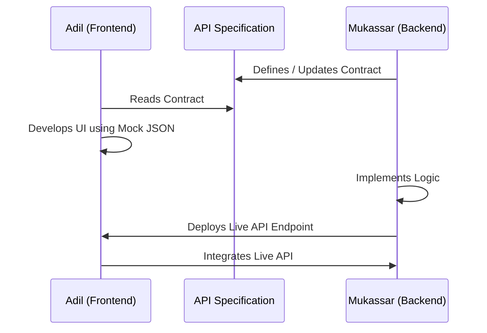
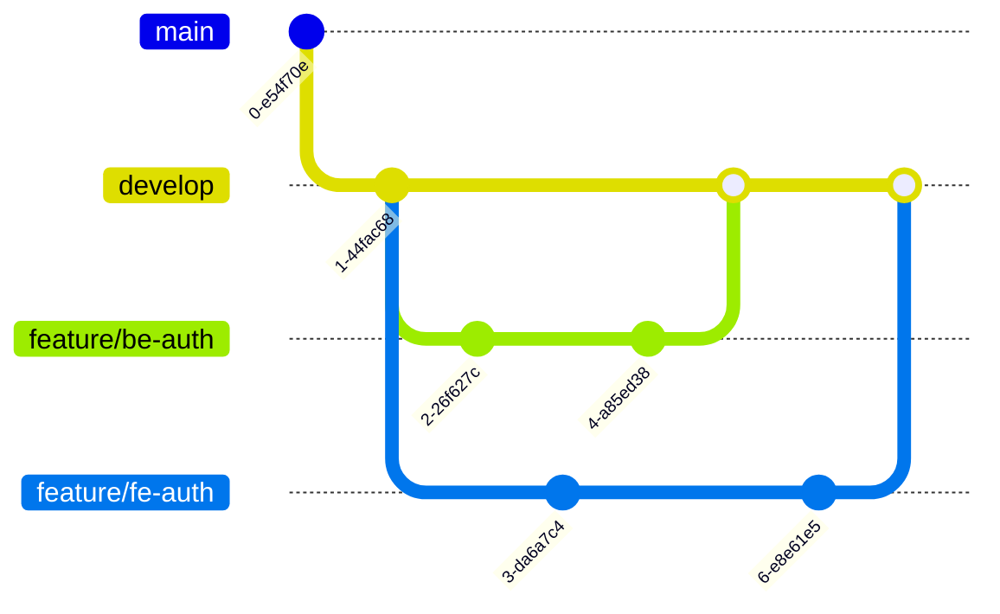

# FamilyOS AI Collaboration Guide

## 1. Introduction

This document serves as the official operating handbook for the FamilyOS AI engineering team. With exactly two collaborators executing a complex, full-stack AI application within a compressed hackathon timeframe, strict alignment on ownership, communication, API contracts, and development workflows is critical.

This guide ensures that backend and frontend development can proceed rapidly in parallel while maintaining high code quality, minimizing merge conflicts, and delivering a stable product.

## 2. Team Structure

To ensure accountability and prevent duplicated effort, the project operates with strict domain ownership.

| Role | Name | Core Responsibilities |
|---|---|---|
| **Backend Lead** | **Mukassar** | Backend Architecture, NestJS, Prisma, PostgreSQL, Authentication APIs, OCR/AI Integration, Business Logic, Readiness Engine, Security, Deployment, Backend Testing. |
| **Frontend Lead** | **Adil** | Frontend Architecture, Next.js App Router, TypeScript, Tailwind CSS, UI Components, Dashboard, Family/Document/Upload UI, AI Chat UI, API Integration, Frontend Testing, Responsive Design. |
| **Shared** | **Mukassar & Adil** | API Contract Review, Documentation, Bug Fixes, End-to-End Testing, Demo Preparation, Architecture Discussions, Final Deployment Verification. |

## 3. Responsibility Matrix

Clear ownership across every project module prevents bottlenecks.

| Module | Primary Owner | Secondary Owner | Deliverable |
|---|---|---|---|
| **Authentication** | Mukassar (Logic) | Adil (UI) | JWT generation, validation, Login/Register forms. |
| **Family / Workspaces** | Mukassar (Guards) | Adil (UI) | Isolated family data access and management UI. |
| **Family Members** | Mukassar (CRUD) | Adil (UI) | Member API and Frontend configuration screens. |
| **Documents** | Mukassar (Storage) | Adil (Upload) | Cloudinary backend pipeline and Frontend dropzone. |
| **OCR** | Mukassar | None | Background text extraction from document binaries. |
| **AI** | Mukassar (Prompts) | Adil (Chat UI) | Structured JSON extraction and conversational API. |
| **Readiness Engine** | Mukassar | Adil (UI) | Deterministic evaluation logic and visual score display. |
| **Dashboard** | Adil | Mukassar (Data) | Aggregated view of metrics and alerts. |
| **Notifications** | Mukassar | Adil (UI) | Triggered alerts and frontend display. |
| **Deployment** | Mukassar | None | Vercel, Railway, and Neon setup. |
| **Testing** | Split (Unit) | Shared (E2E) | Unit tests (respective domains) and E2E walkthroughs. |
| **Documentation** | Shared | Shared | Both leads must update architecture docs as domains evolve. |

## 4. Development Workflow

```mermaid
flowchart TD
    Plan[Planning & API Contract Setup] --> DevBE[Backend Development]
    Plan --> DevFE[Frontend Development (Mock Data)]
    DevBE --> TestBE[Backend Local Testing]
    DevFE --> TestFE[Frontend Local Testing]
    TestBE --> PR_BE[Open PR & Code Review]
    TestFE --> PR_FE[Open PR & Code Review]
    PR_BE --> Merge[Merge to Develop]
    PR_FE --> Merge
    Merge --> Deploy[Deploy to Staging & E2E Validation]
```

1. **Planning:** Review the task breakdown and confirm API contracts before coding begins.
2. **Development:** Work occurs on isolated feature branches.
3. **Testing:** Unit tests and local verifications are performed.
4. **Code Review:** Peers review PRs against architectural guidelines.
5. **Merge:** Approved code is squash-merged into `develop`.
6. **Deployment:** The CI/CD pipeline pushes `develop` to the staging environment.

## 5. API Contract Management

The API is the single most critical dependency between the frontend and backend.

- **Ownership:** The Backend Lead (Mukassar) owns the API specification (`05_API_Specification.md`) and the underlying Swagger implementation.
- **Consumption:** The Frontend Lead (Adil) consumes the API strictly according to the documented contract.
- **Modifications:** Any changes to the API payload, status codes, or parameters require a synchronous discussion and an immediate update to the documentation.
- **Mock Responses:** If backend logic is incomplete, Mukassar must provide static JSON mock endpoints (or Swagger mocks) so Adil is not blocked.

### API Contract Flow



## 6. Git Collaboration

The team strictly adheres to the `09_Git_Workflow.md` guidelines.

- **Branch Ownership:** Mukassar branches off `develop` for backend features (e.g., `feature/be-auth`). Adil branches off `develop` for frontend features (e.g., `feature/fe-auth`).
- **Conflict Resolution:** If a shared file (e.g., a shared type definition or documentation) has a conflict, the person opening the PR is responsible for pulling `develop` and resolving the conflict locally before merging.
- **Commit Expectations:** Commits must follow Conventional Commits (e.g., `feat(ui): add upload dropzone`).

### Git Collaboration Flow



## 7. Parallel Development Strategy

To maintain high velocity during the hackathon, neither developer should be blocked waiting for the other.

- **Swagger-First Development:** Mukassar generates the Swagger API interface or updates the documentation immediately upon starting a task.
- **Mock JSON:** Adil utilizes temporary API adapters or hardcoded mock JSON files matching the API spec to build out the Next.js UI components.
- **Independent Progress:** Once Mukassar finishes the backend logic and deploys it to the Staging environment, Adil simply swaps the mock adapter for the live API URL.

## 8. Communication Guidelines

Clear communication prevents wasted effort and architectural divergence.

| Scenario | Communication Method | Expectation |
|---|---|---|
| **Daily Sync** | 10-Minute Standup | Review yesterday's progress, today's goals, and blockers. |
| **Feature Completion** | Async Message | Notify partner that a PR is ready for review or an API is live. |
| **Blocker Escalation** | Direct Call | Immediate resolution if one developer is completely blocked. |
| **Design/Architecture Decisions** | Video Call / Pair Session | Synchronous alignment before updating documentation. |
| **Documentation Updates** | PR & Async Message | Explicitly notify the partner if an architectural blueprint changes. |

## 9. Pull Request Rules

No code reaches the `develop` branch without a Pull Request.

### PR Checklist

| Check | Requirement |
|---|---|
| **Size** | PRs should be small and atomic (single logical feature). |
| **Testing** | Contains instructions for manual testing; passes automated CI tests. |
| **Format** | Follows the established PR template. |
| **Approval** | Requires at least 1 approval from the other lead before merging. |

## 10. Code Review Guidelines

Reviewers must prioritize high-level architecture over subjective style preferences (which should be handled automatically by Prettier/ESLint).

### Review Checklist

| Dimension | Focus Area |
|---|---|
| **Architecture** | Does this follow DDD (Backend) or Server/Client Component rules (Frontend)? |
| **Naming** | Are variables and functions descriptive and properly cased? |
| **Security** | Are Guards in place? Are inputs validated via Zod/Class-validator? |
| **Performance** | Are there N+1 query issues? Are large frontend assets optimized? |
| **Consistency** | Does the code match the patterns defined in `10_Antigravity_Development_Guide.md`? |

## 11. Merge Strategy

- **Target:** All feature branches merge into `develop`.
- **Method:** **Squash Merge** is mandatory to keep the commit history linear.
- **Release:** When a milestone is reached, `develop` is merged into `main` (or a `release/*` branch) for production deployment.

### Merge Checklist

| Check | Requirement |
|---|---|
| **CI Passing** | All automated tests and linting must show green. |
| **Up to Date** | The PR branch must be rebased or merged with the latest `develop`. |
| **Approved** | The partner has explicitly approved the PR. |
| **Squashed** | The merge commit is clean and descriptive. |

## 12. Demo Freeze Rules

A strict code freeze is implemented to guarantee a stable presentation.

- **Feature Freeze:** 24 hours before the demo. No new features, UI components, or APIs can be introduced.
- **Bug Fixes Only:** Only critical P0/P1 defect resolutions are allowed.
- **Deployment Freeze:** 12 hours before the demo. The Staging/Production environments are locked.
- **Final Verification:** Mukassar and Adil perform a joint, end-to-end walkthrough of the `14_Demo_Strategy.md` script on the frozen environment.

## 13. Working Agreements

Both collaborators agree strictly to the following rules:

1. **No direct commits to `main` or `develop`.** Everything goes through a PR.
2. **No undocumented API changes.** The `05_API_Specification.md` is the absolute source of truth.
3. **No force pushes.** Never force push to shared branches like `main` or `develop`.
4. **Keep documentation synchronized.** If the code diverges from the architecture docs, update the docs immediately.
5. **Update task board.** Ensure the implementation roadmap (`13_Project_Task_Breakdown.md` or equivalent tracker) reflects current status.
6. **Maintain code quality.** Do not merge failing tests or unlinted code to save time.

## 14. Risks

| Risk | Mitigation |
|---|---|
| **Merge Conflicts on Shared Files** | Communicate before modifying shared configurations (e.g., root `package.json` or architectural markdown docs). |
| **API Desynchronization** | Adil uses strict TypeScript types based entirely on Mukassar's defined API contracts. Any mismatch will fail the frontend build. |
| **Siloing / Tunnel Vision** | Enforce the daily 10-minute sync. Ensure both leads are aware of the other's progress. |

## 15. Assumptions

- Both Mukassar and Adil are comfortable with Git branching, PR reviews, and conflict resolution.
- Both leads have read, understood, and agreed to the contents of the `/docs` architectural blueprints.
- A shared communication channel (e.g., Slack, Discord, Microsoft Teams) is established and monitored during working hours.
