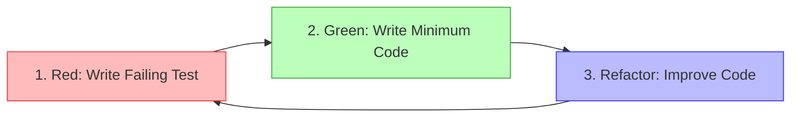
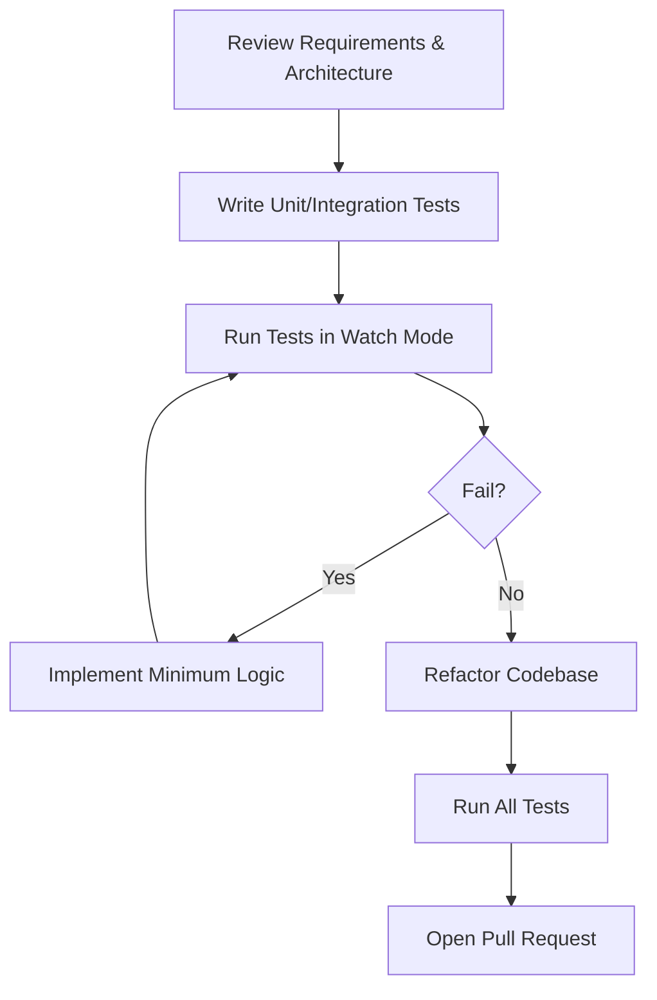
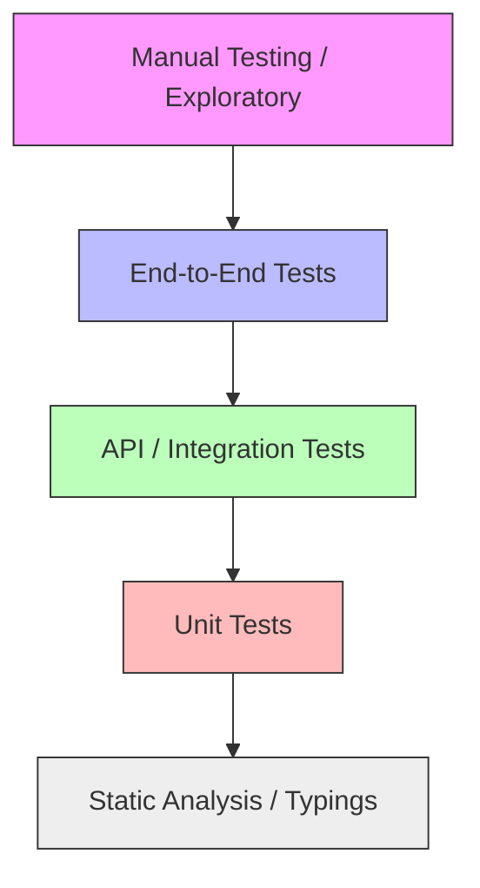
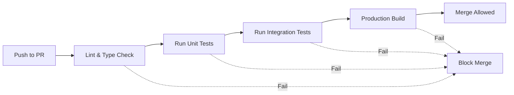

# FamilyOS AI Test-Driven Development Guide

## 1. Introduction

This document establishes the official Test-Driven Development (TDD) methodology for the FamilyOS AI project. As a robust enterprise application managing sensitive family data and leveraging non-deterministic AI pipelines, FamilyOS requires extreme reliability. 

Every feature in the repository must be implemented following the TDD lifecycle. This guide outlines the development workflows, mocking strategies, and quality gates required to ensure code is inherently testable, maintainable, and secure from its inception.

## 2. TDD Principles

Our engineering team adheres to the core tenets of Extreme Programming and TDD.

| Principle | Description |
|---|---|
| **Red** | Write a failing test before writing any production code. This proves the test is valid and that the feature does not currently exist. |
| **Green** | Write the absolute minimum amount of production code required to make the failing test pass. Do not over-engineer. |
| **Refactor** | Once the test passes, refactor the code to meet architectural standards (e.g., Domain-Driven Design) without changing its external behavior. |
| **Small Iterations** | Keep the feedback loop tight. Test one specific behavior at a time rather than writing massive test suites upfront. |
| **Continuous Feedback** | Run tests locally in watch mode. Developers should know within seconds if a change broke existing functionality. |
| **Maintainability** | Tests serve as living documentation. They must be as readable and maintainable as the production code itself. |

### Red → Green → Refactor Flow

## 3. Development Lifecycle

The TDD lifecycle ensures that code is written strictly to satisfy defined requirements.

1. **Requirement:** Understand the business rule or acceptance criteria (e.g., "User cannot view another family's documents").
2. **Write Test:** Write a test asserting that behavior.
3. **Run Test:** Execute the suite. Ensure the new test fails for the expected reason (Red).
4. **Write Minimum Code:** Implement the logic in the controller, service, or component.
5. **Pass:** Execute the suite. Ensure the test passes (Green).
6. **Refactor:** Clean up the code, extract methods, or apply design patterns while ensuring tests remain green.
7. **Repeat:** Move to the next requirement.

## 4. Backend TDD

Backend TDD focuses on isolating business logic from infrastructure.

| Component | TDD Focus |
|---|---|
| **Controllers** | Test HTTP routing, parameter extraction, and delegation to services. |
| **Services** | Test core business rules (e.g., Readiness logic). Isolate by mocking database repositories. |
| **Repositories** | Test query construction and database interactions. Use an in-memory or isolated test database. |
| **Guards** | Test authorization boundaries. Assert that invalid JWTs or cross-family access attempts are rejected. |
| **Validation** | Test Data Transfer Objects (DTOs). Assert that malformed payloads throw bad request exceptions. |
| **Authentication** | Test token generation, expiry logic, and password hashing logic. |
| **Database** | Test transactions, cascades, and constraints (e.g., unique indices). |
| **Business Rules** | Exhaustively test complex state machines and Readiness engine criteria. |

## 5. Frontend TDD

Frontend TDD focuses on behavior, accessibility, and state transitions rather than pixel-perfect styling.

| Component | TDD Focus |
|---|---|
| **Components** | Test atomic UI rendering based on props. |
| **Forms** | Test user input, validation triggers, error message display, and form submission payloads. |
| **Context** | Test global state mutations and multi-component synchronization. |
| **Hooks** | Test custom logic encapsulation and lifecycle events in isolation. |
| **API Layer** | Test data fetching logic, loading states, and error handling when the backend returns 4xx/5xx. |
| **State** | Assert that state transitions occur correctly on user actions (e.g., clicking 'Delete'). |
| **Layouts** | Test responsive breakpoints and conditional rendering of navigation elements. |
| **Accessibility** | Write tests to assert ARIA roles and keyboard navigation capabilities. |

## 6. AI TDD

Testing AI requires bounding non-deterministic outputs into deterministic tests.

| Area | TDD Focus |
|---|---|
| **OCR Fixtures** | Create static mock text outputs representing good, bad, and illegible OCR results. Test backend handling of these inputs. |
| **Prompt Regression** | Test prompts against historical "golden" OCR datasets to ensure prompt changes do not degrade extraction quality. |
| **JSON Validation** | Assert that the system successfully parses strict JSON schemas returned by the mock AI, or cleanly rejects them. |
| **Schema Validation** | Test that AI payloads strictly match the defined Zod/DTO schemas. |
| **Hallucination Prevention** | Write tests simulating the AI returning fabricated documents. Assert the application strips or rejects them. |
| **Retry Testing** | Force a mock JSON validation failure to test that the system correctly triggers a retry attempt. |
| **Fallback Testing** | Force all retries to fail to test that the system degrades gracefully without crashing the application. |

## 7. API TDD

APIs are tested at the boundaries between systems.

- **Contract-First:** Define the API specification before writing tests. Tests validate adherence to this contract.
- **Request Validation:** Assert that the API strictly enforces required fields and types.
- **Response Validation:** Assert that responses exactly match the documented schema wrapper.
- **Integration Testing:** Test the full request-response cycle without mocking internal services, using an isolated database.
- **Consumer Validation:** The frontend tests its API clients by mocking the backend's expected responses.

## 8. Database TDD

The database layer requires specific integration tests.

- **Migration Testing:** Assert that schema migrations can be applied and rolled back without data loss.
- **Repository Testing:** Test specific Prisma queries for expected results, especially complex joins or aggregations.
- **Relationship Validation:** Assert that foreign keys and relationships act correctly (e.g., fetching a Family includes its Members).
- **Constraint Validation:** Test that unique constraints (e.g., email) correctly throw database errors.
- **Rollback Verification:** Test that failed transactions roll back changes completely.

## 9. Feature Development Workflow

This is the standard flow for a developer picking up a new task.

| Step | Action | Description |
|---|---|---|
| 1 | **Requirement** | Read the PRD and API Spec for the feature. |
| 2 | **Tests** | Write unit tests defining the expected behavior. |
| 3 | **Implementation** | Write the production code to satisfy the tests. |
| 4 | **Integration** | Write integration tests connecting the new code to the database/API. |
| 5 | **Refactoring** | Clean the code. Ensure all tests remain green. |
| 6 | **Merge** | Open a Pull Request. CI pipeline runs all tests. |

### Feature Development Workflow Diagram

## 10. Test Pyramid

The TDD methodology relies heavily on fast feedback loops, represented by the Test Pyramid.

### Test Pyramid Diagram

| Level | Explanation |
|---|---|
| **Static Analysis** | Strict TypeScript and ESLint configuration. Forms the base of code correctness. |
| **Unit Tests** | Fast, isolated tests for services and components. The bulk of the TDD effort. |
| **Integration Tests** | Validates connections to the database and internal module interactions. |
| **API Tests** | Validates HTTP endpoints against the contract. |
| **E2E** | Automates critical user journeys in the browser. |
| **Manual Testing** | Final exploratory validation of edge cases and UX feel. |

## 11. Mocking Strategy

TDD requires isolating the code under test from external side-effects.

| Dependency | Mocking Strategy |
|---|---|
| **OpenAI** | Mock the HTTP client or SDK to return static JSON payloads representing successful extractions and malformed errors. |
| **OCR** | Mock the OCR service to return predefined text strings (clean, garbled, empty). |
| **Cloudinary** | Mock the upload provider to simulate successful uploads and return fake signed URLs. |
| **JWT** | Sign test tokens with a known local secret during API testing to bypass external identity providers. |
| **Database** | Use an isolated test schema or in-memory SQLite (if compatible) for integration tests. Mock the Prisma client for unit tests. |
| **Notifications** | Mock event emitters to assert that alerts are dispatched without actually sending them. |
| **External APIs** | Intercept network requests at the application boundary and provide stubbed responses. |

## 12. Quality Gates

Code cannot be merged into `develop` or deployed unless it passes strict automated CI quality gates.

| Gate | Requirement |
|---|---|
| **Tests Pass** | 100% pass rate for all unit and integration tests. |
| **Coverage Maintained** | Test coverage must not drop below the established project threshold (e.g., 80%). |
| **Lint Passes** | Zero ESLint errors or Prettier formatting issues. |
| **Build Succeeds** | TypeScript compilation (`tsc --noEmit`) passes with zero errors. |
| **Documentation Updated** | Any architectural or API changes are reflected in the `/docs` directory. |
| **Review Approved** | Manual sign-off from a peer reviewer. |

### CI Quality Gate Flow

## 13. Definition of Done

A feature is considered done only when the following checklist is completed:

| Definition of Done Checklist |
|---|
| [ ] Code implements the exact requirements defined in the PRD. |
| [ ] Feature was developed using TDD (tests exist for all logic). |
| [ ] All unit, integration, and E2E tests are passing. |
| [ ] Code has been manually tested in the local environment. |
| [ ] External services (AI, Cloudinary) are properly mocked in the test suite. |
| [ ] Code conforms to Domain-Driven Design / Next.js architectural standards. |
| [ ] Automated CI pipelines (Linting, Building, Testing) pass. |
| [ ] Peer Code Review has been completed and approved. |

## 14. Risks

| Risk | Mitigation |
|---|---|
| **Slowing Development Velocity** | TDD requires initial overhead. Mitigation: Maintain a robust library of test factories, mocks, and seed data to make writing tests frictionless. |
| **Testing Implementation Details** | Tests become brittle if they test *how* a function works instead of *what* it returns. Mitigation: Focus tests on public interfaces and behavioral outcomes. |
| **Flaky Tests** | Tests fail randomly due to race conditions or async AI calls. Mitigation: Strictly mock all external dependencies and ensure tests run completely isolated from each other. |

## 15. Assumptions

- Developers are familiar with the concepts of Red/Green/Refactor.
- The project is set up with standard testing frameworks (e.g., Jest/Vitest) that support watch mode and fast execution.
- CI infrastructure is capable of running automated tests efficiently on every Pull Request.
