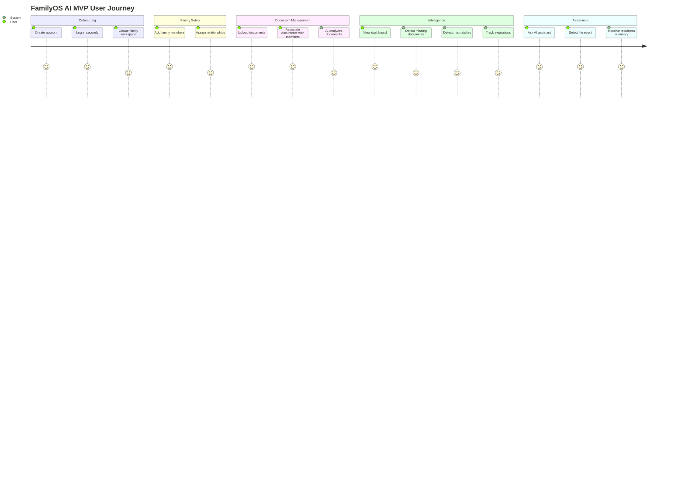
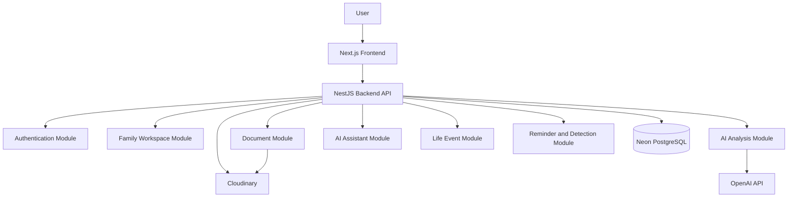
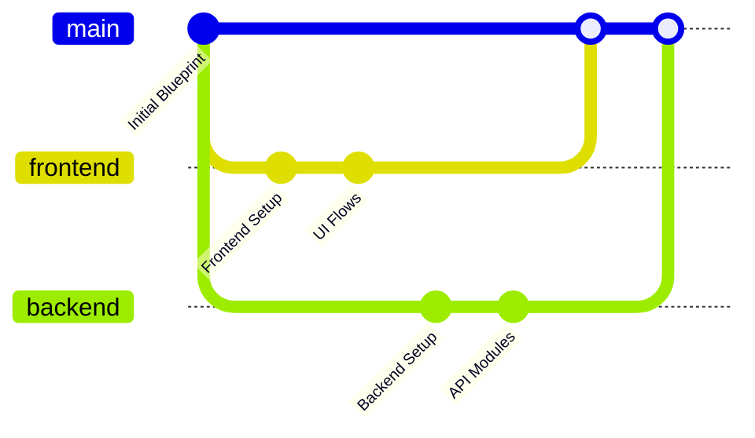
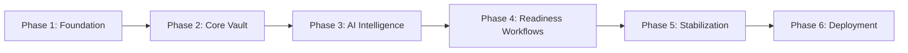
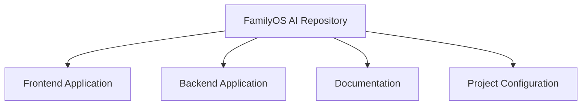
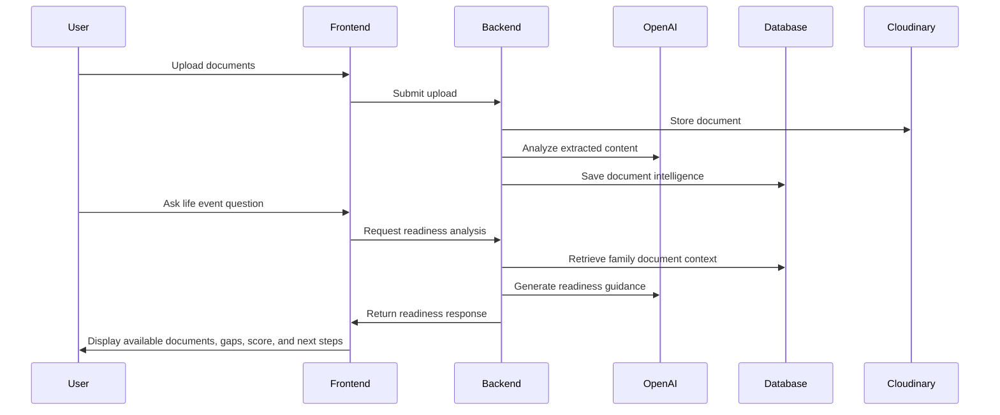

# FamilyOS AI Project Blueprint

## 1. Executive Summary

**FamilyOS AI** is an AI-powered Family Digital Vault designed to help families securely store, understand, organize, and manage important life documents.

Unlike conventional cloud storage platforms, FamilyOS AI does not only store files. It analyzes uploaded documents using OCR and AI to extract meaningful information, identify gaps, detect inconsistencies, monitor expirations, and assist users in preparing for important government and life events.

The product acts as a digital family secretary: proactive, organized, intelligent, and context-aware.

This blueprint defines the product direction, scope, architecture principles, team responsibilities, development strategy, and delivery expectations before engineering implementation begins.

## 2. Product Vision

FamilyOS AI aims to become the trusted digital operating system for family documentation.

The platform will help families answer critical questions such as:

- Which documents do we have?
- Which documents are missing?
- Are names, addresses, or details inconsistent across documents?
- Which documents are expiring soon?
- Are we ready for a government process or life event?
- What steps should we take next?

The long-term vision is to evolve from a document vault into a family readiness platform for legal, financial, insurance, government, education, travel, and emergency use cases.

## 3. Problem Statement

Families often manage important documents across physical files, phones, email inboxes, messaging apps, and cloud folders. This creates several problems:

| Problem | Impact |
|---|---|
| Documents are scattered | Hard to find documents when needed |
| No structured understanding | Files are stored but not interpreted |
| Missing documents are discovered late | Delays in applications and processes |
| Name or address mismatches go unnoticed | Rejections or manual correction cycles |
| Expiry dates are forgotten | Last-minute renewals and penalties |
| Government process requirements are unclear | Confusion and dependency on external agents |
| Families lack a shared secure workspace | Poor collaboration between members |

Traditional storage systems solve file storage, but they do not solve document readiness.

## 4. Solution

FamilyOS AI provides a secure family workspace where users can upload important documents and receive AI-powered assistance.

The platform will:

- Store documents securely
- Extract document information using OCR
- Analyze documents using AI
- Organize documents by family member and document type
- Detect missing documents for selected life events
- Identify name and address mismatches
- Track document expirations
- Provide readiness scores
- Offer an AI chat assistant for document-related questions
- Guide users through life event preparation workflows

## 5. Goals

| Goal | Description |
|---|---|
| Secure family document vault | Provide a trusted workspace for family documents |
| AI-powered understanding | Extract and interpret document data |
| Readiness intelligence | Help users know whether they are prepared for life events |
| Proactive alerts | Surface expirations, missing documents, and inconsistencies |
| Simple user experience | Make complex document management approachable for families |
| Parallel engineering delivery | Enable frontend and backend leads to work independently |
| Scalable foundation | Support future advisors, integrations, and advanced workflows |

## 6. Non Goals

The following are explicitly outside the initial product intent:

- Replacing official government portals
- Submitting applications directly to government systems
- Providing legal, tax, or financial advice
- Acting as a certified identity verification authority
- Building a generic file storage product
- Supporting enterprise document management workflows in MVP
- Building native mobile applications in MVP
- Creating advisor-facing portals in MVP
- Supporting payment workflows in MVP

## 7. Scope

The project scope covers the planning and development of a SaaS web application with:

- User authentication
- Secure family workspace
- Family member management
- Document upload and storage
- OCR-based extraction
- AI-based document analysis
- Dashboard visibility
- AI chat assistant
- Life event readiness support
- Expiry and inconsistency detection

## 8. MVP Scope

The MVP should validate whether families find value in an AI-powered document readiness platform.

### MVP Capabilities

| Area | MVP Scope |
|---|---|
| Authentication | JWT-based login and protected access |
| Family workspace | One user can manage a family workspace |
| Family members | Add and manage family members |
| Document upload | Upload documents and associate them with members |
| Document storage | Store uploaded documents using Cloudinary |
| OCR | Extract text from uploaded documents |
| AI analysis | Identify document type and key document attributes |
| Dashboard | Show uploaded documents, pending items, and readiness indicators |
| AI assistant | Answer questions using available document context |
| Life event assistant | Support limited predefined life events |
| Readiness score | Provide basic readiness calculation |
| Missing document detection | Identify unavailable documents for selected life events |
| Mismatch detection | Detect basic name/address inconsistencies |
| Expiry reminders | Surface documents nearing expiry |

### MVP Example

A user uploads Aadhaar, PAN, and Passport, then asks:

> I want to apply for a Driving License.

FamilyOS AI should respond with:

- Available documents
- Missing documents
- Readiness score
- Required next steps
- Government process summary

## 9. Future Scope

| Future Area | Description |
|---|---|
| Multi-family workspace | Allow users to manage multiple family groups |
| Advisor access | Legal, insurance, and financial advisors with controlled permissions |
| Advanced reminders | Email, WhatsApp, SMS, and calendar integrations |
| Government integration | Deep links or assisted workflows for official portals |
| Emergency vault mode | Quick access to critical documents |
| Document sharing | Secure temporary document sharing |
| Verification workflows | Advanced validation and authenticity checks |
| Mobile applications | Native iOS and Android apps |
| Multi-language support | Regional language support for Indian families |
| Smart recommendations | AI suggestions for future preparedness |
| Audit history | Full activity and access tracking |

## 10. User Personas

### Primary Persona: Family Organizer

| Attribute | Description |
|---|---|
| User type | Parent, guardian, or responsible family member |
| Goal | Keep all family documents organized and ready |
| Pain points | Missing documents, scattered files, expiry tracking |
| Needs | Simplicity, security, reminders, clarity |

### Secondary Persona: Individual User

| Attribute | Description |
|---|---|
| User type | Student, working professional, migrant worker, frequent traveler |
| Goal | Manage personal documents and government readiness |
| Pain points | Confusing requirements, missed renewals |
| Needs | Personal vault, assistant, readiness checklist |

### Future Persona: Advisor

| Attribute | Description |
|---|---|
| User type | Legal advisor, insurance advisor, financial planner |
| Goal | Help clients prepare required documentation |
| Pain points | Manual collection and validation of documents |
| Needs | Controlled access, document status, readiness insights |

## 11. User Journey

## 12. Functional Requirements

### Authentication

| Requirement | Description |
|---|---|
| User registration | Users must be able to create an account |
| User login | Users must authenticate securely |
| JWT authentication | Protected APIs must require valid access tokens |
| Refresh token support | Users should remain signed in securely |
| Logout | Users must be able to end sessions |

### Family Workspace

| Requirement | Description |
|---|---|
| Workspace creation | A user must have access to a secure family workspace |
| Workspace isolation | One family's data must not be accessible to another family |
| Workspace dashboard | Users must see a summary of family document status |

### Family Member Management

| Requirement | Description |
|---|---|
| Add member | Users must add family members |
| Edit member | Users must update member information |
| Associate documents | Documents must be linked to a family member where applicable |

### Document Upload

| Requirement | Description |
|---|---|
| Upload document | Users must upload supported document files |
| Store document | Uploaded documents must be stored securely |
| Associate metadata | Documents must include basic user-provided and AI-derived metadata |
| View document list | Users must view uploaded documents |

### AI Document Analysis

| Requirement | Description |
|---|---|
| OCR extraction | System must extract text from documents |
| Document classification | System should identify document type where possible |
| Attribute extraction | System should identify key information from documents |
| Confidence handling | System should represent uncertainty where AI confidence is low |

### AI Chat Assistant

| Requirement | Description |
|---|---|
| Ask questions | Users must ask document-related questions |
| Use available context | Assistant must consider uploaded document information |
| Explain gaps | Assistant should identify missing or incomplete information |
| Provide next steps | Assistant should guide users toward readiness |

### Life Event Assistant

| Requirement | Description |
|---|---|
| Select life event | Users must choose or ask about a supported life event |
| Check readiness | System must compare available documents against expected needs |
| Provide readiness score | System must summarize preparedness |
| Explain missing items | System must identify unavailable or incomplete documents |
| Summarize process | System should provide a high-level process summary |

### Detection Engines

| Requirement | Description |
|---|---|
| Missing document detection | Identify unavailable documents for supported scenarios |
| Name mismatch detection | Compare names across uploaded documents |
| Address mismatch detection | Compare addresses across uploaded documents |
| Expiry detection | Identify documents with expiry dates |
| Expiry reminder | Surface documents expiring soon |

### Dashboard

| Requirement | Description |
|---|---|
| Document summary | Show uploaded document status |
| Member summary | Show member-level readiness |
| Alert summary | Show missing, mismatched, and expiring documents |
| Life event readiness | Show readiness insights where available |

## 13. Non Functional Requirements

| Category | Requirement |
|---|---|
| Security | Protect user and document data through authentication and authorization |
| Privacy | Limit access to family workspace data |
| Scalability | Support future growth in users, documents, and AI workloads |
| Reliability | Ensure core document and account workflows are stable |
| Availability | Design for managed cloud deployment on Vercel, Railway, Neon, and Cloudinary |
| Maintainability | Use modular architecture and clear responsibility boundaries |
| Observability | Support logs and diagnostics for backend workflows |
| Performance | Keep dashboard and document workflows responsive |
| Compliance readiness | Design with privacy and auditability in mind |
| AI safety | Avoid presenting AI output as official legal or government advice |
| Data integrity | Prevent cross-family data leakage |
| Extensibility | Allow future advisor, notification, and integration modules |

## 14. Product Principles

| Principle | Description |
|---|---|
| Trust first | Families must feel safe storing sensitive documents |
| Clarity over complexity | AI output must be understandable and actionable |
| Proactive assistance | The system should surface issues before users ask |
| Human confirmation | AI-extracted data should support review and correction |
| Privacy by design | Family data must remain isolated and protected |
| Readiness oriented | The product should focus on outcomes, not just storage |
| MVP discipline | Build only what validates the core value proposition first |

## 15. High Level Modules

### Module Overview

| Module | Responsibility |
|---|---|
| Frontend Application | User interface, forms, dashboards, assistant experience |
| Backend API | Business logic, authentication, orchestration |
| Authentication | JWT and refresh token workflows |
| Family Workspace | Workspace and member management |
| Document Management | Upload, association, listing, storage coordination |
| AI Analysis | OCR interpretation and document understanding |
| AI Assistant | Conversational interface over family document context |
| Life Event Assistant | Readiness evaluation for supported scenarios |
| Detection Engine | Missing document, mismatch, and expiry detection |
| Dashboard | Aggregated product intelligence and status visibility |

## 16. Technology Decisions

### Locked Technology Stack

| Area | Technology | Rationale |
|---|---|---|
| Frontend | Next.js App Router | Modern React framework suitable for SaaS applications |
| Frontend Language | TypeScript | Type safety and maintainability |
| Styling | Tailwind CSS | Fast, consistent UI development |
| HTTP Client | Axios | Standardized API communication |
| Forms | React Hook Form | Efficient form handling |
| Validation | Zod | Type-safe schema validation |
| Animation | Framer Motion | Polished interaction support |
| Icons | Lucide React | Consistent icon library |
| Backend | NestJS | Modular, scalable backend framework |
| Backend Language | TypeScript | Shared language across stack |
| ORM | Prisma | Type-safe database access |
| Database | PostgreSQL via Neon | Managed relational database |
| Auth | JWT and Refresh Token | Common SaaS authentication model |
| API Docs | Swagger | API visibility and frontend-backend alignment |
| Upload Handling | Multer | Backend file upload support |
| AI | OpenAI API | AI reasoning and document intelligence |
| Storage | Cloudinary | Managed document and media storage |
| Frontend Hosting | Vercel | Optimized for Next.js deployment |
| Backend Hosting | Railway | Simple managed backend deployment |

## 17. Team Responsibilities

| Role | Owner | Responsibilities |
|---|---|---|
| Frontend Lead | Adil | Next.js application, UI flows, forms, dashboard, assistant interface |
| Backend Lead | Mukassar | NestJS API, authentication, database integration, document processing, AI orchestration |
| Shared | Adil and Mukassar | API contracts, validation behavior, integration testing, deployment readiness |

### Collaboration Expectations

- Frontend and backend development should proceed in parallel.
- API contracts should be agreed before dependent implementation.
- Swagger should serve as the backend API reference.
- Mocked frontend flows may be used before backend completion.
- Backend should expose stable contracts early for integration.
- Shared terminology must remain consistent across UI, API, and documentation.

## 18. Documentation Strategy

Documentation will be maintained as a project asset and treated as part of delivery quality.

| Document | Purpose |
|---|---|
| Project Blueprint | Single source of truth for product and architecture direction |
| API Contract Document | Defines backend endpoints and request/response expectations |
| Database Design Document | Defines entities, relationships, and constraints |
| AI Prompting Strategy | Defines AI use cases, prompt boundaries, and safety rules |
| Frontend Architecture Document | Defines UI structure, routes, state handling, and component strategy |
| Backend Architecture Document | Defines modules, services, guards, and processing flows |
| Deployment Guide | Defines Vercel, Railway, Neon, and Cloudinary deployment steps |
| Testing Strategy | Defines unit, integration, and manual QA expectations |

## 19. Git Strategy Overview

The project will support parallel development by frontend and backend leads.

### Branching Model

| Branch | Purpose |
|---|---|
| `main` | Stable integration branch |
| `frontend/*` | Frontend feature branches |
| `backend/*` | Backend feature branches |
| `docs/*` | Documentation updates |
| `fix/*` | Bug fixes |

### Pull Request Expectations

- PRs should be small and focused.
- Each PR should describe scope, testing, and impact.
- API-affecting PRs must update Swagger or contract documentation.
- Documentation changes should accompany major architectural changes.
- Frontend and backend integration changes should be coordinated.

## 20. Risks

| Risk | Impact | Mitigation |
|---|---|---|
| AI extraction inaccuracies | Incorrect readiness or mismatch results | Show confidence, allow review, avoid overclaiming |
| Sensitive document handling | Privacy and trust concerns | Strong authentication, access control, secure storage practices |
| Scope creep | MVP delay | Maintain MVP boundaries and phase future features |
| Government requirement variability | Incorrect process guidance | Present summaries as guidance, not official advice |
| Frontend-backend misalignment | Integration delays | Define API contracts early |
| File upload complexity | Reliability issues | Validate formats, size limits, and storage flows |
| Cost growth from AI usage | Higher operating cost | Monitor usage and optimize AI calls |
| Expiry and mismatch false positives | User confusion | Explain findings clearly and support manual correction |

## 21. Assumptions

| Assumption | Description |
|---|---|
| Users understand document sensitivity | Users will expect strong privacy and security |
| MVP focuses on Indian family documents | Initial examples include Aadhaar, PAN, Passport, and similar documents |
| Cloudinary is acceptable for document storage | Storage decision is locked for MVP |
| OpenAI API is available | AI features depend on OpenAI service availability |
| Manual review is acceptable | Users may need to confirm AI-extracted details |
| Government processes are informational | The platform will not officially submit applications |
| Web-first experience is sufficient | Native mobile apps are not required for MVP |

## 22. Constraints

| Constraint | Description |
|---|---|
| Locked stack | Technology choices are fixed |
| No native app in MVP | Delivery is web-only |
| No direct government integration | Guidance only, no official submission |
| Limited initial team | Frontend and backend leads must work independently |
| AI uncertainty | AI outputs may require confidence handling and user review |
| Sensitive data domain | Security and privacy must influence product decisions |
| Startup delivery pace | Documentation must support rapid but disciplined execution |

## 23. Success Metrics

| Metric | Description |
|---|---|
| Account creation rate | Measures onboarding interest |
| Family member creation rate | Measures workspace activation |
| Document upload count | Measures vault adoption |
| AI analysis completion rate | Measures core system reliability |
| Assistant usage rate | Measures AI value discovery |
| Life event readiness usage | Measures differentiated product value |
| Missing document detection engagement | Measures usefulness of proactive intelligence |
| Expiry alert engagement | Measures ongoing utility |
| User retention | Measures whether families continue using the product |
| Support issues related to confusion | Measures clarity of experience |

## 24. Development Phases

### Phase Breakdown

| Phase | Focus |
|---|---|
| Phase 1 | Project setup, environment setup, authentication foundation |
| Phase 2 | Family workspace, member management, document upload |
| Phase 3 | OCR extraction, AI document analysis, metadata review |
| Phase 4 | AI assistant, life event assistant, readiness score, detection logic |
| Phase 5 | Dashboard polish, validation, security review, testing |
| Phase 6 | Deployment to Vercel, Railway, Neon, and Cloudinary configuration |

## 25. Coding Principles

Although this document does not define implementation details, the following engineering principles should guide development:

| Principle | Description |
|---|---|
| Type safety first | Use TypeScript consistently across frontend and backend |
| Modular design | Keep product domains separated into clear modules |
| Contract-driven development | Align frontend and backend through documented API behavior |
| Security by default | Protect sensitive data at every layer |
| Validation at boundaries | Validate user input and API payloads |
| Clear error handling | Provide predictable and understandable errors |
| Minimal coupling | Avoid tight dependency between unrelated modules |
| Test meaningful behavior | Prioritize tests for business-critical flows |
| Maintain readability | Code should be understandable by the whole team |
| Avoid premature abstraction | Add abstractions only when they solve real complexity |

## 26. Definition of Done

A feature is considered complete when:

| Area | Requirement |
|---|---|
| Product | Feature satisfies agreed scope |
| UX | User flow is understandable and usable |
| Frontend | UI is responsive and validates inputs |
| Backend | API behavior is implemented and documented |
| Security | Access control and validation are applied |
| AI | AI behavior is bounded, explainable, and reviewed where needed |
| Testing | Relevant tests or manual verification are completed |
| Documentation | Related documentation is updated |
| Integration | Feature works across frontend and backend |
| Deployment | Feature is compatible with target deployment environments |

## 27. Project Folder Overview

This section intentionally remains high level. Detailed folder structures will be defined in frontend and backend architecture documents.

### High-Level Areas

| Area | Purpose |
|---|---|
| Frontend Application | Next.js user interface and client-side experience |
| Backend Application | NestJS API and business logic |
| Documentation | Product, architecture, API, database, deployment, and testing documents |
| Project Configuration | Shared project-level configuration and repository metadata |

## 28. Glossary

| Term | Meaning |
|---|---|
| FamilyOS AI | AI-powered family digital vault product |
| Family Workspace | Secure space where a family's members and documents are managed |
| Family Member | A person whose documents are stored and managed in the workspace |
| Document Vault | Secure storage and management area for uploaded documents |
| OCR | Optical Character Recognition used to extract text from documents |
| AI Analysis | AI-based interpretation of uploaded document content |
| Life Event | A user goal such as applying for a driving license, passport renewal, school admission, or insurance claim |
| Readiness Score | A summary indicator showing how prepared a user is for a selected life event |
| Missing Document Detection | Identification of documents not currently available but likely required |
| Mismatch Detection | Detection of inconsistencies such as name or address differences |
| Expiry Reminder | Alert for documents that are expired or nearing expiration |
| AI Assistant | Conversational interface that answers questions using document context |

## 29. Appendix

### Appendix A: Example MVP Scenario

User uploads:

- Aadhaar
- PAN
- Passport

User asks:

> I want to apply for a Driving License.

Expected system response should include:

| Response Area | Description |
|---|---|
| Available documents | Documents already uploaded and relevant |
| Missing documents | Documents or information not currently available |
| Readiness score | Preparedness summary |
| Next steps | Suggested user actions |
| Process summary | High-level government process guidance |

### Appendix B: Conceptual Readiness Flow

### Appendix C: Approval Notes

This blueprint is intended to align product, architecture, and delivery expectations before implementation begins.

Detailed implementation documents should be created separately for:

- API contracts
- Database schema
- Frontend architecture
- Backend architecture
- AI prompt strategy
- Security model
- Deployment guide
- Testing strategy
